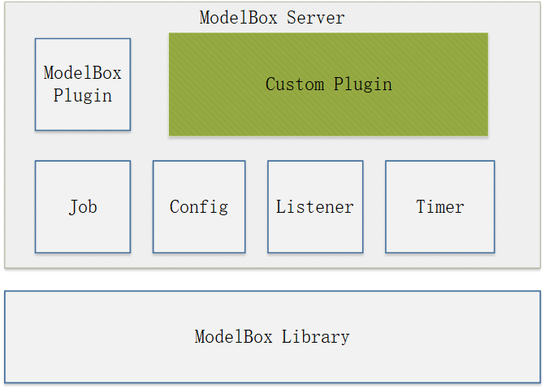

# API

ModelBox API包括了多种编程语言，有C++，python，具体API的支持范围如下：
请选择合适的开发语言进行扩展。

| 类型                   | 说明                      | C++ | Python            |
| ---------------------- | ------------------------- | --- | ----------------- |
| ModelBox Server Plugin | ModelBox微服务插件。      | ✔️   | ❌                 |
| ModelBox Library       | ModelBox开发API。         | ✔️   | ✔️(不包含基础组件) |
| ModelBox FlowUnit      | ModelBox功能单元开发API。 | ✔️   | ✔️                 |
| ModelBox Device        | 设备支持开发API。         | ✔️   | ❌                 |

下面具体说明各个组件的API组件信息。

## ModelBox Server Plugin

ModelBox微服务插件，提供了开发为服务必要的API接口，对应的周边组件如下：

ModelBox插件可以调用的接口有：

1. Job: 任务管理，可以添加，删除，查询图以及对应的任务。
1. Config：配置读取，可以从ModelBox Server的配置文件/usr/local/etc/modelbox/modelbox.conf中读取配置项。
1. Listener: http server，可以注册HTTP请求的URL事件。
1. Timer: 定时器，可以注册定时任务，定时触发特定的函数。
1. ModelBox Library: ModelBox运行库的所有API。

## ModelBox Library

ModelBox运行库，提供了对业务开发需要的API接口，对应的周边组件如下：

ModelBox Library包含`基础Base`部分和`功能`部分。基础部分用于支撑业务的运行，功能部分用于支撑AI推理的运行。

### 基础Base

基础Base，包含了各种支撑业务运行的组件，包括如下组件：

1. BlockingQueue，阻塞队列。
1. Config，图配置读取。
1. Crypto，数据加解密。
1. Status，错误返回接口。
1. Utils，工具函数。
1. Device， 设备抽象接口。
1. Timer，定时器组件。
1. ThreadPool，线程池组件。
1. Log，日志组件。
1. Slab，Slab内存缓存组件。
1. OS Adapter API，OS抽象接口
1. Driver，ModelBox插件接口。

注意：python仅包含Log, Status, Config组件接口。

### ModelBox推理接口

推理接口包含运行推理任务，和编写功能单元的模块，包括如下组件

1. Buffer: 数据接口，用于承载AI推理数据。
1. Flow，推理启动接口，用于加载编排图，并启动推理任务。
1. FlowUnit，功能单元接口，用于扩展新的功能单元组件。
1. TensorList，Buffer操作接口，支持使用Tensor相关的接口操作Buffer。
1. DataContext，支持FLowUint功能单元开发的接口，用于获取功能单元的输入，输出，和上下文的存储。
1. Session，会话上下文，用于开发存储和会话相关的信息。
1. Statistics，统计接口，用于统计，获取相关组件的统计信息。

注意：python仅包含Buffer, Flow, Flowunit, tensor, Datacontext, Session相关的接口。

## 开发扩展

[ModelBox Server Plugin](../use-modelbox/modelbox-app-mode/service-plugin/service-plugin.md)，[ModelBox Device](../other-features/device/device.md)，[ModelBox Flowunit](../use-modelbox/modelbox-app-mode/flowunit/flowunit.md)的扩展，请参考相关的开发指导。
