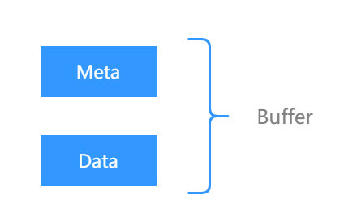

# Buffer

Buffer作为数据流的唯一载体，在节点的端口之间进行数据的传递，因此功能单元的输入输出均需要与Buffer产生交互。

## Buffer定义

Buffer由BufferMeta和DeviceData两个部分组成，BufferMeta存放了每个Buffer的元信息，用于描述Buffer的数据，BufferMeta只存放在主机上；DeviceData是Buffer的主体，用于存放数据，DeviceData是具体设备上申请的存储空间，可以是gpu、cpu等硬件上的存储空间。因此功能单元的输入端口可以指定输入Buffer所在的设备，框架会帮忙检查并确保数据存放在指定的设备上。

## 输入Buffer

功能单元获取输入Buffer时，首先会获取到BufferList，包含了一个batch的数据，BufferList与vector行为一致。获取到输入Buffer后，其数据部分是不允许修改的，只能通过ConstData来获取数据指针，因为一个Buffer被设计为，在产生时写入，后续流程只允许读取。

## 输出Buffer

输出的Buffer可以来自两种方式，一是将输入直接推到输出；一是在功能单元中构建。对于构建的方式时，功能单元只能构建出功能单元声明的依赖设备上的内存，不能随意选择Buffer所在的设备。
