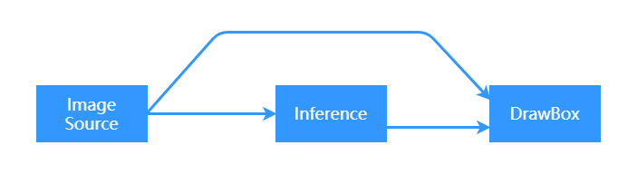
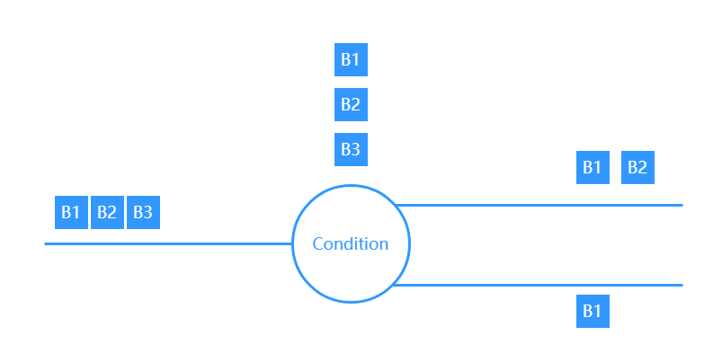

# 数据流

数据流，在ModelBox中称为Stream，一个数据流，定义为```节点和节点的端口之间传递的一组有序的Buffer```，这个定义是理解ModelBox中数据流的关键基础。

在此定义下的一个典型数据流处理实例：URL送入demuxer，产生packet数据流；送入decoder，产生视频流；经过resize，产生新的视频流；经过人脸检测，得到人像框流。这个过程中，每个数据流都只存在于节点和节点的端口之间。

## stream特点

数据流在传递中通过有序的Buffer进行承载，进行流处理时，会顺序处理每个Buffer。数据流通过特殊操作后会产生继承层级，如经过expand、condition后，数据流的继承层级会下降一层，这样做是为了显示标记数据流，避免不同层级的数据进行匹配操作，经过collapse、condition的单端口合并之后，数据流的继承层级会回退一层。可以类比为表达式中的左右括号，不同类型的括号同样不可以交叉。

## stream构成


Stream由数据部分和元信息部分构成，数据部分由多个有序的Buffer承载，元信息则记录在数据流上，数据流的产生功能单元在第一个数据产生前可以写入流的元信息，数据流处理功能单元只能读取数据流的元信息。

## 流的处理

下文介绍数据流经过不同功能单元的处理。

### 数据流匹配



上图介绍了一种典型的数据流匹配场景，Image Source功能单元功能是产生图片，Inference功能单元的功能是输入图片输出图片中包含人的框，DrawBox功能单元的功能是接受一个输入图像，和输入检测框，输出一个绘制了检测框的图像。对DrawBox来说图像和检测框结果之间就存在匹配关系，两个数据流均来自ImageSource，且两个数据流中的Buffer数量一致，则可以正确完成匹配的过程。

### 数据流经过Normal功能单元


两个数据流进入节点处理，功能单元的batch设置为2，可以看到数据被划分为最多两个一组，多组数据同时开始处理，生成的结果数据与输入一致，并且整理成独立的输出流输出。

#### 数据流经过Stream功能单元


两个数据流进入节点处理，功能单元的batch设置为2，可以看到数据被划分为最多两个一组，不同的数据流同时处理，同一个数据流的多组batch串行处理，生成的结果数据与输入数量可以不一致。

#### 数据流经过Condition功能单元



单个数据流进入节点处理，功能单元一次处理一个buffer，多个buffer同时处理，每个输出buffer选择一个端口，输出的总量与单端口输入的数量一致。

#### 数据流经过Expand功能单元


单个数据流进入节点处理，功能单元一次处理一个buffer，多个buffer同时处理，每个Buffer展开成一个子数据流。

### 数据流经过Collapse功能单元


多个子数据流进入节点处理，功能单元一次处理一个子流，多个子流的数据同时处理，每个子流只能合并输出一个Buffer。
