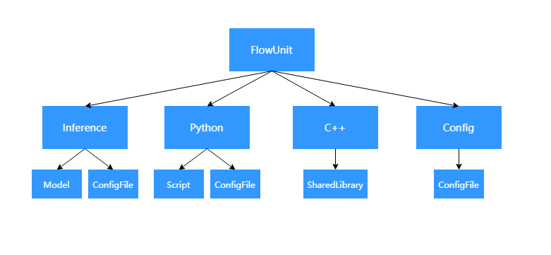
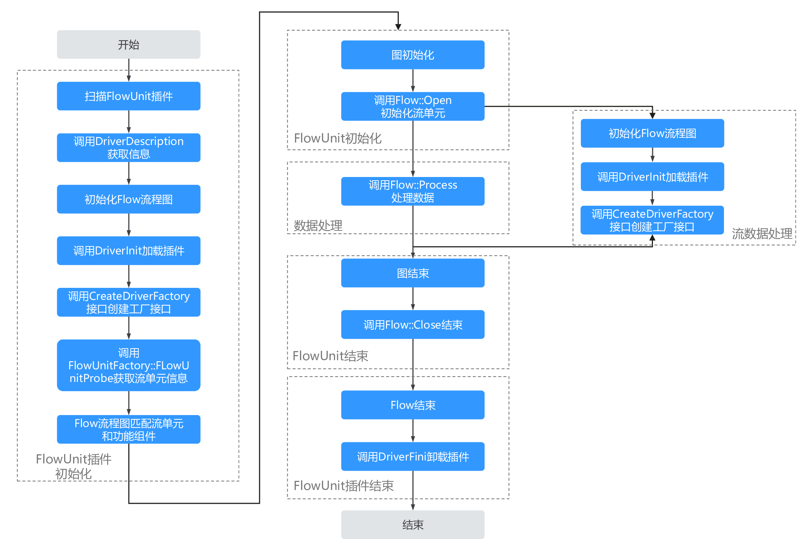
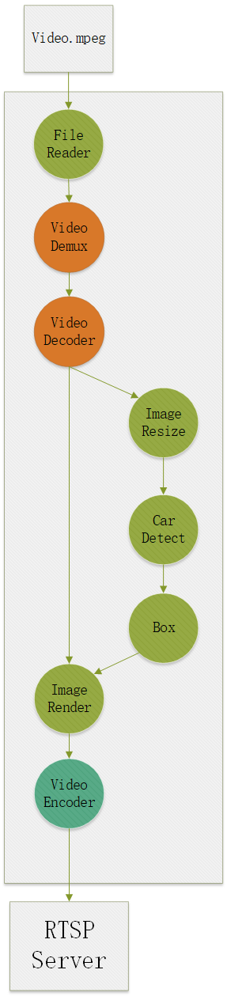

# 功能单元

`功能单元(FlowUnit)`，是应用流程中处理数据的基本单元。

## 功能单元基础概念

在ModelBox中，功能单元被设计为依赖特定设备完成固定功能的代码单元，因此一个功能单元应当有明确的功能名、设备类型，例如ModelBox内置的resize功能单元有cpu、cuda、ascend三个硬件的版本，使用时需要明确指定功能单元名、设备类型、设备号。多设备更多了解请见[设备](../advanced-features/device/device.md)章节。

功能单元的输入数据所在的设备默认与功能单元依赖的设备一致，如有特殊需要，可以对单个输入端口配置特定的设备，框架会保证输入的数据在特定设备上已准备就绪。功能单元的输出端口无需指定设备，输出不会发生数据搬移。功能单元使用输出构建接口创建Buffer时，创建的Buffer所在的设备是当前功能单元声明的依赖设备类型。

[图](./graph.md)中介绍了节点与功能单元的对应关系。开发者在设置节点时，需要通过在节点上配置功能单元名、设备类型、设备号来指明节点所使用的功能单元。

## 功能单元实现方式

在ModelBox中，功能单元支持不同的实现方式以适用于不同场景的使用。

| 实现方式    | 说明                                              |
| ---------- | ----------------------------------------          |
| Inference  | 推理流单元，通过模型和简单的配置文件即可完成          |
| Python     | Python编写流单元，需要提供Python代码，并提供配置文件  |
| C++        | C++编写流单元，需要编译成动态库                      |
| Config     | 配置流单元，通过编写特定配置文件即可完成，如yolo后处理 |

流单元的具体开发操作参考[流单元开发](../../use-modelbox/flowunit/flowunit.md)

## 加载运行流程

为方便功能单元的扩展和复用，它被设计为插件的方式进行加载，如下简要介绍其加载的过程。

FlowUnit插件的加载流程如上图：

* 初始化过程

    1. ModelBox模块先扫描插件目录。
    1. 对扫描到的插件，调用`DriverDescription`获取FlowUnit插件信息。信息包括功能单元名称，功能单元版本号，执行的硬件信息，描述信息，配置参数信息。
    1. 当启动Flow时，则调用插件的`DriverInit`初始化插件。
    1. 初始化插件完成后，调用`CreateDriverFactor`创建插件工厂类。
    1. 之后调用`FLowUnitFactor::FlowUnitProbe`获取FlowUnit信息，信息包括输入，输出参数。
    1. 初始化完成后，业务调用Flow初始化图。
    1. 在图初始化时，首先通过图中指定的FlowUnit名称选择对应的FlowUnit实例化，调用实例化对象的`Flow::Open`初始化`FlowUnit`对象。
    1. 图初始化完成后，若有数据达到，则调用当前节点实例的`Flow::Process`处理数据；若当前功能单元选择的类型是流，还会调用`Flow::DataPre`接口，再调用`Flow::Process`接口，流数据结束时，调用`Flow::DataPost`接口。
    1. 当图运行完成后，则调用`Flow::Close`接口关闭图。
    1. 整个Flow结束时，ModelBox模块卸载FlowUnit插件，调用插件的`DriverFini`函数清理资源。

## 数据处理

节点存在多种数据处理方式可以选择，功能单元提供了数据处理选项让功能单元开发者来决定对应节点的数据应当如何处理，如下将介绍数据处理的过程及选项的具体作用。

图中每个节点包含多个输入端口，每个输入端口包含一个数据队列，用于缓存待处理的数据，节点一次运行中，从端口缓存数据里读取数据，并进行处理，产生新的多输出端口数据，多个输出端口之间的输出数据量一致。这个过程中，称输出端口数据继承自输入端口数据。
1. 单个端口中包含多个流的数据，因此取出的数据需要先区分所属的数据流。
1. 多个端口的数据流之间存在匹配关系，匹配关系定义为继承路线中，存在相同的数据源。按照匹配关系将多端口的数据流进行匹配后，记录在DataContext中，多组匹配的流组成多个DataContext，准备接下来的处理。
1. 对于多组匹配流的数据，存在两种处理方式：stream类型，表示功能单元处理数据时，希望处理流式数据，关心流的状态，因此多个DataContext会并发操作，单个DataContext的数据会按照batch逐次交给功能单元处理；normal类型，主要用于resize、推理这类关注于数据处理的功能单元，可以混合多个DataContext的数据，然后再按照batch划分为多组，尽可能的并发操作多组batch的数据。对于normal类型的，要求其输入数据与输出数据量一致。
1. 数据处理完毕后，功能单元的处理结果会经过节点的后处理，保证其有序性，开发者在编写功能单元时，只需要关心选择stream或者normal来决定当前处理是否需要保证数据的流式属性。

特殊处理：
以上介绍了基本的数据处理过程，ModelBox还支持了如下几种特殊的处理方式，用于解决特殊场景下的问题。
1. condition：条件选项，用于解决数据需要选择某个分支进行传递的场景。设置此选项后，功能单元的一次输入batch为1，功能单元需要决定产生的单个输出buffer从哪一个端口输出。
1. expand: 数据展开选项，典型场景为视频流处理时，单个图片检测出多个框，开发者希望能标记出每个框所属于的图片，方便后续能够将属于同一个图片的多个框收集起来一起处理。在形式上，展开操作是对于原始数据流的每一个Buffer，执行展开操作，如单图片的多框，完成检测时，多个框还存储在一个Buffer中，执行展开操作后，一个Buffer转换成为一个子数据流，原始数据流就转换成为了多个子数据流。这个过程ModelBox称为数据流层级下降了一次。展开后的子数据流依然是正常处理，只是数据流的关系中增加了一层从属标记。
1. collapse: 数据合并选项，可以用于合并展开后的子数据流，每次处理默认传入单个子流的数据，对于每个子流，只允许功能单元合并生成单个Buffer。这样就完成了从多个子流合并成为单个数据流的过程。

上文从数据处理的角度，介绍了功能单元的类型，开发者可以根据使用场景选择设置功能单元类型。下文将从功能单元角度进行介绍。
## 功能单元类型选择

1. Normal功能单元
    * 说明：  
    在处理数据时，功能单元只关心数据的批处理，不关心流的属性，且不记录任何状态。设置为该类型时，其一次process调用处理的数据可能来自多个数据处理任务，且process会并发调用，同一个任务内的数据在此时不保证处理的先后。数据处理完毕后会由框架重新收集排序，无需关心当前功能单元对整个数据流后续的影响。功能单元只需要实现Process接口。
    * 约束：  
    输出buffer的数量必须与输入buffer的数量一致
    * 举例：  
    框架内预置的resize、crop、推理等数据处理功能单元。

1. Stream功能单元
    * 说明：  
    在处理数据时，功能单元每次process都是处理当前数据流的数据，针对当前数据流可以保存状态，并且process在数据流上会保持顺序处理。设置为该类型时，框架会保证一个数据流的数据会顺序的进入process，不同数据流的数据会并发进入process，开发者无需关心数据之前是否是有序的，在process此处，已经由框架保证顺序。DataPre用于通知数据流的开始，DataPost用于通知数据流的结束。
    * 举例：  
    框架内预置的demuxer、decoder等流数据处理功能单元。

1. 条件功能单元
    * 说明：
    在处理数据时，功能单元关心数据流中的单个buffer的分支，经过分支后的输出流是输入流的子流，它们只包含了输入流的部分。
    * 约束：
    暂不可与条件流程外的完整流进行匹配。

1. 展开功能单元  
    * 说明：  
    在处理数据时，功能单元需要对单个buffer展开成为一个子流，并且期望之后可以通过合并功能单元，将数据按照展开关系进行合并。
    * 约束：  
    功能单元的处理batch只能是1，输出必须有buffer。经过展开后的流不可与展开前的数据流进行匹配。

1. 合并功能单元
    * 说明：  
    在处理数据时，功能单元需要将展开的数据流进行合并。
    * 约束：
    对于一个子流的合并，只能产生一个输出buffer。

## 功能单元类别与接口说明

| 类别 | 说明 | 需要重写的接口 |
| ---- | --- | ------------- |
| Normal功能单元 | 只关心数据处理 | Process |
| Stream功能单元 | 关心数据流的处理，因此可以获得数据流开始结束的通知 | DataPre, Process, DataPost |
| 条件功能单元 | 为输出的单个buffer选择一个端口输出 | Process |
| 展开功能单元 | 对每个输入buffer，展开为一个子流 | Process |
| 合并功能单元 | 对每个子流，合并成为单个buffer | DataPre, Process, DataPost |

## 功能单元类型样例

下图以车辆检测为例子说明涉及到功能单元类型

* **例子**

    

    车辆跟踪推理DEMO，当发现车辆时，对车辆画框图提示。

* **Flow流程图**

    

    流程说明：
    1. 将文件数据发送给VideoDemux，VideoDemux将数据解开packet后发送给VideoDecoder。
    1. VideoDecode获取packet并解码为图像。
    1. 图像数据分别发送到两个流程，一个发送给ImageResize，一个发送给ImageRender。
    1. ImageResize将图像数据进行resize。
    1. resize后的图像，发送给CarDetect进行模型推理。
    1. 推理后的数据发送给Box进行框信息处理。
    1. Box输出框信息。
    1. ImageRender接收两路输入，图像和框图信息，并对图像进行画框。
    1. 画框后的图像，输出到编码器VideoEncoder。
    1. VideoEncode对图像进行编码，并发送给RTSP服务器。

    流程上，使用了8个功能单元，1个是输入类，3个是处理流数据的视频功能单元，其他是图像处理和推理类的通用功能单元。

* **上图流程的涉及的功能单元列表以及类别**

| 功能单元名称  | 功能         | 功能分类     | 业务分类 | 解释                                     |
| ------------- | ------------ | ------------ | -------- | ---------------------------------------- |
| File Reader   | 读取数据文件 | 流数据拆分类 | 输入类   | 输入是一个URL，输出是一个文件流。        |
| Video Demux   | 解数据封包   | 流数据类     | 视频类   | 输入是文件流，输出是一组连续的packet流。 |
| Video Decoder | 视频解码     | 流数据类     | 视频类   | 输入是packet流，输出是独立的图像数据。   |
| Image Resize  | 图像大小调整 | 通用类       | 图像类   | 输入是一张图像，输出也是一张图像。       |
| Car Detect    | 车辆推理     | 通用类       | 推理类   | 输入是Tensor，输出是Tensor。             |
| Box           | 框选取       | 通用类       | 后处理类 | 输入是Tensor，输出是框信息。             |
| Image Render  | 合并框图信息 | 通用类       | 图像类   | 输入是两组数据，图像和框图，输出是图像。 |
| Video Encoder | 视频编码     | 流数据类     | 视频类   | 输入是多张图像，输出是一个视频流。       |

要查阅ModelBox所有预置的功能单元，请参考[FlowUnits](../../flowunits/flowunits.md)章节。
