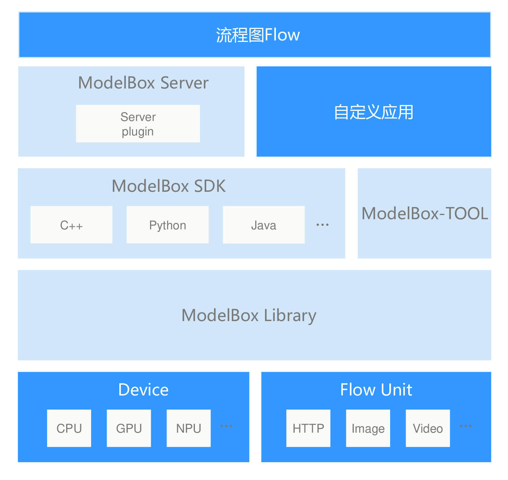

# 开发

本章节开始，将开始介绍如何使用modelbox进行应用的开发。modelbox在设计中以易扩展为目标，在框架多个位置增加了扩展的能力，提供多种编程的模式，以及多语言的支持，以更加灵活的满足应用的实现。

modelbox的扩展能力如下：
1. modelbox服务插件扩展。
2. modelbox组件可任意集成。
3. 推理加速设备支持扩展。
4. 功能单元的扩展及复用。
5. c++，Python，Java等多语言的开发支持。

这些扩展能力将满足应用开发中的大部分需求。对于基本应用开发的场景下，开发者一般只需要关注应用图和功能单元的开发即可；在需要与外部系统交互以响应外部数据处理请求的场景下，则需要对modelbox服务插件进行自定义扩展；当应用需要支持的运行环境含有modelbox未支持的硬件设备时，则需要扩展开发推理加速设备支持模块；当AI应用需要作为组件被集成到其他系统中时，可以直接使用libmodelbox组件提供的API，完成应用的集成；并且modelbox支持多种语言的开发，可以选择擅长使用的语言快速完成应用。

## Modelbox开发套件

modelbox的开发视图如下，图中绿色的部分是开发者可以自定义扩展的部分。

modelbox开发套件包含如下部分：

1. 流程图 Flow

    控制ModelBox执行的过程，默认情况，采用[Graphviz DOT](https://www.graphviz.org/pdf/dotguide.pdf)语言进行流程图设计，开发。

1. modelbox server

    为简化服务化应用开发者的工作量，Modelbox集成了服务功能，modelbox server有完善的服务集成功能，REST-API功能，任务管理功能，并集成了modelbox library，对应用开发者提供了插件扩展的接口，应用开发者只需编写业务需要的插件，即可驱动modelbox和业务控制服务对接。

1. 自定义应用

    与modelbox server对应，如果业务需要更多的定制能力，业务可以直接使用ModelBox SDK提供的接口来驱动modelbox，支持的语言有c++，python。

1. modelbox sdk

    modelbox应用提供的开发API，包含了C++, python等多种语言的支持。开发者可以使用自己熟悉的语言进行集成或扩展。

1. modelbox tool

    modelbox运行，开发支撑工具，可用于检查图的正确性，调试单个图，查询可用的功能单元Flowunit，模型加密等功能。

1. modelbox library

    modelbox核心库，包含了modelbox运行需要的功能，包含内存管理，调度管理，图管理等功能。此核心组件不可定制，开发者直接通过API使用modelbox核心库功能。

1. flowunit

    功能单元，modelbox的关键组成，处理数据关键组件，开发者主要开发的组件。

1. device

    设备支持组件，用于支持特定的硬件，如GPU，NPU等，MODELBOX已经内置了主流的GPU，NPU开发支持。开发者只需要开发相应的功能即可。
