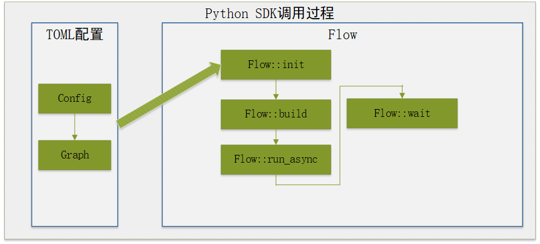

# Python开发流程图

## 当前方式适合哪些场景下使用

此方式适用于python开发者开发流程图。

Python开发调用流程图时，需要安装python的运行包，然后再编写python函数，调用Flow执行API执行流程图。

## Python的API接口

从flow章节中我们知晓了流程图运行的流程，在Python中有对应的函数接口用于处理对应不同的阶段。下面是Python中使用的API列表：

| API接口                                               | 参数说明                                                     | 函数说明                                                     |
| ----------------------------------------------------- | ------------------------------------------------------------ | ------------------------------------------------------------ |

| Flow::init   | configfile: 指定config文件的路径<br />format： 指定图文件的格式，可选项为 FORMAT_AUTO,FORMAT_TOML，FORMAT_JSON | 初始化modelbox服务，主要包含功能如下：<br />1. 读取driver参数，获取driver的扫描路径<br />2. 扫描指定路径下的driver文件，并创建driver实例<br />3. 加载流程图并转换为modelbox可识别的模型<br />4. 初始化设备信息，性能跟踪和数据统计单元 |
| Flow::init   | name: 指定的图的名称<br />graph: 存储图的字符串<br />format：指定图的格式 | 与上面init的区别是，上面通过读取文件的方式，而此函数通过读取字符串的方式，其他功能相同 |
| Flow::init    | config: Configuration指针，存储图信息  | 功能同上                                                     |
| Flow::build() | / | 用于构建图，将图模型转为可以运行的Node节点并且建立好数据通道 |
| Flow::run()    | / | 图的运行： 同步方式，图运行完成后返回  |
| Flow::run_async  | / | 图的运行： 异步运行， 调用后直接返回， wait()函数判断运行是否结束 |
| Flow::wait | millisecond: 超时时间， 以毫秒为单位<br />ret_val: 图运行的结果 | 等待图运行结束，当图的运行时间超过millisecond表示的时间时，则强制停止图的运行，并返回TIMEOUT |
| Flow::stop | / | 强制停止运行中的图 |
| Flow::create_external_data_map   | / | 当图中的第一个节点为input节点时， 使用此函数可以创建一个输入的ExternalDataMap， 用户可以通过向ExternalDataMap数据中赋值并传递数据给Input节点。具体使用方法可参考[外部数据交互](./python.md#外部数据交互)章节 |

## Python SDK API调用说明

Flow流程图接口调用过程如下图所示。



1. 安装python SDK包
1. 开发流程图，配置基础部分和图部分。
1. 调用Flow::init接口，输入流程图文件。
1. 调用Flow::build初始化流程图。
1. 调用Flow::run_async，异步执行流程图。
1. 调用Flow::wait等待结果。

## TOML流程图配置

```toml
[driver]
dir="/usr/local/lib"
[graph]
graphconf = '''digraph demo {
  input[type=input]
  output[type=output]
  process[flowunit=process]

  input->process->output
}'''
format = "graphviz"
```

## 导入modelbox包

编写时，需要导入ModelBox的开发包。

```python
import modelbox
```

## 基本接口

```python
def RunFlow():
    # 指定图文件路径
    flow_file = "/path/to/graph/flow-example.toml"
    flow = modelbox.Flow()

    # 初始化Flow接口
    ret = flow.init(flow_file)
    if ret == False:
        modelbox.error(flow_file + " flow init failed")

    # 创建流程图
    ret = flow.build()
    if ret == False:
        modelbox.error(flow_file + " flow build failed")

    # 异步执行流程图
    ret = flow.run_async()
    if ret == False:
        modelbox.error(flow_file + " flow run async failed")

    # 等待结果
    ret = flow.wait(0)
    if ret != modelbox.Status.StatusCode.STATUS_STOP:
        modelbox.error(flow_file + " flow run failed")
```

* 流程执行流程
    1. 使用flow-example.toml文件中配置的流程图初始化flow， `flow = modelbox.Flow()` 返回一个flow对象， 如何配置流程图详见[流程图开发流程](./flow.md)
    1. `flow.init(flow_file)` 根据配置文件初始化flow对象。
    1. `flow.build()` 开始构建flow对象
    1. `flow.run_async()` 开始异步运行flow
    1. `flow.wait(0)` 等待flow结束，超时时间为0表示无限等待。

## 外部数据交互

* 配置图，图中增加`input`, `output`端口名称。

```toml
digraph demo {
  input[type=input]
  output[type=output]
  process[flowunit=process]

  input->process->output
}
```

* 创建external data对象

```python
    # extern_data 对象
    def init_external_dat():
        extern_data = flow.create_external_data_map()
        return extern_data
```

* 代码发送数据，到`input`端口。

```python
    # 发送数据到图
    def send_external_data(extern_data):
        # 申请内存。
        buffer_list = extern_data.create_buffer_list()
        im_array = np.asarray(img_rgb[:,:])
        buffer_list.push_back(im_array)
        # 将数据发送到"input"。
        extern_data.send("input", buffer_list)
        # 结束输入。
        extern_data.shutdown()
```

* 代码从图中`output`端口接收数据

```python
    # 从图中接收数据
    def recv_flow_data(extern_data):
        out_buffer = extern_data.create_buffer_list()
        # 使用创建的external对象从output接收数据
        while True:
            ret = extern_data.recv(out_buffer)
            if ret != modelbox.Status.StatusCode.STATUS_SUCCESS:
                if ret == modelbox.Status.StatusCode.STATUS_EOF:
                    break

                extern_data.close()
                print("recv data failed", ret)
                break

            result_buffer_list = out_buffer.get_buffer_list("output")

            # 循环处理数据
            for i in range(result_buffer_list.size()):
                aa = result_buffer_list[i]
                np_image = np.array(aa, copy= False)
                image = Image.fromarray(np_image)
                # ....

```

## Python日志

默认情况，ModelBox的SDK输出日志到console，业务需要注册相关的日志处理函数，注册方法可参考[日志章节](../debug/log.md)
