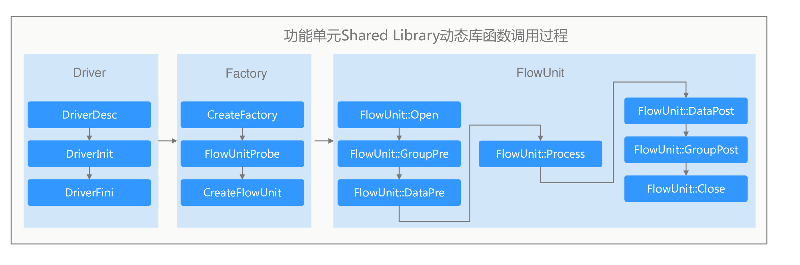

# c++开发流单元

c++开发流单元时，需要预先安装ModelBox的开发包，然后再基于example改造，修改为相应的流单元组件。

样例工程可从源代码目录的`example/flowunit/`中获取，在开发之前，可以从[流单元概念](../../framework-conception/flowunit.md)章节了解流单元的执行过程。

## C++ API调用说明

FlowUnit接口调用过程如下图所示。



FlowUnit开发分为三部分，`Driver`和`Factory`，分别设置插件属性和流单元属性，封装为易于接口，`FlowUnit`为流单元处理对象，三部分的需要实现的功能如下：

| 组件     | 函数                                               | 功能                                 | 是否必须 | 实现功能                                                                                                                                         |
| -------- | -------------------------------------------------- | ------------------------------------ | -------- | ------------------------------------------------------------------------------------------------------------------------------------------------ |
| Driver   | MODELBOX_DRIVER_FLOWUNIT                           | 设置插件属性                         | 是       | Driver属性设置接口，填写插件相关的描述信息，包括，插件名称，插件版本号，插件运行的设备类型，初始化函数，查询的细节描述信息，插件的配置参数列表。 |
| Factory  | MODELBOX_FLOWUNIT                                  | 流单元属性设置接口，并注册到ModelBox | 是       | 填写ModelBox相关的输入，输出端口，参数设置等信息                                                                                                 |
| FlowUnit | FlowUnit::Open<br/>FlowUnit::Close                 | FlowUnit初始化                       | 否       | FlowUnit初始化、关闭，创建、释放相关的资源                                                                                                       |
| FlowUnit | FlowUnit::Process                                  | FlowUnit数据处理                     | 是       | FlowUnit数据处理函数，读取数据数据，并处理后，输出数据                                                                                           |
| FlowUnit | FlowUnit::DataPre<br/>FlowUnit::DataPost           | Stream流数据开始，结束通知           | 部分     | stream流数据开始时调用DataPre函数初始化状态数据，Stream流数据结束时释放状态数据，比如解码器上下文。                                              |
| FlowUnit | FlowUnit::DataGroupPre<br/>FlowUnit::DataGroupPost | 数据组归并开始，结束通知             | 部分     | 数据组归并，结束通知函数，当数据需要合并时，对一组数据进行上下文相关的操作。                                                                     |

### 头文件

编写时，需要先确认设备的类型，确认完成设备类型后，导入对应设备的头文件，例如

| 设备类型 | 头文件                                          | 说明                      |
| -------- | ----------------------------------------------- | ------------------------- |
| cpu      | #include &lt;modelbox/device/cpu.h&gt;          | CPU类型的流单元           |
| cuda     | #include &lt;modelbox/device/cuda.h&gt;         | Nvidia GPU类型的流单元    |
| ascend   | #include &lt;modelbox/device/ascend.h&gt;       | Huawei Ascend类型的流单元 |
| flowunit | #include &lt;modelbox/flowunit_api_helper.h&gt; | 流单元开发接口            |

### 创建模板工程

ModelBox提供了模板创建工具，可以通过**ModelBox Tool**工具产生c++流单元的模板，具体的命令为

```shell
modelbox-tool create -t c++ -n FlowUnitName -d /path/to/flowunit
```

### Driver接口说明

Driver相关的接口，主要用于描述Drvier相关的属性，如Driver名称，版本号，设备类型，描述信息。FlowUnit流单元开发，这里只需修改流单元名称即可。

#### 设置Driver相关属性

```c++
#include "modelbox/flowunit_api_helper.h"

MODELBOX_DRIVER_FLOWUNIT(desc) {
  // 设置插件相关属性
  desc.Desc.SetName(FLOWUNIT_NAME);
  desc.Desc.SetClass(modelbox::DRIVER_CLASS_FLOWUNIT);
  desc.Desc.SetType(modelbox::DEVICE_TYPE);
  desc.Desc.SetVersion(FLOWUNIT_VERSION);
  desc.Desc.SetDescription(FLOWUNIT_DESC);
  desc.Init([]() {
    // driver init function.
    return modelbox::STATUS_OK;
  });
  desc.Exit([]() {
    // driver finish function.
    return modelbox::STATUS_OK;
  });
  return;
}
```

代码从上到下，分别设置Driver命令，类型，设备类型，描述信息，版本号。

如果有需要Driver相关的初始化功能，可以通过通过`desc.Init`, `desc.Exit`设置回调函数。`desc.Init`在插件启用时调用，`desc.Exit`在插件关闭时调用。

### 设置FlowUnit相关属性

ModelBox在编写插件时，需要定义FlowUnit对应的处理函数和设置FlowUnit对应的端口，参数等信息。

#### FlowUnit属性设置

```c++
#include "modelbox/flowunit_api_helper.h"

MODELBOX_FLOWUNIT(SomeFlowUnit, desc) {
  // 设置FlowUnit属性
  desc.SetFlowUnitName("some-flowuint");
  desc.SetFlowType(modelbox::NORMAL);
  desc.AddFlowUnitInput(
      modelbox::FlowUnitInput("input", modelbox::DEVICE_TYPE));
  desc.AddFlowUnitOutput(
      modelbox::FlowUnitOutput("output", modelbox::DEVICE_TYPE));
}
```

设置流单元名称，工作模式，输入及输出的名称、类型。此处可以写多个流单元功能模块的描述，此描述等效于向框架注册流单元的信息，注册后框架扫描到so时，才能够正确按照名称对流单元进行加载。

* `SomeFlowUnit`：对应的插件流单元派生对象，从FlowUnit派生出来的类。
* `MODELBOX_FLOWUNIT`: 一个Driver内部可以注册多个流单元，`MODELBOX_FLOWUNIT`可以设置多个不同的FlowUnit。

### FlowUnit接口说明

流单元的数据处理的基本单元。如果流单元的工作模式是`modelbox::NORMAL`时，流单元会调用`::Open`、`::Process`、`::Close`接口；如果流单元的工作模式是`modelbox::STREAM`时，流单元会调用`::Open`、`::DataGroupPre`、`::DataPre`、`::Process`、`::DataPost`、`::DataGroupPost`、`::Close`接口；用户可根据实际需求实现对应接口。

#### FlowUnit数据处理接口

```c++
class SomeFlowUnit : public modelbox::FlowUnit {
 public:
  modelbox::Status Open(const std::shared_ptr<modelbox::Configuration> &opts) {
    // 流单元打开，读取配置
    return modelbox::STATUS_OK;
  }

  modelbox::Status Close() {
    // 流单元关闭，释放资源
    return modelbox::STATUS_OK;
  }

  modelbox::Status Process(std::shared_ptr<modelbox::DataContext> data_ctx) {
    // 数据处理
    return modelbox::STATUS_OK;
  }

  modelbox::Status DataPre(std::shared_ptr<modelbox::DataContext> data_ctx) {
    // stream流数据处理开始
    return modelbox::STATUS_OK;
  };

  modelbox::Status DataPost(std::shared_ptr<modelbox::DataContext> data_ctx) {
    // stream流数据处理结束
    return modelbox::STATUS_OK;
  };

  modelbox::Status DataGroupPre(std::shared_ptr<modelbox::DataContext> data_ctx) {
    // 数据组处理开始
    return modelbox::STATUS_OK;
  };

  modelbox::Status DataGroupPost(std::shared_ptr<modelbox::DataContext> data_ctx) {
    // stream流数据处理结束
    return modelbox::STATUS_OK;
  };
};
```

注意：Cuda编程的接口，与CPU编程的接口以及Ascend编程的接口稍有不同，具体参考下列编程接口

| 设备   | 说明          | 连接                        |
| ------ | ------------- | --------------------------- |
| Ascend | Huawei Ascend | [链接](../device/ascend.md) |
| Cuda   | Nvidia Cuda   | [链接](../device/cuda.md)   |

#### 流单元初始化、关闭接口

对应需实现的接口为`FlowUnit::Open`、`FlowUnit::Close`，实现样例如下：

```c++
modelbox::Status SomeFlowUnit::Open(
    const std::shared_ptr<modelbox::Configuration> &opts) {
  // 获取流单元配置参数
  auto pixel_format = opts->GetString("pixel_format", "bgr");
  return modelbox::STATUS_OK;
}
```

Open函数将在图初始化的时候调用，`const std::shared_ptr<modelbox::Configuration> &opts`为流单元的配置参数，可调用相关的接口获取配置，返回`modelbox::STATUS_OK`，表示初始化成功，否则初始化失败。

```c++
modelbox::Status Close() {
  return modelbox::STATUS_OK;
}
```

Close函数将在图处理结束时调用，可用于释放相关的资源。

#### 数据处理

对应需实现的接口为`FlowUnit::Process`，实现样例如下：

```c++
modelbox::Status CVResizeFlowUnit::Process(
    std::shared_ptr<modelbox::DataContext> ctx) {
  // 获取输入，输出Buffer对象，"input", "output"为对应流单元Port名称，可以有多个。
  // 此处的"Input"和"Output"必须与toml的端口名称一致
  auto input_bufs = ctx->Input("input");
  auto output_bufs = ctx->Output("output");
  
  // 获取绑定设备，设备在DriverDesc的时候设置的输出buffer设备
  auto device = GetBindDevice();

  // 循环处理每个输入数据，并产生相关的输出结果。
  for (auto &input : *input_bufs) {
      // 获取数据元数据信息
      auto meta = input->Get("Meta", "Default");

      // 获取输入，输出的内存指针。输入为const只读数据，输出为可写入数据。
      auto input_data = input->ConstData();

      // 根据device类型构造buffer
      auto output_buffer = std::make_shared<modelbox::Buffer>(device); 
      
      // 处理数据，下面给出几个例子，根据需要选择对应转换方式
      /* 1. string转成buffer */
      std::string test_str = "test string xxx";
      // 申请内存，单位是字节数
      output_buffer->Build(test_str.size()); 
      // 获取对应类型的buffer指针
      auto output_data = static_cast<char *>(output_buffer->MutableData()); 
      // 拷贝string到buffer中。假设输出为cpu设备，则这里使用cpu内存拷贝
      if(memcpy_s(output_data, output_buffer->GetBytes(), test_str.data(), test_str.size()) != 0 ) {
          MBLOG_ERROR << "cpu memcpy failed, ret " << ret;
          return modelbox::STATUS_FAULT;
      } 

      /* 2. cuda数据拷贝 */
      // 转换为对应类型指针
      auto in_data = static_cast<const unit8_t*>(input_data);
      output_buffer->Build(input->GetBytes())
      // 拷贝string到buffer中。假设输出为cuda设备，则这里需要用cuda显存拷贝
      if(cudaMemcpy(output_buffer, in_data, input_buf->GetBytes(),
                 cudaMemcpyHostToDevice) != 0) {
          MBLOG_ERROR << "cuda memcpy failed, ret " << ret;
          return modelbox::STATUS_FAULT;
      }

      // 设置输出Meta
      output_buffer->Set("Meta", "Meta Data");

      // push到输出bufferlist中
      output_bufs->PushBack(output_buffer);
  }

  return modelbox::STATUS_OK;
```

* Process的返回值说明

| 返回值          | 说明                                                 |
| --------------- | ---------------------------------------------------- |
| STATUS_OK       | 返回成功，将Output中的数据，发送到后续FlowUnit流程。 |
| STATUS_CONTINUE | 返回成功，暂缓发送Output中的数据。                   |
| STATUS_SHUTDOWN | 停止数据处理，终止整个流程图。                       |
| 其他            | 停止数据处理，当前数据处理报错。                     |

#### Stream流数据处理

对应需实现的接口为`FlowUnit::DataPre`、`FlowUnit::DataPost`，此接口Stream模式可按需实现。实现样例如下：

```c++
modelbox::Status VideoDecoderFlowUnit::DataPre(
    std::shared_ptr<modelbox::DataContext> data_ctx) {
  // 获取Stream流元数据信息
  auto stream_meta = data_ctx->GetInputMeta("Stream-Meta");

  // 初始化Stream流数据处理上下文对象。
  auto decoder = CreateDecoder(stream_meta);

  // 保存流数据处理上下文对象。
  data_ctx->SetPrivate("Decoder", decoder);
  return modelbox::STATUS_OK;
}

modelbox::Status CVResizeFlowUnit::Process(
    std::shared_ptr<modelbox::DataContext> ctx) {
  // 获取流数据处理上下文对象。
  auto decoder = data_ctx->GetPrivate("Decoder");
  auto inputs = ctx->Input("input");
  auto outputs = ctx->Output("output");

  // 处理输入数据。
  decoder->Decode(inputs, outputs);

  return modelbox::STATUS_OK;
}

modelbox::Status VideoDecoderFlowUnit::DataPost(
    std::shared_ptr<modelbox::DataContext> data_ctx) {
  // 关闭解码器。
  auto decoder = data_ctx->GetPrivate("Decoder");
  decoder->DestroyDecoder();
  return modelbox::STATUS_OK;
}

```

#### 拆分合并处理

对应需实现的接口为`FlowUnit::DataGroupPre`、`FlowUnit::DataGroupPost`，假设需要统计视频流中每一帧有几个人脸，和整个视频文件所有人脸数量，实现样例如下：

```c++
modelbox::Status VideoDecoderFlowUnit::DataGroupPre(
    std::shared_ptr<modelbox::DataContext> data_ctx) {
  // 创建整个视频流计数
  uint64_t stream_count = 0;
  data_ctx->SetPrivate("stream_count", stream_count);
  return modelbox::STATUS_OK;
}

modelbox::Status VideoDecoderFlowUnit::DataPre(
    std::shared_ptr<modelbox::DataContext> data_ctx) {
  // 创建当前帧的人脸计数
  uint64_t frame_count = 0;
  data_ctx->SetPrivate("frame_count", frame_count);
  return modelbox::STATUS_OK;
}

modelbox::Status CVResizeFlowUnit::Process(
    std::shared_ptr<modelbox::DataContext> ctx) {
  // 获取流数据处理上下文对象
  auto inputs = ctx->Input("input");
  auto outputs = ctx->Output("output");

  auto stream_count = std::static_pointer_cast<uint64_t>(data_ctx->GetPrivate("stream_count"));
  auto frame_count = std::static_pointer_cast<uint64_t>(data_ctx->GetPrivate("frame_count"));
  
  ++frame_count;
  ++stream_count;

  return modelbox::STATUS_OK;
}

modelbox::Status VideoDecoderFlowUnit::DataPost(
    std::shared_ptr<modelbox::DataContext> data_ctx) {
  // 打印当前帧人脸计数
  auto stream_count = std::static_pointer_cast<uint64_t>(data_ctx->GetPrivate("frame_count"));
  MBLOG_INFO << "frame face total is " << frame_count;
  return modelbox::STATUS_OK;
}

modelbox::Status VideoDecoderFlowUnit::DataGroupPost(
    std::shared_ptr<modelbox::DataContext> data_ctx) {
  // 打印视频流的人脸计数
  auto stream_count = std::static_pointer_cast<uint64_t>(data_ctx->GetPrivate("stream_count"));
  MBLOG_INFO << "stream face total is " << stream_count;
  return modelbox::STATUS_OK;
}
```

### 编译安装

生成的c++流单元模板中包含CMakeLists.txt文件，主要流程如下：

1. 设置流单元名称
1. 链接流单元所需头文件
1. 链接流单元所需库
1. 设置编译目标为动态库
1. 指定流单元安装目录

需要特殊说明的是编译生成的so命名需要`libmodelbox-`开头，否则ModelBox无法扫描到。
