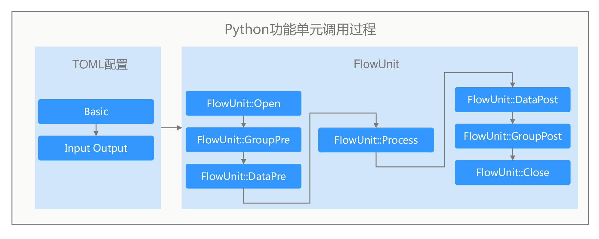

# Python开发功能单元

Python开发功能单元时，需要预先安装ModelBox的运行包， 可参考[编译安装章节](../../get-start/compile.md#安装命令说明)，
在开发之前，可以从[功能单元概念](../../framework-conception/flowunit.md)章节了解流单的执行过程。

## Python API调用说明

Python FlowUnit接口调用过程如下图所示。



FlowUnit开发分为两部分，一部分是`TOML配置`, 一部分是`FlowUnit`代码，用户需要实现如下接口和配置：

|组件|函数|功能|是否必须|实现功能|
|--|--|--|--|--|
|TOML配置|base.*|设置Python插件基本属性|是|填写Python插件相关的描述信息，包括，插件名称，插件版本号，插件运行的设备类型，查询的细节描述信息，以及插件的Python入口信息。|
|TOML配置|config.*|配置参数|是|可以自定义增加功能单元配置参数|
|TOML配置|input.* <br/> output.*|输入，输出端口属性|是|用于描述插件的输入，输出端口个数，名称，类型|
|FlowUnit|FlowUnit::Open<br/>FlowUnit::Close|FlowUnit初始化|否|FlowUnit初始化、关闭，创建、释放相关的资源|
|FlowUnit|FlowUnit::Process|FlowUnit数据处理|是|FlowUnit数据处理函数，读取数据数据，并处理后，输出数据|
|FlowUnit|FlowUnit::DataPre<br/>FlowUnit::DataPost|Stream流数据开始，结束通知|部分|Stream流数据开始时调用DataPre函数初始化状态数据，Stream流数据结束时释放状态数据，比如解码器上下文。|
|FlowUnit|FlowUnit::DataGroupPre<br/>FlowUnit::DataGroupPost|数据组归并开始，结束通知|部分|数据组归并，结束通知函数，当数据需要合并时，对一组数据进行上下文相关的操作。|

### Python功能单元目录结构

python功能单元需要提供独立的toml配置文件，指定python功能单元的基本属性。一般情况，目录结构为：

```shell
[FlowUnitName]
     |---[FlowUnitName].toml
     |---[FlowUnitName].py
     |---xxx.py
```

### 创建模板代码

ModelBox提供了模板创建工具，可以通过**ModelBox Tool**工具产生python功能单元的模板，具体的命令为

```shell
modelbox-tool create -t python -n FlowUnitName -d ./ProjectName/src/flowunit
```

ModelBox框架在初始化时，会扫描/path/to/flowunit/[FlowUnitName]目录中的toml后缀的文件，并读取相关的信息，具体可通过**ModelBox Tool**工具查询。

### TOML配置

```toml
# 基础配置
[base]
name = "FlowUnit-Name" # 功能单元名称
device = "cpu" # 功能单元运行的设备类型，python 功能单元仅支持cpu类型。
version = "x.x.x" # 功能单元组件版本号
description = "description" # 功能单元功能描述信息
entry = "python-module@SomeFlowunit" # python 功能单元入口函数
type = "python" # Python功能单元时，此处为固定值

# 工作模式
stream = false # 是否数据功能单元
condition  = false # 是否条件功能单元
collapse = false # 是否合并功能单元
collapse_all = false # 是否合并所有数据
expand = false # 是否拆分功能单元

# 默认配置值
[config]
item = value

# 输入端口描述
[input]
[input.input1] # 输入端口编号，格式为input.input[N]
name = "Input" # 输入端口名称
type = "datatype" # 输入端口数据类型

# 输出端口描述
[output]
[output.output1] # 输出端口编号，格式为output.output[N]
name = "Output" # 输出端口名称
type = "datatype" # 输出端口数据类型
```

### 头文件

编写时，需要先确认设备的类型，确认完成设备类型后，导入对应设备的头文件，例如

```python
import _flowunit as modelbox
```

### 基本接口

```python
import _flowunit as modelbox
from PIL import Image  

class SomeFlowunit(modelbox.FlowUnit):
    # 派生自modelbox.FlowUnit
    def __init__(self):
        super().__init__()

    def open(self, config):
        # 打开功能单元，获取配置信息
        return modelbox.Status.StatusCode.STATUS_SUCCESS

    def process(self, data_context):
        # 数据处理
        return modelbox.Status.StatusCode.STATUS_SUCCESS

    def close(self):
        # 关闭功能单元
        return modelbox.Status()

    def data_pre(self, data_context):
        # stream流数据开始
        return modelbox.Status()

    def data_post(self, data_context):
        # stream流数据结束
        return modelbox.Status()

    def data_group_pre(self, data_context):
        # 数据组开始
        return modelbox.Status()

    def data_group_post(self, data_context):
        # 数据组结束
        return modelbox.Status()
```

### FlowUnit接口说明

功能单元的数据处理的基本单元。如果功能单元的工作模式是`stream = false`时，功能单元会调用`open`、`process`、`close`接口；如果功能单元的工作模式是`stream = true`时，功能单元会调用`open`、`data_group_pre`、`data_pre`、`process`、`data_post`、`data_group_post`、`close`接口；用户可根据实际需求实现对应接口。

#### 功能单元初始化、关闭接口

对应的需要实现的接口为`open`, `close`接口，实现样例如下：

```python
    def open(self, config):
        # 打开功能单元，获取配置信息。

        # 获取用户配置。
        config_item = config.get_float("config", "default")

        # 初始化公共资源。
        # 返回初始化结果。
        return modelbox.Status.StatusCode.STATUS_SUCCESS

    def close(self):
        # 关闭功能单元，返回关闭结果。
        return modelbox.Status.StatusCode.STATUS_SUCCESS
```

返回`modelbox.Status.StatusCode.STATUS_SUCCESS`，表示初始化成功，否则初始化失败。

#### 数据处理

对应的需要实现的接口为`process`接口，实现样例如下：

```python
    def process(self, data_context):
        # 获取输入，输出控制对象。
        # 此处的"Input"和"Output"必须与toml的端口名称一致
        inputs = data_context.input("Input")
        outputs = data_context.output("Output")

        # 循环处理每一个input输入
        for buffer in inputs:
            np_in_data = np.array(buffer, copy= False)
            np_out_data = process_data(np_in_data)
            out_buffer = self.create_buffer(np_out_data)
            out_buffer.set("brightness", self.__brightness)
            outputs.push_back(out_buffer)

        return modelbox.Status.StatusCode.STATUS_SUCCESS
```

* Process接口处理流程大致如下：
    1. 从context中获取Input输入，Output输出对象，参数为Port名称。
    1. 循环处理每一个inputs数据。
    1. 将input数据转换为numpy对象，并编写process_data函数。
    1. 将process_data结果返回的output numpy数据调用self.create_buffer，转换为buffer。
    1. 设置output buffer的meta信息。
    1. 将output放入outputs结果集中。
    1. 返回处理结果。
* Process的返回值说明

|返回值|说明|
|--|--|
|STATUS_OK|返回成功，将Output中的数据，发送到后续FlowUnit流程。|
|STATUS_CONTINUE|返回成功，暂缓发送Output中的数据。|
|STATUS_SHUTDOWN|停止数据处理，终止整个流程图。|
|其他|停止数据处理，当前数据处理报错。|

#### Stream流数据处理

对应需实现的接口为`data_pre`、`data_post`，此接口Stream模式可按需实现。实现样例如下：

```python
    def data_pre(self, data_ctx):
        # 获取Stream流元数据信息
        stream_meta = data_ctx.get_input_meta("Stream-Meta")

        # 初始化Stream流数据处理上下文对象。
        decoder = self.CreateDecoder(stream_meta)

        # 保存流数据处理上下文对象。
        data_ctx.SetPrivate("Decoder", decoder)
        return modelbox.Status.StatusCode.STATUS_SUCCESS

    def process(self, data_ctx):
        # 获取流数据处理上下文对象。
        decoder = data_ctx.GetPrivate("Decoder")
        inputs = data_ctx.input("Input")
        outputs = data_ctx.output("Output")

        # 处理输入数据。
        decoder.Decode(inputs, outputs)
        return modelbox.Status.StatusCode.STATUS_SUCCESS

    def data_post(self, data_ctx):
        # 关闭解码器。
        decoder = data_context.GetPrivate("Decoder")
        decoder.DestroyDecoder()
        return modelbox.Status.StatusCode.STATUS_SUCCESS
```

#### 拆分合并处理

对应需实现的接口为`data_group_pre`、`data_group_post`，假设需要统计视频流中每一帧有几个人脸，和整个视频文件所有人脸数量，实现样例如下：

```python
    def data_group_pre(self, data_ctx):
        # 创建整个视频流计数
        stream_count = 0
        data_ctx.SetPrivate("stream_count", stream_count)

        return modelbox.Status.StatusCode.STATUS_SUCCESS

    def data_pre(self, data_ctx):
        # 创建当前帧的人脸计数
        frame_count = 0
        data_ctx.SetPrivate("frame_count", frame_count)
        return modelbox.Status.StatusCode.STATUS_SUCCESS

    def process(self, data_ctx):
        # 获取流数据处理上下文对象
        inputs = data_ctx.input("Input")
        outputs = data_ctx.output("Output")

        stream_count = data_ctx.GetPrivate("stream_count")
        frame_count = data_ctx.GetPrivate("frame_count")

        return modelbox.Status.StatusCode.STATUS_SUCCESS

    def data_post(self, data_ctx):
        # 打印当前帧人脸计数
        frame_count = data_context.GetPrivate("frame_count")
        print("frame face total is ", frame_count)
        return modelbox.Status.StatusCode.STATUS_SUCCESS

    def data_group_post(self, data_ctx):
        # 打印视频流的人脸计数
        stream_count = data_context.GetPrivate("stream_count")
        print("stream face total is ", stream_count)
        return modelbox.Status.StatusCode.STATUS_SUCCESS
```
