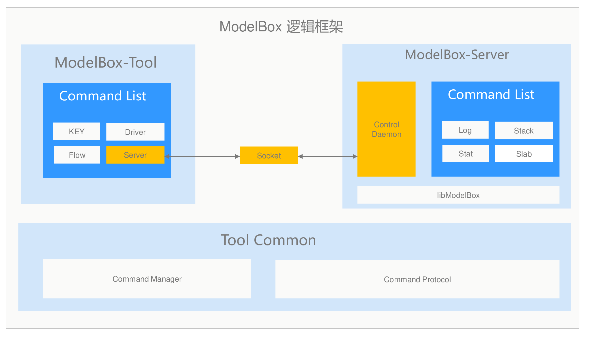

# ModelBox Tool

ModelBox Tool是ModelBox套件集成的一个开发、维护工具，提供了开发、维护的常用命令。

在功能上，ModelBox Tool包含了如下功能

| 功能   | 功能说明                             |
| ------ | ------------------------------------ |
| Driver | 查看Driver列表及其功能               |
| Flow   | 快速运行一个流程，快速验证           |
| Key    | 密码加解密，模型加解密               |
| Server | 查看Log，Stack，Slab和Statistics信息 |

ModelBox为标准的命令行工具，可以使用`modelbox-tool -h`查看详细的帮助说明

## Driver功能

用于查询ModelBox Driver相关的信息。

此命令组为`modelbox-tool driver`

### 查询可用流单元

在开发过程中，可能需要查询图中需要的插件报列表，这时ModelBox Tool可以用于查询当前图的情况。

此命令组为`modelbox-tool driver action [options]`

* 查询当前系统中已经安装可用的流单元：

    ```shell
    modelbox-tool driver -info
    ```

* 查询指定图使用的流单元

    ```shell
     modelbox-tool driver -info -conf [path/to/graph.conf]
    ```

### 查询具体流单元的功能

如需要查询具体流单元的功能说明，输入，输出名称和选项设置，可以用ModelBox Tool查询详细参数。

此命令组为`modelbox-tool driver -info -details [-name name]`

* 查询当前系统中可用流单元的详细信息：

    ```shell
    modelbox-tool driver -info -details
    ```

* 查询指定名称的流单元详细信息

    ```shell
    modelbox-tool driver -info -details -name [name]
    ```

## Flow功能

流程图相关的功能，用于测试，验证图是否配置正确。

此命令组为`modelbox-tool flow`

### 运行调测流程图

在开发过程中，可能需要临时调试图以及对应的流单元，这时，可以使用`modelbox-tool flow`命令组的命令。

* 执行图

    ```shell
    modelbox-tool flow -run [path/to/graph.conf]
    ```

工具执行后的运行日志，存储在`/var/log/modelbox/modelbox-tool.log`中。如果需要修改日志级别，或将日志输出到屏幕上，可参考后续章节的内容。

## Key功能

key功能包括了模型加解密，密码加密等功能。

此命令组为`modelbox-tool key`

### 密码加密

某些情况，需要对存储在本地文件，或图中的密码等敏感信息，加密。

* 键盘输入密码：

    ```shell
    modelbox-tool key -pass
    ```

* 标准输入输入密码：

    ```shell
    modelbox-tool key -pass < pass_file
    ```

    ```shell
    modelbox-tool key -pass <<EOF
    pass
    EOF
    ```

* 环境变量输入密码加密

    ```shell
    MODELBOX_PASSWORD="pass" modelbox-tool key -pass
    ```

注意

1. 默认情况下，加密的密码和设备绑定，若需要和设备无关，则需要增加`-n`参数。
1. 密码安全性上，键盘输入最可靠，其次是标准输入，环境变量形式不推荐。
1. 编程接口，可以使用popen执行命令，然后write密码到管道中。

### 模型加密

如需要对模型文件进行加密，则可以使用`modelbox-tool key -model`命令组对模型文件进行加密。

* 对指定模型文件进行加密

```shell
modelbox-tool key -model [path/to/model]
```

执行后，输入密码，工具加密后，会输出加密文件，以及加密密钥。

注意：

1. 默认情况下，加密的密码和设备绑定，若需要和设备无关，则需要增加`-n`参数。
1. 模型安全性上，并不能确保模型文件100%不被获取到明文，为保证模型的安全性，应该从系统角度考虑安全性。具体可参考推理功能单元的说明。

## Server功能

查看Log，Stack，Slab和Statistics信息。

此命令组为`modelbox-tool server`



### Log

查看Control线程的日志
此命令组为`modelbox-tool server log`

### Stack

查看Control线程的栈信息
此命令组为`modelbox-tool server stack`

### Slab

查看Control线程的内存碎片
此命令组为`modelbox-tool server slab`

### Statistics

查看Control线程的统计信息
此命令组为`modelbox-tool server stat`

## ModelBox Tool日志设置

ModelBox Tool可以支持修改日志级别，输出形式，和日志文件路径，在执行命令时，可以通过如下参数修改

```shell
modelbox tool main options:
  -verbose      output log to screen.
  -log-level    log level: DEBUG, INFO, NOTICE, WARN, ERROR, FATAL.
  -log-path     log file: default : /var/log/modelbox/modelbox-tool.log
```

注意，使用时，上述参数需要紧接`modelbox-tool`命令后，不能放到子命令组阶段，如

```shell
modelbox-tool -verbose flow -run [/path/to/graph.conf]
```

### 参数说明

| 参数       | 功能说明                                                    |
| ---------- | ----------------------------------------------------------- |
| -verbose   | 是否将日志输出到屏幕                                        |
| -log-level | 输出日志级别，可以为debug, info, notice, warn, error, fatal |
| -log-path  | 输出日志文件，默认为`/var/log/modelbox/modelbox-tool.log`       |
