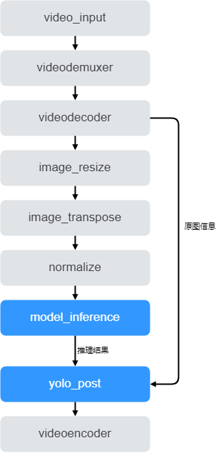

# 车辆检测

车辆检测案例是对输入视频进行解码，对每一帧图片进行车辆检测，将结果渲染成视频。

## 功能

输入本地视频文件，识别画面中的车辆，识别结果保存到本地。

## 模型准备

AI应用开发前需要准备好匹配当前modelbox版本支持的推理框架和版本的模型文件，这里已经准备好车辆检测torch模型文件。

## AI应用开发

首先准备开发环境，然后进入应用开发环节，主要分为流程图编排、功能单元编写、运行与调试、打包部署4个开发步骤。

### 环境准备

环境准备工作可以参考[环境准备](./hello-world.md###环境准备)，区别是需要选择torch镜像：

```shell
docker pull modelbox/modelbox-develop-libtorch_1.9.1-cuda_10.2-ubuntu-x86_64:latest
```

### 创建项目

可参考[创建项目](./hello-world.md)，最后可选择创建car_detction项目工程。

### 流程图开发



如上图所示，video_input功能单元用作输入视频配置，后面接视频的解封装、解码功能单元(videodemuxer、videodecoder)得到视频帧，对视频帧进行预处理(reisze、transpose、normalize)，将预处理后的数据交给模型推理(model_inference)，推理后进行后处理，画出检测框渲染到图像上(yolo_post)，最后将渲染结果图编码成视频文件(videoencoder)。整个流程只需要实现蓝色部分功能单元，其他功能单元都在modelbox中内置，只需修改配置即可使用。具体toml配置文件如下所示：

```toml
[graph]
format = "graphviz"
graphconf = """digraph car_detection {
    node [shape=Mrecord]
    video_input[type=flowunit, flowunit=video_input, device=cpu, deviceid=0, source_url="/opt/modelbox/demo/video/car_test_video.mp4"]
    videodemuxer[type=flowunit, flowunit=video_demuxer, device=cpu, deviceid=0]
    videodecoder[type=flowunit, flowunit=video_decoder, device=cuda, deviceid=0, pix_fmt=bgr]
    image_resize[type=flowunit, flowunit=resize, device=cpu, deviceid=0, image_width=512, image_height=288]
    image_transpose[type=flowunit, flowunit=packed_planar_transpose, device=cpu, deviceid=0]
    normalize[type=flowunit, flowunit=normalize, device=cpu, deviceid=0, standard_deviation_inverse="1,1,1"]
    model_inference[type=flowunit, flowunit=car_detect, device=cuda, deviceid=0, batch_size=1]
    yolox_post[type=flowunit, flowunit=yolox_post, device=cpu, deviceid=0]
    videoencoder[type=flowunit, flowunit=video_encoder, device=cpu, deviceid=0, encoder=mpeg4, format=mp4, default_dest_url="/tmp/car_detection_result.mp4"]

    video_input:out_video_url -> videodemuxer:in_video_url
    videodemuxer:out_video_packet -> videodecoder:in_video_packet
    videodecoder:out_video_frame -> image_resize:in_image
    image_resize:out_image -> image_transpose:in_image
    image_transpose:out_image -> normalize:in_data
    normalize:out_data -> model_inference:input
    model_inference:output -> yolox_post:in_feat
    videodecoder:out_video_frame -> yolox_post:in_image
    yolox_post:out_data -> videoencoder:in_video_frame
}"""
```

除了构建图之外，还需要增加必要配置，如功能单元扫描路径，日志级别等，具体可参考样例文件`/usr/local/share/modelbox/demo/car_detection/graph/car_detection.toml`

### 功能单元开发

用户只需开发车辆检测推理功能单元(model_inference)、后处理(yolo_post)即可。

* 车辆检测推理功能单元

 ModelBox已经适配了torch推理引擎，只需推理功能单元只需准备好模型和对应的配置文件即可。

 ```toml
 [base]
 name = "car_detect"
 device = "cuda"
 version = "1.0.0"
 description = "car detection infer"
 entry = "./yolox_nano_jit_trace_288x512.pt"
 type = "inference"
 virtual_type = "torch"
 
 [input]
 [input.input1]
 name = "input"
 type = "float"
 
 [output]
 [output.output1]
 name = "output"
 type = "float"
 ```

 详细代码可参考`/usr/local/share/modelbox/demo/car_detection/flowunit/car_detect/car_detect.toml`。

* 车辆检测后处理功能单元(yolo_post)

 详细代码可参考`/usr/local/share/modelbox/demo/car_detection/flowunit/yolox_post`。

### 调试运行

本案例是测试本地视频文件，可以视频路径可以在video_input中设置。所以直接使用modelbox-tool测试工具运行流程图即可

```shell
modelbox-tool -verbose -log-level info flow -run path_to_car_detection.toml
```

ModelBox镜像已集成样例，可直接运行`modelbox-tool -log-level info flow -run /usr/local/share/modelbox/demo/car_detection/graph/car_detection.toml`。

### 编译打包

进入build目录，执行`make package`，根据系统版本可得到rpm/deb安装包。
