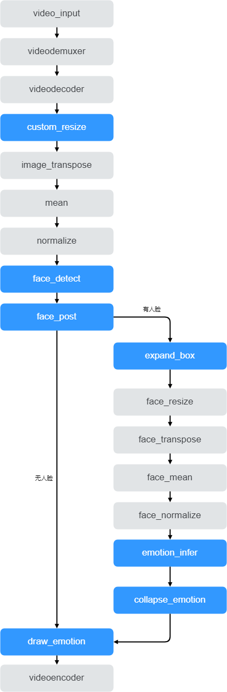

# 表情识别

表情识别案例是对输入视频进行解码，然后对每一帧图片进行人脸检测，如果检测到人脸，则识别人脸表情，最后将结果渲染成视频。

## 功能

输入本地视频文件，识别画面中的人脸表情，并将识别结果保存到本地。

## 模型准备

AI应用开发前需要准备好匹配当前modelbox版本支持的推理框架和版本的模型文件，这里已经准备好人脸检测，表情识别两个torch模型文件。

## AI应用开发

首先准备开发环境，备好了之后进入应用开发环节，主要分为流程图编排、功能单元编写、运行与调试、打包部署4个开发步骤。

### 环境准备

环境准备工作可以参考[环境准备](./hello-world.md###环境准备)，区别是需要选择torch镜像：

```shell
docker pull modelbox/modelbox-develop-libtorch_1.9.1-cuda_10.2-ubuntu-x86_64:latest
```

### 创建项目

可参考[创建项目](./hello-world.md)，最后可选择创建emotion_detction项目工程。

### 流程图开发



如上图所示，video_input功能单元用作输入视频配置，后面接视频的解封装、解码功能单元(videodemuxer、videodecoder)得到视频帧，后续需要进行两次模型推理。首先检测视频帧中有没有人脸，若有人脸则进行表情识别；若无人脸则跳过表情识别。对视频帧进行预处理(custom_reisze、transpose、normalize)，将预处理后的数据交给模型推理(model_inference)，推理后进行后处理，画出检测框渲染到图像上(yolo_post)，最后将渲染结果图编码成视频文件(videoencoder)。整个流程只需要实现蓝色部分功能单元，其他功能单元都在modelbox中内置，只需修改配置即可使用。具体toml配置文件如下所示：

### 功能单元开发


### 调试运行

### 编译打包
