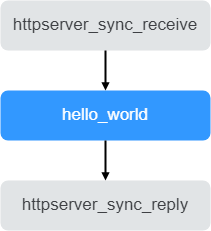

# Hello World

Hello World案例是用使用ModelBox搭建一个简易的http请求服务，给收入消息加上时间戳返回。

## 功能

启动一个HTTP Server监听端口接收http请求，然后从请求体中的msg获取输入消息，将首字母转换为大写并加上时间戳返回给用户。

Request 请求样例：

```json
{
    "msg": "hello world!"
}
```

Response 响应：

```json
Hello World! Thu May 30 12:00:00 2022
```

## AI应用开发

### 环境准备

环境准备可以使用现成ModleBox镜像，也可以从源代码构建ModelBox。本章节使用现成ModelBox镜像开发，如果没有相关的镜像，可以参考[编译安装](../environment/compile.md)。

使用镜像开发，省去了准备复杂编译环境的巨大工作量，推荐ModelBox开发者直接使用镜像开发，ModelBox镜像相关的指导，可以先参考[容器使用](../environment/container-usage.md)章节。

1. 安装启动docker后，执行下列命令下载docker镜像

    ```shell
    docker pull modelbox/modelbox-develop-tensorrt_7.1.3-cuda_10.2-ubuntu-x86_64:latest
    ```

1. 配置并启动容器

    可采用一键式脚本快速进入容器。参考[一键式启动脚本](../environment/container-usage.md)相关内容。

### 创建项目

1. 进入容器并且切换至ModelBox开发者模式

    ```shell
    modelbox-tool develop -s
    ```

   注意事项：
    * 如果需要通过可视化UI进行图的编排，可参考[可视化编排服务](../tools/editor/editor.md)章节访问`http://[host]:[EDITOR_MAP_PORT]/editor/`地址；
    * 如果访问被拒绝，可参考[运行编排服务](../tools/editor/editor.md)中的[访问控制列表](../tools/editor/editor.md#访问控制列表)相关内容。

1. 连接ModelBox编排服务

    服务启动后，可直接链接编排服务，服务启动信息可通过如下命令查询：

    ```shell
    modelbox-tool develop -q
    ```

    浏览器访问上述地址的1104端口，注意事项：
    * 如有权限问题，修改conf/modelbox.conf配置文件中的acl.allow数组，增加允许访问的IP范围。
    * 推荐使用vscode的远程链接的终端操作，vscode可以自动建立端口转发。[远程开发](https://code.visualstudio.com/docs/remote/ssh)

1. 创建项目工程

    * 点击任务编排
    * 点击项目->新建项目，
    * 新建项目：
      * 输入创建项目的名称:`hello-world`
      * 路径: `/home/[user]`
      * 项目模板为: `hello world`

    创建出的文件夹说明可参考[工程目录](../use-modelbox/modelbox-app-mode/create-project.md#工程目录)。

### 流程图开发

流程图编排是根据实际情况将现有业务逻辑拆分为N个功能单元，再将功能单元串联成一个完整的业务的过程。有两种方式可编排流程图，第一种是使用UI进行可视化UI编排，第二种是直接编写图文件。具体可参考[流程图开发章节](../flow/flow.md#流程图开发及运行)。这里采用第二种方式。



如上图所示，根据业务流程，可将业务划分为3个功能单元，分别为接收http请求，hello world处理，发送http响应。对用图编排文件如下：

```toml
[graph]
format = "graphviz"
graphconf = '''digraph hello_world_diagraph {
    node [shape=Mrecord]
    httpserver_sync_receive[type=flowunit, flowunit=httpserver_sync_receive, device=cpu, time_out_ms=5000, endpoint="http://0.0.0.0:7770", max_requests=100]
    hello_world[type=flowunit, flowunit=hello_world, device=cpu]
    httpserver_sync_reply[type=flowunit, flowunit=httpserver_sync_reply, device=cpu]

    httpserver_sync_receive:out_request_info -> hello_world:in_data
    hello_world:out_data -> httpserver_sync_reply:in_reply_info
}
```

除了构建图之外，还需要增加必要配置，如功能单元扫描路径，日志级别等，具体可参考样例文件`/usr/local/share/modelbox/demo/hello_world/graph/hello_world.toml`。

### 功能单元开发

ModelBox提供基础预置功能单元，除此之外还需补充流程图中缺失的功能单元，具体开发可参考[功能单元开发章节](../../develop/flowunit/flowunit.md#功能单元开发)。

这里接收http请求、发送http响应两个功能单元ModelBox已提供，我们只需实现hello world处理功能单元即可。

* hellworld功能单元
  
  解析收到的http请求，将首字母转换为大写并加上时间戳。

  ```python
  in_data = data_context.input("in_data")
  out_data = data_context.output("out_data")

  for buffer in in_data:
      # parse request body
      request_body = json.loads(buffer.as_object().strip(chr(0)))
      msg = request_body.get("msg")
      msg = msg.title()
      msg = addTimestamp(msg)

      # build output buffer
      out_string = msg + chr(0)
      out_buffer = modelbox.Buffer(self.get_bind_device(), out_string.encode('utf-8').strip())
      out_data.push_back(out_buffer)
  ```

  详细代码可参考`/usr/local/share/modelbox/demo/hello_world/flowunit/hello_world/hello_world.py`。

### 调试运行

首先需要把http服务运行起来，然后再模拟请求测试。

* 运行流程图

  执行如下命令即可启动hellw world识别http服务：

  ``` shell
  modelbox-tool -log-level info flow -run path_to_mnist.toml
  ```

  由于ModelBox库已集成样例，可直接运行`modelbox-tool -log-level info flow -run /usr/local/share/modelbox/demo/hello_world/flowunit/hello_world/hello_world.py`。

* 测试

  可以使用已经准备好测试脚本`/usr/local/share/modelbox/demo/hello_world/graph/test_hello_world.py`。

  直接运行`python3 test_hello_world.py`得到结果为：

  ``` json
  Hello World! Thu May 30 12:00:00 2022
  ```

  也可以在UI界面中进行API测试。

### 编译打包

进入build目录，执行`make package`，根据系统版本可得到rpm/deb安装包。
