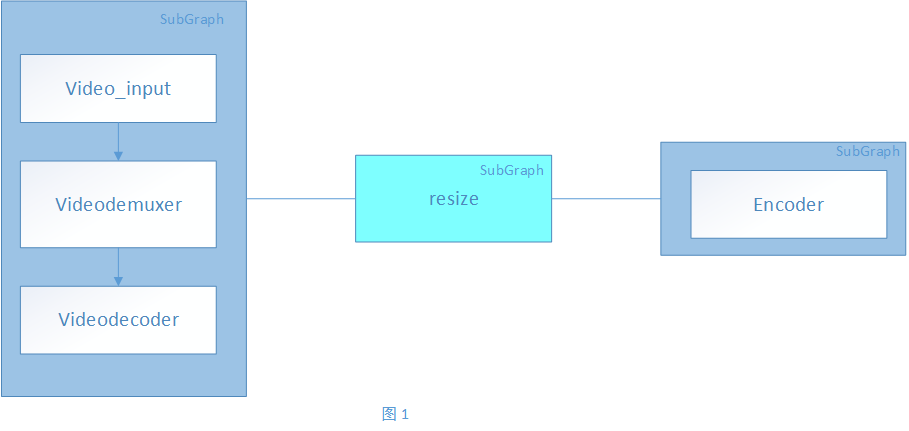
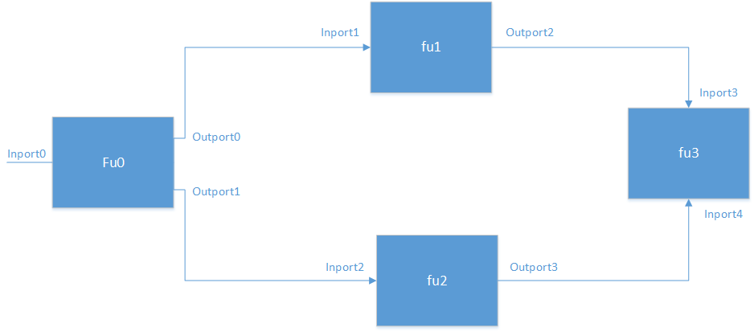
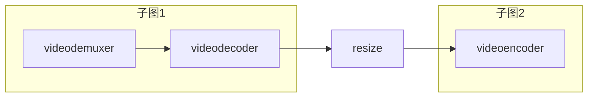

# Modelbox API模式使用指南

## 实现原理

Modelbox是一种基于静态图实现的推理框架，需要用户在服务运行前实现flowunit流算子以及创建好标识流单元连接关系的图，之后可以运行具体的业务。 对于习惯了使用编程语言的开发者来讲，学习和调试成本都比较高。为了降低开发者的学习成本， modelbox推出了API模式用于服务的前期开发和调试，在所有功能调试完毕后可以将其功能需要较少的工作量就可以转换为静态图。

API模式的实现与静态图最大的区别是开发者可以任意的定制子图和功能单元， 不必将功能单元转换为流算子就可以执行，而且在过程中可以方便的获取到中间数据，提高开发者的调试效率。静态图与API模式的对比如下：

| 对比项 | 静态图 | API模式 |
| :------: | :------: | :-------: |
| 使用流算子之外的能力 | × | √ |
| 代码调试 | × | √ |
| 运行效率 | 高 | 低 |

为了便于调试， API模式中引入了子图的概念， 子图与静态图类似，最大的区别在于子图不一定是一个功能完整的图， 可能只是图的一部分。 子图需要开发者告诉程序哪里是子图的开始， 哪里是子图的最后一个节点， 当子图的最后一个节点加入并且输入数据也已经填充就可以执行了， 子图的输出是一个DataHandler对象，里面存储了输出的Buffer以及meta信息， 开发者可以根据对应的函数接口获取其中的数据或者将其作为参数传递给其他的功能模块（比如下一个子图）。在API模式中有一种特殊的子图， 它的生命周期和函数相同，开发者可以把它作为函数使用，这种子图中含有的流算子全部都是normalize类型， 为了方便也可以将这种子图封装为一个函数使用。

图1中的例子表示了一个功能演示， 该功能中包含了三个子图。

子图1中包含了三个流算子： video_input, videodemuxer和videodecoder

子图2只包含了一个流算子： resize

子图3也只包含了一个流算子： encoder

在子图中间开发者可以根据业务状况对于子图1和子图2 的输出进行任意的更改，将修改后的数据再传入子图2和子图3. 再功能调试通过之后，开发者可以将中间功能的修改封装成一个流算子直接转为静态图运行。这样每调试完一个功能模块都可以转换为流算子，大大降低了开发者功能调试的难度。



### 接口和数据结构

API模式对外暴露的接口主要有两个： ModelBoxEngine和DataHandler。

ModelBoxEngine作为执行类，和API模式相关的执行接口都是在此类中实现， 其重要接口如下：

| 函数接口      | 参数 | 返回值 | 函数作用 |
| --------| -------- | ------- | -------- |
| ModelBoxEngine.init| 参数有两种：<br />1. 支持键值对传入 <br />2. 支持Configuration对象的传入 | Status： 判断是否初始化成功 | 初始化Modelbox资源|
| ModelBoxEngine.create_input | port_name: 端口名称| datahandler对象| 创建一个用于输入的数据句柄，指定对应端口的名称，可以指定一个或者多个端口，也可以不指定，不指定的话就默认其后面连接的端口名（连接的流单元只有一个输入端口） |
| ModelBoxEngine.execute      | name: 流单元的名称</br> config:流单元的配置参</br> data :输入数据 | DataHandler: 输出数据       | 执行函数，主要有下面几种功能：<br />1. 连接流算子，执行构图构成<br />2. 执行功能函数， 输出执行结果<br />3. 运行子图， 输出子图执行结果 |
| ModelBoxEngine.close        | NULL                                                         | NULL                        | 关闭Modelbox，释放资源                                       |

DataHandler作为数据传递的载体，主要用于在流单元间传递数据。

| 函数接口             |   参数                            |  返回值      |   函数作用                         |
| ------------------- | ---------------------------------|------------ | ---------------------------------  |
| DataHandler.setmeta | (key, value): 设置meta信息，支持键值对 |  Status | 设置datahandler的meta信息，比如url   |
| DataHandler.pushdata | (datahandler，port_name ): 数据datahandler以及对应的端口名称 | Status |  有多个输入的流单元使用， 指定端口设置特定的数据输入 |
|DataHandler.[]    | port_name：指定输出端口名称 | Datahandler对象 | datahandler[port_name]: 获取流单元的某个输出端口的数据 |
|DataHandler.close | NULL | NULL | 关闭datahandler，关闭之后不允许向datahandler 继续push数据 |

除了上面的接口之外， 还支持使用for循环获取单个Buffer：

```python
for buffer in datahandler: 
获取datahandler中存储的数据，每次输出为存储一个Buffer的datahandler对象，当读取数据完毕后结束循环
```

接口支持的配置属性列表：

| 函数                             | 支持的属性                                                   | 举例                                                         |
| -------------------------------- | ------------------------------------------------------------ | ------------------------------------------------------------ |
| ModelBoxEngine::Init(Config)     | “dir” : “dir_path” 流单元库文件所在的路径<br/>“skip-default”: “false” 支持跳过默认的流单元库路径<br />"queue_size":"32" 流单元的输入队列的缓存大小<br />"batch_size": "16" 批量处理的最大Buffer数量 | 使用方法：<br />1. MzodelBoxEngine.init({"dir":"/tmp/dir","skip-default":"false",“queue_size”:"32","batch_size":"16"})<br />2. config= modelbox.Configuration()<br />config.set("graph.queue_size","32")<br />config.set("graph.queue_size_external","1000")<br />config.set("graph.batch_size","16")<br />需注意的是，类似dir选项需要填充多个字符串时， 此种方式不能使用，智能使用Configuration创建对象 |
| ModelBoxEngine.execute中的config | 固定的参数：<br />"type":"flowunit" 指定为流单元（默认为flowunit）<br />“flowunit”:"unit_name": 指定流单元的名称<br />“device”:"cpu": 指定设备（默认为cpu）<br />“deviceid”:"0": 指定设备编号（默认为0）<br />其他的为流单元的特定配置 | modelbox_engine.execute("videomuxer",{"flowunit":"videodemuxer"}, input_stream, <br />简化为：<br />modelbox_engine.execute("videodemuxer",{},inputstream)) |

## 使用指导

API模式的设计目的是为了更方便的调试图，开发者可以在开发过程中获取想要的数据，并且动态的调整图的结构。

与静态图的最大不同是可以使用编码的方式实现构图，不再需要配置文件，更加符合开发者的习惯。下面以一个简单的demo为例讲解如何使用API模式开发。

python版本：

```python
import modelbox

log = modelbox.Log()

# define log callback
def LogCallback(level, file, lineno, func,msg):
    print([{time}][{level}][{file}]:{lineno} {msg}.format(time=datatime.datatime.now(), level-level,file=file,
                                                          lineno = lineno,msg=msg))
def RegLog():
    log.reg(LogCallback)
    log.set_log_level(modelbox.Log.Level.INFO)

if __name__ == "__main__":
    RegLog()  # Register log callback
    modelbox_engine = modelbox.ModelBoxEngine()

    modelbox_engine.init({"queue_size":"32","queue_size_external":"1000","batch_size":"16"})

    input_stream = modelboxenv.create_input()
    encoder_stream = modelboxenv.create_input()
    source_url = f"/home/test.mp4"
    input_stream.setmeta("source_url",source_url)
    input_stream.close()

    video_encoder_output = modelbox_engine.execute("videoencoder",{"type":"flowunit","flowunit":"videodecoder","device":"cpu","device_id":"0","queue_size":"1","format":"mp4", "default_dest_url":"/tmp/dest.mp4","encoder":"libx264"},encoder_stream)
    video_demux_output = modelbox_engine.execute("videodemuxer",{"type":"flowunit","flowunit":"videodemuxer","device":"cpu","device_id":"0"},input_stream)
    video_decoder_output = modelbox_engine.execute("videodecoder",{"type":"flowunit","flowunit":"videodecoder","device":"cpu","device_id":"0","pix_fmt":"nv12"},video_demux_output)
    for packet in video_decoder_output:
        encoder.pushdata(packet)
        
    encoder.stream.close()  // 关闭
    video_demuxer_output.close()
    video_decoder_output.close()  
    fs.close()
```

图的实现步骤：

1. 注册日志， 为了方便开发，可以在开发过程中精确地定位出问题在哪，需要将日志打印出来，我们提供了一套日志注册的机制，也是需要开发者必须实现的。具体使用方法如下：

   ```python
   # 1. 导入日志接口
   log = modelbox.Log()
   
   # 2. 创建日志回调函数，此处可以将日志打印到console，也可以写入文件，由用户自定义
   def LogCallback(level, file, lineno, func, msg):
       print([{time}][{level}][{file}]:{lineno} {msg}.format(time=datatime.datatime.now(), level-level,file=file,lineno = lineno,msg=msg))  #此处是将日志写入console
       
   # 3. 注册函数并且指定日志级别, 日志级别的指定可以参照日志章节
   def RegLog():
       log.reg(LogCallback)
       log.set_log_level(modelbox.log.level.INFO) 
       
   # 4. 调用日志注册函数
   define __main__ == "__main__":
       RegLog()
       ...
       ...
   ```

2. 初始化ModelBoxEngine，初始化全局配置以及指定驱动的扫描路径，调用接口只用，服务会初始化全局配置，扫描指定路径下的驱动文件。使用方式如下：

   ```python
   modelbox_engine = modelbox.ModelBoxEngine()
   
   ret = modelbox_engine.init({"queue_size":"32","queue_size_external":"1000","batch_size":"16"})
   
   if ret == modelbox.Status.StatusCode.STATUS_FAULT:
       ...
   else:
       ...
   ```

   此处需要注意的是，当配置的选项有多个参数的时候，不能使用（key,value）的方式配置， 必须使用Configuration的方式，如下：

   ```python
   modelbox_engine = modelbox.ModelBoxEngine()
   config= modelbox.Configuration()
   config.set("graph.queue_size","32")
   config.set("graph.queue_size_external","1000")
   config.set("graph.batch_size","16")
   config.set("graph.dir",["/tmp1","/tmp2"])
   
   ret = modelbox_engine.init(config)
   if ret == modelbox.Status.StatusCode.STATUS_FAULT:
       ...
   else:
       ...
   ```

3. 创建一个输入流， 应用场景为流单元需要接收外部输入，并且其配置参数不能直接配置外部输入的地址，此时需要创建一个虚拟的节点接收外部输入，并且传递给下一个流单元使用，比如videodemuxer节点无法直接接收用户的输入， 需要创建一个虚拟节点将需要的视频地址传入。具体实现为：

   ```python
   input_stream = modelbox_engine.create_input_stream()
   source_url = f"/home/test.mp4"
   input_stream.setmeta("source_url",source_url)
   input_stream.close() # 当输入流不再接收输入输入时， 记得close()
   ```

4. 调用执行函数执行流单元的处理，调用执行函数需要指定流单元的名称流单元的配置以及输入句柄，返回值也是与流单元绑定的句柄。举例为:

   ```python
   data_handler = modelbox_engine.execute("videodemuxer",{"type":"flowunit","flowunit":"videodemuxer","device":"cpu","device_id":"0"},input_stream)
   # 可以精简为：
   data_handler = modelbox_engine.execute("videodemuxer",{},input_stream)
   ```

5. 读取流单元的输出。流单元分为两种： stream类型和normal类型。 stream类型输出的为数据流， 输入和输出不一定是一一匹配的，比如demuxer只有一个输入，多个输入，输出之间可能有依赖关系，流单元有状态保存；normal为通用性， 输入输出都是匹配的，流单元内部是没有状态保存的。

   ```python
   # 流单元为stream时，获取数据的方式为采用for循环遍历数据，当数据结束后，for循环结束
   for packet in video_demuxer_output:
       ...  # 此处对得到的数据操作
   
   # 流单元为normal， normal流单元有两种用法， 1. 输入为for循环得到的句柄，则此时的normal处理的是实时数据，输入和输出是同步的。 2. 输入为stream流单元的输出，此时normal也被同化为stream类型，使用方法和stream流单元相同
   ```

不同类型的流单元调用方法：

每一个DataHandler按照其使用的方式，可以分为Input和Output，当作为流单元的输出时，将DataHandler标识为Output，当开发者创建一个新的DataHandler时，默认的标识为Input。当调用执行函数Execute时， 作为输入参数的DataHandler可以为Input，也可以为OutPut，在执行函数内部会判断具体的使用方式。

我们的流单元按照你输入输出端口的个数的不同，可以分为一对一， 一对多，多对一，多对多， 为了方便沟通，提供了一下更加方便构图的方式，下面举例说明：

)

其对应的代码为：

```python
log = modelbox.Log()

# 2. 创建日志回调函数，此处可以将日志打印到console，也可以写入文件，由用户自定义
def LogCallback(level, file, lineno, func, msg):
    print([{time}][{level}][{file}]:{lineno} {msg}.format(time=datatime.datatime.now(), level-level,file=file,lineno = lineno,msg=msg))  #此处是将日志写入console
    
# 3. 注册函数并且指定日志级别, 日志级别的指定可以参照日志章节
def RegLog():
    log.reg(LogCallback)
    log.set_log_level(modelbox.log.level.INFO) 
    
# 4. 调用日志注册函数
define __main__ == "__main__":
    RegLog()

if __name__ == "__main__":
    RegLog()  # Register log callback
    modelbox_engine = modelbox.ModelBoxEngine()

    modelbox_engine.init({"queue_size":"32","queue_size_external":"1000","batch_size":"16"})

    input_stream = modelbox_engine.create_input()
    encoder_stream = modelbox_engine.create_input()
    source_url = f"/home/test.mp4"
    input_stream.setmeta("source_url",source_url)
    input_stream.close()
    
    out1 = modelbox_engine.execute("fu0", config1, input_stream)
    out2 = modelbox_engine.execute("fu1", config2, out1["Output0"])
    out3 = modelbox_engine.execute("fu2", config2, out1["Output1"])

    out4 = modelbox_engine.execute("fu3", config2, {"Inport3":out2,"Inport4":out3})
    
    modelbox_engine.close()
    
```

在代码中主要是对两种流单元的输入输出进行解释： 展开流单元和收拢流单元。

展开流单元： 输出是一个DataHandler对象， 调用重载符号或者函数GetDataHandler可以获取到其中某个端口对应的DataHandler对象

收拢流单元： 输入时多个端口， 在使用输入时需要执行某个端口对应的DataHandler对象，这些DataHanlder对象必须时Input或者其他流单元的输出，但不管时那种的，其只能对应一个端口。使用方法为{"key1":datahandler01,"key2":datahandler02 ... }

Example:

视频编解码：



对应的程序为:

```python
import modelbox

log = modelbox.Log()

# define log callback
def LogCallback(level, file, lineno, func,msg):
    print([{time}][{level}][{file}]:{lineno} {msg}.format(time=datatime.datatime.now(), level-level,file=file,
                                                          lineno = lineno,msg=msg))
def RegLog():
    log.reg(LogCallback)
    log.set_log_level(modelbox.Log.Level.INFO)

if __name__ == "__main__":
    RegLog()  # Register log callback
    modelbox_engine = modelbox.ModelBoxEngine()
 modelbox_engine.init({"queue_size":"32","queue_size_external":"1000","batch_size":"16"})

 input_stream = fs.create_input()
 encoder_stream = fs.create_input()
 source_url = f"/home/test.mp4"
 input_stream.push(source_url)
 input_stream.close()

 video_encoder_output = modelbox_engine.execute("videoencoder",{"queue_size":"1","format":"mp4", "default_dest_url":"/tmp/dest.mp4","encoder":"libx264"},encoder_stream)
 video_demux_output = modelbox_engine.execute("videodemuxer",{},input_stream)
 video_decoder_output = modelbox_engine.execute("videodecoder",{"pix_fmt":"nv12"},video_demux_output)
 for packet in video_decoder_output:
     resize_output = modelbox_engine.execute("resize",{"width":"352","height":"176"},packet)
     encoder.stream.push(resize_output)
    

 encoder.close()
 video_demuxer_output.close()
 video_decoder_output.close()
 modelbox_engine.close()
```

此时用户可以拿到decoder之后的数据，如果没有必要获取数据的话可以直接构成一个静态图。


代码为:

```python
import modelbox

log = modelbox.Log()

# define log callback
def LogCallback(level, file, lineno, func,msg):
    print([{time}][{level}][{file}]:{lineno} {msg}.format(time=datatime.datatime.now(), level-level,file=file,
                                                          lineno = lineno,msg=msg))
def RegLog():
    log.reg(LogCallback)
    log.set_log_level(modelbox.Log.Level.INFO)

if __name__ == "__main__":
    RegLog()  # Register log callback
    modelbox_engine = modelbox.ModelBoxEngine()
 modelbox_engine.init({"queue_size":"32","queue_size_external":"1000","batch_size":"16"})

 input_stream = fs.create_input_stream()
 source_url = f"/home/test.mp4"
 input_stream.push(source_url)
 input_stream.close()

    video_demux_output = modelbox_engine.execute("videodemuxer",{},input_stream)
    video_decoder_output = modelbox_engine.execute("videodecoder",{"pix_fmt":"nv12"},video_demux_output)
    resize_output = modelbox_engine.execute("resize",{"width":"352","height":"176"},video_decoder_output)
    video_encoder_output = modelbox_engine.execute("videoencoder",{"queue_size":"1","format":"mp4", "default_dest_url":"/tmp/dest.mp4","encoder":"libx264"},resize_output)

    modelbox_engine.close()
```

业务举例：

```python
import modelbox

log = modelbox.Log()

# define log callback
def LogCallback(level, file, lineno, func,msg):
    print([{time}][{level}][{file}]:{lineno} {msg}.format(time=datatime.datatime.now(), level-level,file=file,
                                                          lineno = lineno,msg=msg))
def RegLog():
    log.reg(LogCallback)
    log.set_log_level(modelbox.Log.Level.INFO)

if __name__ == "__main__":
    RegLog()  # Register log callback
    modelbox_engine = modelbox.ModelBoxEngine()
 modelbox_engine.init({"queue_size":"32","batch_size":"1"})

    receive_output = modelbox_engine.execute("httpserver_sync_receive",{}, null)
    preprocess_output = modelbox_engine.execute("mnist_preprocess", {},receive_output)
    infer_output = modelbox_engine.execute("mnist_infer",{},preprocess_output)
    reponse_output = modelbox_engine.execute("mnist_response",{},infer_output)
 reply_output = modelbox_engine.execute("httpserver_sync_reply",{},reponse_output)
    
    modelbox_engine.close()
```

需要注意的是，此用例使用了流单元httpserver_sync_receive和httpserver_sync_reply， 这两个流单元必须在一个子图中。


