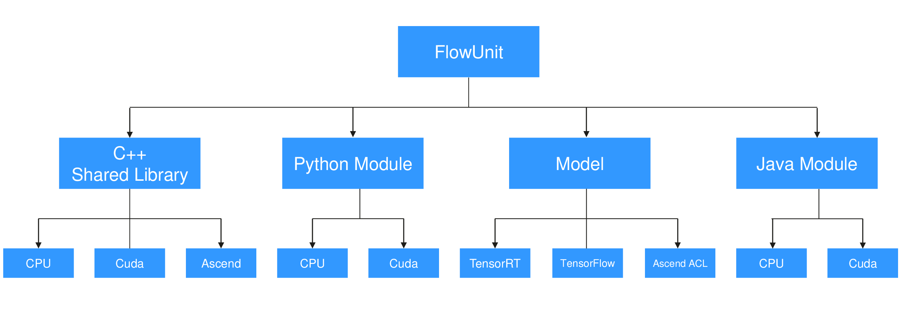

# 功能单元

功能单元FlowUnit是ModelBox中处理数据的基本单元，可称之为`流程单元`，简称`功能单元`，功能单元的处理对象是[数据流](./stream.md)。在ModelBox中，功能单元根据数据处理需求差异划分为不同的类别，下面将从功能单元组成、加载、分类进行详细的讲解。

## 功能单元组成



功能单元是数据处理的基本功能单元，实现可以是多种语言和设备类型的。

功能单元可选的实体功能组件如下：

|类型|设备类型|说明|开发指导|
|--|--|--|--|
|C++动态库|CPU|使用CPU执行的C++动态库|[指导](../develop/flowunit/flowunit.md)|
|C++动态库|Cuda|使用Cuda执行的C++动态库|[指导](../develop/flowunit/flowunit.md)|
|C++动态库|Ascend|使用Ascend执行的C++动态库|[指导](../develop/flowunit/flowunit.md)|
|Python模块|CPU|使用CPU执行的Python模块|[指导](../develop/flowunit/flowunit.md)|
|Python模块|Cuda|使用Cuda执行的Python模块|[指导](../develop/flowunit/flowunit.md)|
|Python模块|Ascend|使用Ascend执行的Python模块|[指导](../develop/flowunit/flowunit.md)|
|Java模块|CPU|使用CPU执行的Java模块|[指导](../develop/flowunit/flowunit.md)|
|推理|TensorRT|使用TensorRT推理框架的模型推理功能|[指导](../develop/flowunit/flowunit.md)|
|推理|TensorFlow|使用TensorFlow推理框架的模型推理功能|[指导](../develop/flowunit/flowunit.md)|

ModelBox可根据图中的配置，加载对应的功能单元实体功能组件，在功能单元开发时，开发者也可以选择相关类型的功能单元实体进行开发。

## 加载运行流程


FlowUnit插件的加载流程如上图：

* 初始化过程

    1. ModelBox模块先扫描插件目录。
    2. 对扫描到的插件，调用`DriverDescription`获取FlowUnit插件信息。信息包括功能单元名称，功能单元版本号，执行的硬件信息，描述信息，配置参数信息。
    3. 当启动Flow时，则调用插件的`DriverInit`初始化插件。
    4. 初始化插件完成后，调用`CreateDriverFactor`创建插件工厂类。
    5. 之后调用`FLowUnitFactor::FlowUnitProbe`获取FlowUnit信息，信息包括输入，输出参数。
    6. 初始化完成后，业务调用Flow初始化图。
    7. 在图初始化时，首先通过图中指定的FlowUnit名称选择对应的FlowUnit实例化，调用实例化对象的`Flow::Open`初始化`FlowUnit`对象。
    8. 图初始化完成后，若有数据达到，则调用当前节点实例的`Flow::Process`处理数据；若当前功能单元选择的类型是流，还会调用`Flow::DataPre`接口，再调用`Flow::Process`接口，流数据结束时，调用`Flow::DataPost`接口。
    9. 当图运行完成后，则调用`Flow::Close`接口关闭图。
    10. 整个Flow结束时，ModelBox模块卸载FlowUnit插件，调用插件的`DriverFini`函数清理资源。

## 分类

功能单元被按照多个维度进行了分类，不同纬度的分类在满足约束的情况下可以进行组合

### 维度一：按处理数据相关性分类

|类别|类别说明|约束|常见的功能单元|需要重写的接口|
|--|--|--|--|--|
|通用功能单元|在处理数据时，功能单元本身不关心数据之间的关联，只对当前数据做处理，并且不记录任何状态，则选择该类型。设置为该类型时，其一次process调用处理的数据可能来自多个数据处理任务，且process会并发调用，同一个任务内的数据在此时不保证处理的先后，当然数据处理完毕后会由框架重新收集排序，无需关心当前功能单元对整个数据流后续的影响|输入buffer的数量必须与输出buffer的数量一致|resize, crop|Process|
|流数据功能单元|在处理数据时，功能单元需假设每次process都是处理当前任务数据流的数据，针对当前数据流可能还需要保存状态，并且process在数据流上要保持顺序处理，此时应当选择流类型的功能单元。设置为该类型时，框架会保证一个数据流的数据会顺序的进入process，不通数据流的数据会并发进入process，开发者无需关心数据之前是否是有序的，在process此处，已经由框架保证顺序。|输入buffer的数量无需与输出buffer的数量一致|decoder, encoder|DataPre, Process, DataPost|

1. 通用功能单元  
举例：  
通用功能单元是比较常见的单元，比如要实现用固定的长宽去Resize其输入，这个功能单元，每次执行Resize时，不关心其输入数据的关联，即单个流的顺序上，以及多个流的隔离，因此这个Resize功能单元是一个通用功能单元，处理时一个process可以接收多个流混合的数据，并且process在并发调用，后续的数据可能会与之前的数据一同进行处理。关于通用功能单元数据运行的详细说明可以参考[通用功能单元数据处理](stream.md#通用功能单元数据处理)。  
配置：  
配置功能单元为通用功能单元，需要在MODELBOX_FLOWUNIT中将desc配置为modelbox::NORMAL，默认情况下功能单元是通用功能单元，此时功能单元的输入与输出必须一致。

```c++
MODELBOX_FLOWUNIT(ResizeFlowUnit, desc) {
  desc.SetFlowUnitName("Resize");
  desc.AddFlowUnitInput(modelbox::FlowUnitInput("In_1", "cpu"));
  desc.AddFlowUnitOutput(modelbox::FlowUnitOutput("Out_1", "cpu"));
  desc.SetFlowType(modelbox::NORMAL);
}
```

1. 流数据功能单元  
* 举例：  
流数据流数据处理的是需要关注数据是否来自同一个数据流，且同一个数据流的数据处理要有先后顺序。比如一个视频编码的功能单元，每次process处理时，都需要保证当前输入的数据来自同一个流，且可以获取到当前流的状态(编码器)，同时输入的数据都是顺序的，这样才能保证编码功能单元正确的对每一路流进行编码。因此这个视频编码功能单元必须设置为一个流数据功能单元。关于流数据功能单元数据运行的详细说明可以参考[流数据功能单元数据处理](stream.md#流数据功能单元数据处理)。  
* 配置：  
配置功能单元为流数据功能单元，需要在MODELBOX_FLOWUNIT中将desc配置为modelbox::STREAM。流数据功能单元输出的buffer数量不一定与输入的buffer数量一致，默认情况下，输出输入的的buffer数量是认为不一致的，因此也是无法[匹配](stream.md#匹配)，如果需要两者匹配可以配置SetStreamSameCount(true)。

```c++
MODELBOX_FLOWUNIT(EncoderFlowUnit, desc) {
  desc.SetFlowUnitName("Encoder");
  desc.AddFlowUnitInput(modelbox::FlowUnitInput("In_1", "cpu"));
  desc.AddFlowUnitOutput(modelbox::FlowUnitOutput("Out_1", "cpu"));
  desc.SetStreamSameCount(false);
  desc.SetFlowType(modelbox::STREAM);
}
```

### 维度二：按输出数据层级分类

关于数据流层级，请参考[数据流](./stream.md)章节

|类别|类别说明|约束|常见的功能单元|
|--|--|--|--|
|同级功能单元|输出的数据与输入的数据属于同一层级|无|resize, crop, decoder, encoder|
|展开功能单元|输出的数据是输入数据的下一层级，展开功能单元将输入的每个Buffer展开为一个新的Stream，该Stream属于输入Stream下一级的Stream|输入只能是一个buffer，且必须有输出buffer|demuxer|
|收拢功能单元|输出的数据是输入数据的上一层级，收拢功能单元是将输入Stream中的数据收齐后形成一个Buffer，该Buffer属于输入Stream上一级的Stream|输出只能是一个buffer|enmuxer|

1. 展开功能单元  
    * 举例：  
在开发功能单元时，输入输出的数据有固定的要求，如Resize输入的是图片流，产生的也是图片流。这是同一层级的。视频解封装(demuxer)功能单元输入的是视频组成的流(流里面的每一个buffer都是一个视频)，产生的是每个视频产生的packet流，每个packet流属于一个视频。因此packet流是视频组成的流的下一层级，而视频解封装功能单元是一个展开功能单元。关于层级的说明可以参考[数据流层级](stream.md#数据流层级)
    * 配置：  
配置功能单元为展开功能单元,需要SetOutputType(modelbox::EXPAND)，在默认情况下OutputType是modelbox::ORGINE，表示功能单元是同级功能单元。

```c++
MODELBOX_FLOWUNIT(DemuxerFlowUnit, desc) {
  desc.SetFlowUnitName("Encoder");
  desc.AddFlowUnitInput(modelbox::FlowUnitInput("In_1", "cpu"));
  desc.AddFlowUnitOutput(modelbox::FlowUnitOutput("Out_1", "cpu"));
  desc.SetOutputType(modelbox::EXPAND);
}
```

1. 收拢功能单元
      * 举例：  
与展开功能单元相对应的是收拢功能单元,视频封装(enmuxer)功能单元输入和输出与视频解封装刚好是反过来的，视频封装功能单元是一个收拢功能单元。关于层级的说明可以参考[数据流层级](stream.md#数据流层级)
      * 配置：  
配置功能单元为展开功能单元,需要SetOutputType(modelbox::COLLAPSE)。默认情况下流中的数据只要到达了就会立即处理，如果需要一次性取完放入process中处理，可以配置SetCollapseAll(true)来实现。

```c++
MODELBOX_FLOWUNIT(DemuxerFlowUnit, desc) {
  desc.SetFlowUnitName("Encoder");
  desc.AddFlowUnitInput(modelbox::FlowUnitInput("In_1", "cpu"));
  desc.AddFlowUnitOutput(modelbox::FlowUnitOutput("Out_1", "cpu"));
  desc.SetOutputType(modelbox::COLLAPSE);
  desc.SetCollapseAll(false);
}
```

### 特例：条件功能单元

条件功能单元是通用功能单元中的一种，当一个功能单元的输出，在不同的条件下需要用不同的流程去处理时，就可以使用条件功能单元来完成数据流的分支选择，使得同一路流可以在不同的流程处理，关于条件功能单元的说明可以参考[条件功能单元数据处理](stream.md#条件功能单元数据处理)

* 配置：  
配置条件功能单元时，需要在MODELBOX_FLOWUNIT中将desc配置为modelbox::NORMAL，并且SetConditionType(modelbox::IF_ELSE)

```c++
MODELBOX_FLOWUNIT(ConditionFlowUnit, desc) {
  desc.SetFlowUnitName("Condition");
  desc.AddFlowUnitInput(modelbox::FlowUnitInput("In_1", "cpu"));
  desc.AddFlowUnitOutput(modelbox::FlowUnitOutput("Out_1", "cpu"));
  desc.SetFlowType(modelbox::NORMAL);
  desc.SetConditionType(modelbox::IF_ELSE);
}
```

`注：使用条件功能单元时，必须配置当前功能单元batch_size= 1`

### 功能单元类别与接口说明

|类别|类别说明|需要重写的接口|
|--|--|--|
|同级通用功能单元|输入输出的数据是同一级别的，输入的数据不会排序，直接放入Process中|Process|
|同级流数据功能单元|输入输出的数据是同一级别的，流开始会调用DataPre,流结束会调用DataPost，输入的数据会排序后放入Process中|DataPre, Process, DataPost|
|展开通用功能单元|输出的数据是输入数据的下一层级，输入的数据不会排序直接放入Process中|Process|
|展开数据流功能单元|输出的数据是输入数据的下一层级，流开始会调用DataPre,流结束会调用DataPost，输入的数据会排序后放入Process中|DataPre, Process, DataPost|
|收拢通用功能单元|输出的数据是输入数据的上一层级，流开始会调用DataPre,流结束会调用DataPost，输入的数据会会排序后放入Process中。两个流之间不会按照输入的顺序排序|DataPre, Process, DataPost|
|收拢数据流功能单元|输出的数据是输入数据的上一层级，流开始会调用DataPre,流结束会调用DataPost，输入的数据会排序后放入Process中。流之间会按照输入的顺序排序调用，在所有流开始之前会调用DataGroupPre,在所有的流结束之后会调用DataGroupPost|DataGroupPre, DataPre, Process, DataPost, DataGroupPost|

### 按业务类型分类

按业务区分功能单元，功能单元的分类大致如下

|类别|类别说明|例子|
|--|--|--|
|输入类功能单元|数据输入类功能组件，输入数据使用|http, filereader, obs等|
|输出类功能单元|数据输出类功能组件，输出数据使用|http, filewriter, obs等|
|图像类功能单元|处理单个图像数据的功能组件，处理图像使用|resize, brightness等|
|视频类功能单元|处理视频数据的功能组件|demutex, decode, encode等|
|推理类功能单元|调用推理功能进行推理的组件|tensorrt, tensorflow等|
|预处理、后处理功能单元|对tensor数据进行处理。|normalize, mean等|

### 功能单元类型样例

下图以车辆检测为例子说明涉及到功能单元类型

* **例子**

    

    车辆跟踪推理DEMO，当发现车辆时，对车辆画框图提示。

* **Flow流程图**

    

    流程说明：
    1. FileReader文件读取，从目录中读取Video.mpeg路径信息。
    2. 将文件数据发送给VideoDemux，VideoDemux将数据解开packet后发送给VideoDecoder。
    3. VideoDecode获取packet并解码为图像。
    4. 图像数据分别发送到两个流程，一个发送给ImageResize，一个发送给ImageRender。
    5. ImageResize将图像数据进行resize。
    6. resize后的图像，发送给CarDetect进行模型推理。
    7. 推理后的数据发送给Box进行框信息处理。
    8. Box输出框信息。
    9. ImageRender接收两路输入，图像和框图信息，并对图像进行画框。
    10. 画框后的图像，输出到编码器VideoEncoder。
    11. VideoEncode对图像进行编码，并发送给RTSP服务器。

    流程上，使用了8个功能单元，1个是输入类，3个是处理流数据的视频功能单元，其他是图像处理和推理类的通用功能单元。

* **上图流程的涉及的功能单元列表以及类别**

|功能单元名称|功能|功能分类|业务分类|解释
|--|--|--|--|--|
|File Reader|读取数据文件|流数据拆分类|输入类|输入是一个URL，输出是一个文件流。
|Video Demux|解数据封包|流数据类|视频类|输入是文件流，输出是一组连续的packet流。
|Video Decoder|视频解码|流数据类|视频类|输入是packet流，输出是独立的图像数据。
|Image Resize|图像大小调整|通用类|图像类|输入是一张图像，输出也是一张图像。
|Car Detect|车辆推理|通用类|推理类|输入是Tensor，输出是Tensor。
|Box|框选取|通用类|后处理类|输入是Tensor，输出是框信息。
|Image Render|合并框图信息|通用类|图像类|输入是两组数据，图像和框图，输出是图像。
|Video Encoder|视频编码|流数据类|视频类|输入是多张图像，输出是一个视频流。

要查阅ModelBox所有预置的功能单元，请参考[FlowUnits](../flowunits/flowunits.md)章节。
