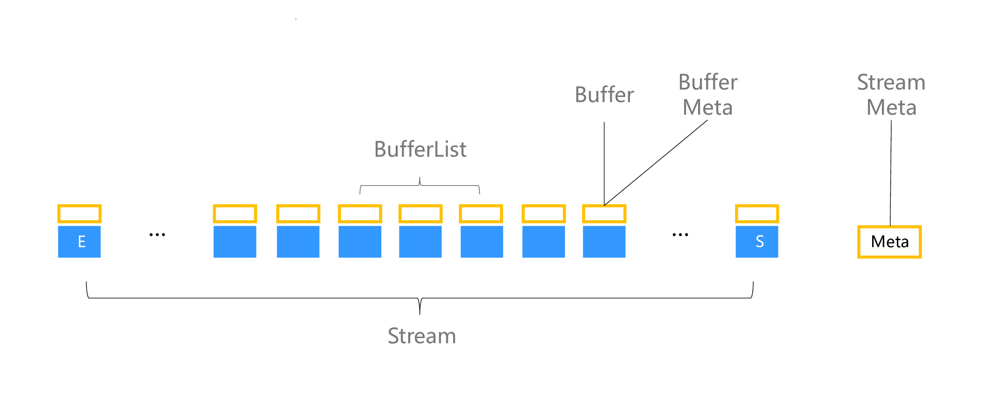
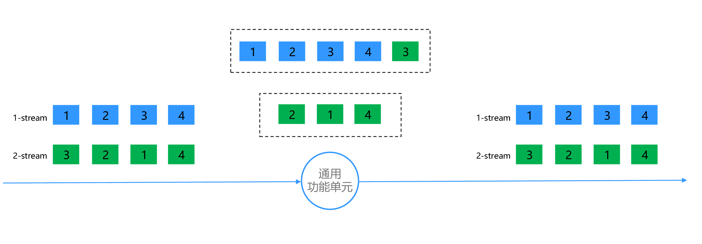
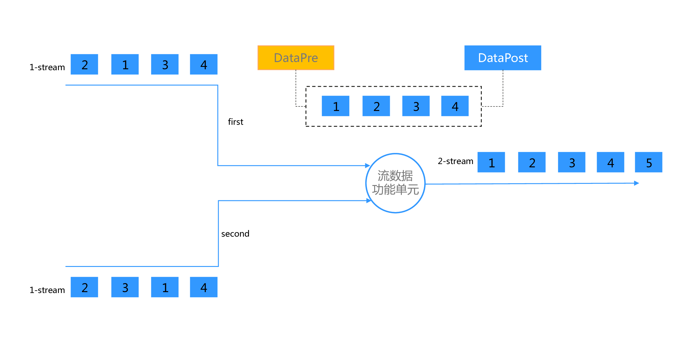
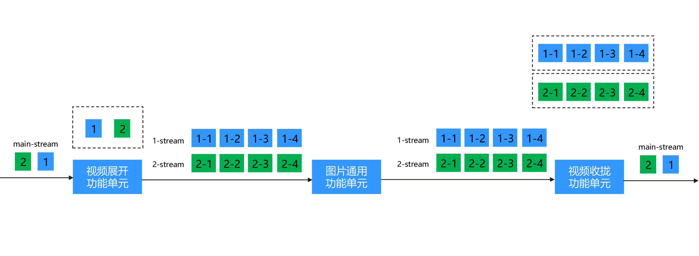

# stream流

Stream流数据是一组顺序、连续到达的数据序列， ModelBox支持各种流数据的处理，这些数据包括，视频，音频，文件，结构化数据。
ModelBox中的流有如下属性：

## stream特点

1. 保序的

    流中的数据只能按照顺序处理，处理完成后的结果，要将按照顺序输出。

1. 分段处理的。

    流中的每个数据可以在处理逻辑上组成一个BufferList，每个BufferList都可以单独处理。

1. 连续的。

    流中的每个数据都是连续的，不能中断，也不能将流中的数据在图中执行不同的分支流程。

## stream结构

ModelBox中流数据由Buffer组成，其结构如下：

1. Buffer是组成stream的基本单位。
1. BufferList是一个逻辑概念，主要用于批量处理一组Buffer数据。
1. N(0 < N < ∞)个buffer组成一个stream
1. 在stream中buffer有序号，标明buffer在流中的位置，位置是在流产生时决定的。
1. 每个Buffer包含一个Meta结构，记录Buffer信息。
1. 每个Stream包含一个Meta结构，记录Stream信息。

## 流的基本处理

流数据经过不同的功能单元处理后，可以匹配，产生兄弟流，聚合，展开，收拢。

### 匹配

#### 为什么需要匹配

如上图所示，Source功能单元功能是产生图片，Inference功能单元的功能是输入图片输出图片中包含人的框，ColorTranspose功能单元的功能是将图片颜色进行变换，输入是图片输出也是图片，DrawBox功能单元的功能是输入图片和框，输出画了框的图片。在上图中，浅绿色表示图片，深绿色表示多个框的集合。在图-A中，每个端口的输入是单一明确的。在图-B中Inference功能单元输出的每一个buffer都是图片和多个框的集合的一个组合体。ColorTranspose功能单元的输入也必须是图片和多个框的集合组合成一个buffer，但ColorTranspose本身只处理组合体中的图片数据。而在图-A下ColorTranspose只需要处理图片数据即可。

但在图-A中需要解决框的集合和图片之间匹配的问题。

#### 如何匹配

两个流匹配是基于流里面的buffer数量一致。

功能单元可能有多个端口作为输入，功能单元会将数据先进行匹配，匹配完成后将数据放入process中处理。在上图中，通用功能单元有first和second两个端口。first端口的数据先传入，second端口的数据后传入。则1-stream first端口进入时，功能单元会把buffer按照1 2 3 4顺序放入缓存但不会执行process，当second端口的数据传入后，匹配的数据完成匹配后才会放入process中执行，而产生的数据的顺序会按照first端口的顺序来排列。通用功能单元要求输入的流必须是一个流，而经过通用功能单元所产生的流与输入的流也必须是一个流。不同流之间的数据匹配是无关的，如上图中1-stream中的数据是可以互相匹配的，但是1-stream的数据与2-stream的数据是不能匹配的。

### 通用功能单元数据处理

如上图所示，1-stream和2-stream是两个流，经过同一个通用功能单元。

#### 输入输出数量一致

通用功能单元的输入与输出的buffer数量必须一致，1-stream输入四个buffer，则输出也必须为四个buffer。1-stream经过通用功能单元产生的四个buffer还是在1-stream中，不会出现在2-stream中，因此对每个stream来说，可以认为其它的stream是不可见的。

#### 按batch_size合并后输出

通用功能单元会按batch数量合并后由process处理。如上图所示，通用功能单元的batch_size设置为5,则通用功能单元会再将1-stream的数据填满后会取走2-stream的部分数据填满batch。如果剩下的数据无法填满batch，数据也会把剩下的所有数据聚合在下一个batch中处理。

### 条件功能单元数据处理

条件功能单元是一种特殊的通用功能单元，条件功能单元的输出必须大于1。条件功能单元其向每个端口的输出数量之和等于输入buffer的数量。如上图所示，1号 2号 3号 4号四个buffer经过条件功能单元A后，其上端口输出1 2 3 三个buffer，下端口输出4 一个buffer。但这两路数据都会被认为是1-stream流的一个部分流，部分流只能用通用功能单元处理，而不能用数据流功能单元处理。因为每一路数据中包含的流信息都是不完整的。部分流可以通过条件功能单元进一步切分成新的部分流。当将部分流的数据输入到一个通用功能单元的同一端口时，会产生聚合，即将输入的部分流聚合成条件功能单元输入时的流。如条件功能单元B产生的1-1-1-part-stream和1-1-2-part-stream最终由通用功能单元B聚合得到1-1-part-stream。注意部分流有层级结构，如图上所示1-1-1-part-stream只能与1-1-2-part-stream聚合，而不能与1-2-part-stream的部分流聚合，只有在聚合成1-1-part-stream的流后才能再进行聚合。

### 流数据功能单元数据处理

数据经过流处理功能单元会产生兄弟流。在单元数据在匹配后会先进行排序，如上图所示，1-stream的在进入流处理功能单元后会排序，然后放入同一个batch中由process处理,在流数据功能单元中不同的stream中的buffer会放入不同的batch中进行处理。在经过了流数据功能单元流处理后，会产生一个新的兄弟流，兄弟流在默认的情况下与前面的流不是一个流，无法匹配。但可以与可以通过设置SetStreamSameCount(true)来设置流处理单元输出的兄弟流与输入的流可以进行匹配。

流处理功能单元除了通常处理数据process函数，还会有其他一些函数也会在stream的开始和结束阶段被调用：

1. 在处理流之前，会触发DataPre调用，这里可以用来申请资源，DataPre中可以设置下一个Stream的Meta信息，如图中2-stream的Meta信息。

1. 当流中最后一个数据处理完成后，将会触发DataPost调用，这里可以用来释放资源。

### 数据流层级

数据流在业务中常常需要展开或收拢，如上图所示，main-stream中有两个buffer每个buffer表示一个视频流地址，而其后的图片普通功能单元处理的是多张图片组成的一个图片流，因此视频流地址需要展开为多张图片组成的一个流。展开功能单元主要就是用来完成将图中main-stream 的1 buffer展开成图片流1-stream，在图片普通功能单元处理后，如果需要收拢为图片流为视频流，可以通过收拢功能单元其还原成main-stream。

在展开功能单元中，process中输入的buffer每次只有一个。收拢功能单元接收下一层流时会排序，并对接收到的每个流都会触发Datapre和DataPost调用。一个流经过收拢后最终会产生一个上级流的buffer。

展开功能单元和收拢功能单元也可以分为通用展开功能单元，数据流展开功能单元，通用收拢功能单元，数据流收拢功能单元。如上图所示：通用展开功能单元和数据流展开功能单元的区别在于，在展开时，数据流展开功能单元如图-A所示，在展开完1-stream后才可以展开2-stream。通用展开功能单元会如图-B所示，会同时展开1-stream和2-stream。数据流收拢功能单元则会在1-stream收拢完后才会2-stream，通用收拢功能单元会同时收拢1-stream和2-stream。

如图-B所示，数据流收拢功能单元在所有的子流收拢之前会调用DataGroupPre，在所有的子流收拢之后则会调用DataGroupPost

### 展开归拢 VS 产生一个兄弟流

展开表现为由一个buffer产生多个buffer。但是由一个buffer产生多个buffer并不一定是展开。同样,归拢表现为由多个buffer合成一个buffer，但是由多个buffer合成一个buffer并不一定是归拢。展开和归拢限定于将一个buffer展开成一个完整的流和将一个流里全部的buffer合成为一个buffer。比如，一个长视频可以展开为N(0 < N < ∞),如果后面在接一个功能单元，其功能是每五个图片合成一个短视频，则这个功能单元应该是同级流数据功能单元，而不是通用收拢功能单元。因为其产生的短视频数量是N/5，不是1。這些短视频还是长视频的子流，而短视频流和图片流之间的关系是兄弟流的关系