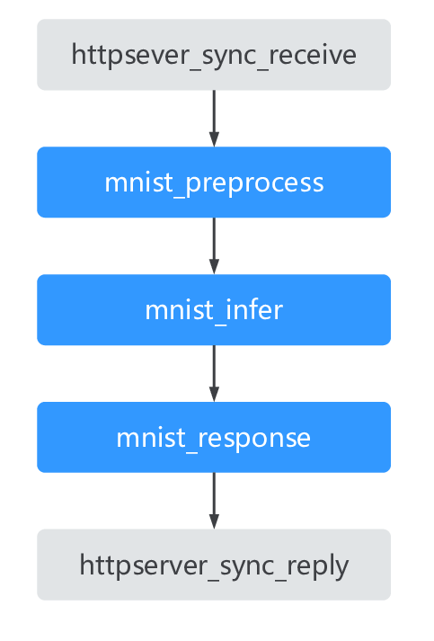

# 第一个应用

## 环境准备

### Docker开发镜像

1. 安装启动docker后，执行下列命令下载docker镜像

    ```shell
    docker pull modelbox/modelbox_cuda101_develop:latest
    ```

    如需要下载其他cuda版本的镜像，可参考[FAQ](../faq/faq.md)中的[其他版本的cuda](../faq/faq.md#其他版本的cuda)相关内容

1. 在系统中创建如下docker启动脚本，或将如下脚本按需修改后，粘贴到ssh终端中执行：

    ```shell
    #!/bin/bash

    # ssh map port, [modify]
    SSH_MAP_PORT=50022

    # editor map port [modify]
    EDITOR_MAP_PORT=1104

    # http server port [modify]
    HTTP_SERVER_PORT=7778

    # container name [modify]
    CONTAINER_NAME="modelbox_instance_`date +%s` "
    
    HTTP_DOCKER_PORT_COMMAND="-p $HTTP_SERVER_PORT:$HTTP_SERVER_PORT"
    docker run -itd --gpus all -e NVIDIA_DRIVER_CAPABILITIES=compute,utility,video \
        --tmpfs /tmp --tmpfs /run -v /sys/fs/cgroup:/sys/fs/cgroup:ro \
        --name $CONTAINER_NAME -v /opt/modelbox:/opt/modelbox -v /home:/home \
        -p $SSH_MAP_PORT:22 -p $EDITOR_MAP_PORT:1104 $HTTP_DOCKER_PORT_COMMAND \
        modelbox/modelbox_cuda101_develop:latest 
    
    ```

    如果docker版本低于19.03，则需要修改脚本

    ```shell
    docker run -itd --runtime=nvidia -e NVIDIA_DRIVER_CAPABILITIES=compute,utility,video \
        --tmpfs /tmp --tmpfs /run -v /sys/fs/cgroup:/sys/fs/cgroup:ro \
        --name $CONTAINER_NAME -v /opt/modelbox:/opt/modelbox -v /home:/home \
        -p $SSH_MAP_PORT:22 -p $EDITOR_MAP_PORT:1104 $HTTP_DOCKER_PORT_COMMAND \
        modelbox/modelbox_cuda101_develop:latest 
    ```

   注意事项：
    *. 可使用`vim start_docker.sh`创建文件后，`i`进入编辑模式后，粘贴上述代码，编辑修改后，`wx`保存。
    * `SSH_MAP_PORT`: 为容器ssh映射端口号。
    * `EDITOR_MAP_PORT`: 为可视化开发界面链接端口号。
    * `HTTP_SERVER_PORT`: 为http flowunit默认服务端口号。
    * docker启动脚本中，请注意启动的镜像版本是否与自己所需的镜像版本一致。
    * 如果启动镜像之后，端口未被占用却仍旧无法访问，需要检查防火墙。
    * 如有疑问，可参考[FAQ](../faq/faq.md)中的[docker](../faq/faq.md#docker启动脚本详解)相关内容

1. 进入容器并且切换至ModelBox开发者模式

    ```shell
    docker exec -it [container id] bash
    modelbox-tool develop -e 
    ```

然后按照提示，访问editor界面。
如果访问被拒绝，可参考[运行编排服务](../server/editor.md)中的[访问控制列表](../server/editor.md#访问控制列表)相关内容

## 第一个应用开发

开发环境准备好了之后进入应用开发环节，这里以MNIST为例介绍整个应用开发过程。首先介绍MNIST应用实现的功能，然后介绍流程图编排、流单元编写、运行与调试3个开发步骤。

MNIST案例是使用MNIST数据集，训练的一个手写数字识别tensorflow模型，搭建的一个简易的http请求服务。模型训练可参考[tensorflow教程](https://doc.codingdict.com/tensorflow/tfdoc/tutorials/mnist_beginners.html) 。

### 功能

监听端口接收http请求，然后从请求体中的base64解析出图片，接着用训练出的MNIST模型进行推理，最后将识别出的数字返回给用户。

图片base64编码：

``` python
import base64

img_path = "path_to_test_image"
with open(img_path, 'rb') as fp:
    base64_data = base64.b64encode(fp.read())
    img_base64_str = str(base64_data, encoding='utf8')
```

请求样例：

``` json
{
    "image_base64": "xxxxx"
}
```

响应样例：

``` json
{
    "predict_reuslt": "x"
}
```

### 流程图编排

流程图是编排整个应用的过程，可根据应用的逻辑进行编排，具体可参考[流程图开发章节](../develop/flow/flow.md#流程图开发及运行)。有两种方式可编排流程图，第一种是使用UI进行可视化编排，第二种是直接编写图文件。这里采用第二种方式。



从上到下共有5个流单元，分别为接收http请求，MNIST预处理，MNIST模型推理，MNIST响应构造，发送http响应。图定义如下

``` toml
[graph]
format = "graphviz"
graphconf = '''digraph mnist_sample {
          queue_size = 32
          batch_size = 1
          httpserver_sync_receive[type=flowunit, flowunit=httpserver_sync_receive, device=cpu, deviceid=0, label="<Out_1>", request_url="http://localhost:7778", max_requests=100, time_out=10]
          mnist_preprocess[type=flowunit, flowunit=mnist_preprocess, device=cpu, deviceid = 0, label="<In_1> | <Out_1>"]
          mnist_infer[type=flowunit, flowunit=mnist_infer, device=cuda, deviceid=0, label="<Input> | <Output>"]
          mnist_response[type=flowunit, flowunit=mnist_response, device=cpu, deviceid=0, label="<In_1> | <Out_1>"]
          httpserver_sync_reply[type=flowunit, flowunit=httpserver_sync_reply, device=cpu, deviceid=0, label="<In_1>"]  

          httpserver_sync_receive:Out_1 -> mnist_preprocess:In_1
          mnist_preprocess:Out_1 -> mnist_infer: Input
          mnist_infer: Output -> mnist_response: In_1
          mnist_response: Out_1 -> httpserver_sync_reply: In_1
        }'''
```

再加上下面实现流单元的路径即可完成流程图的编写。
开发镜像中已集成该图配置，可参考`/usr/local/share/modelbox/solution/graphs/mnist_detection/mnist.toml`。

### 流单元编写

ModelBox提供基础流单元，除此之外还需补充流程图中缺失的流单元，具体开发可参考[流单元开发章节](../develop/flowunit/flowunit.md#流单元开发)。

这里接收http请求、发送http响应两个流单元ModelBox已提供，我们只需实现MNIST的预处理，推理，响应构造三个流单元即可。

* MNIST预处理流单元
  
  预处理需要做：解析出图片，对图片进行reshape，构建流单元输出buffer。
  
  ``` python
  in_data = data_context.input("In_1")
  out_data = data_context.output("Out_1")
  
  for buffer in in_data:
      # get image from request body
      request_body = json.loads(buffer.as_object().strip(chr(0)))
      img_base64 = request_body["image_base64"]
      img_file = base64.b64decode(img_base64)
      # reshape img
      img = cv2.imdecode(np.fromstring(img_file, np.uint8), cv2.  IMREAD_GRAYSCALE)
      img = cv2.resize(img, (28, 28))
      infer_data = np.array([255 - img], dtype=np.float32)
      infer_data = np.reshape(infer_data, (784,)) / 255.
      
      # build buffer
      add_buffer = modelbox.Buffer(self.get_bind_device(), infer_data)
      out_data.push_back(add_buffer)
  ```

  开发镜像中已集成该流单元，可参考`/usr/local/share/modelbox/solution/flowunit/mnist/mnist_preprocess`。

* MNIST推理流单元
  
  推理流单元只需准备好模型和对应的配置文件即可。
  
  配置文件如下：

  ```toml
  [base]
  name = "mnist_infer" 
  device = "cuda" 
  version = "0.0.1" 
  description = "Recognition handwritten digits recognition. The sample mnist_model.pb requires tensorflow1.13 + cuda10.0." 
  entry = "path_to_mnist_model.pb" 
  type = "inference" 
  virtual_type = "tensorflow" 
  
  [input]
  [input.input1] 
  name = "Input" 
  type = "float" 
  
  [output]
  [output.output1] 
  name = "Output" 
  type = "float"
  ```

  开发镜像中已集成该流单元，可参考`/usr/local/share/modelbox/solution/flowunit/mnist/mnist_infer`。

* MNIST响应流单元
  
  得到推理的结果之后，需要构造响应：
  
  ``` python
  in_data = data_context.input("In_1")
  out_data = data_context.output("Out_1")
  
  for buffer in in_data:
      # get result
      max_index = np.argmax(buffer.as_object())
  
      # build response
      result = {
          "predict_reuslt": str(max_index)
      }
      result_str = (json.dumps(result) + chr(0)).encode('utf-8').strip()
      add_buffer = modelbox.Buffer(self.get_bind_device(), result_str)
      out_data.push_back(add_buffer)
  ```

  开发镜像中已集成该流单元，可参考`/usr/local/share/modelbox/solution/flowunit/mnist/mnist_response`。

### 运行与测试

首先需要把http服务运行起来，然后再模拟请求测试。

* 运行流程图

  执行如下命令即可启动MNIST识别http服务：

  ``` shell
  modelbox-tool -log-level info flow -run path_to_mnist.toml
  ```

  由于开发镜像已集成样例，可开发镜像中直接运行`modelbox-tool -log-level info flow -run /usr/local/share/modelbox/solution/graphs/mnist_detection/mnist.toml`。

* 测试

  这里已经准备好测试脚本`/usr/local/share/modelbox/solution/graphs/mnist_detection/test_mnist.py`，测试图片是mnist测试集中的0数字。

  直接运行`python3 test_mnist.py`得到结果为：

  ``` json
  {
      "predict_reuslt": "0"
  }
  ```
