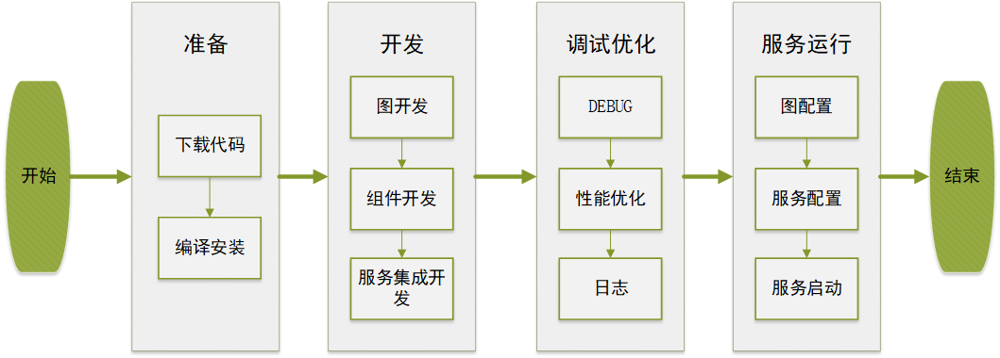

# 快速入门

本章将从概念、编译、第一个应用开发来对ModelBox进行初步介绍，让开发者对框架快速建立一个初步的认识。旨在帮助开发者在之后的开发中，快速掌握基于ModelBox的应用开发。

## 基于ModelBox的开发流程

首先总体介绍基于ModelBox的应用开发流程，之后的章节将会对开发中的每个步骤进行详细的讲解。

如上图所示，这是一个典型的基于ModelBox的应用开发流程，这个流程看起来与其他应用开发流程类似。这里我们简单介绍一下每个开发的步骤：

1. 首先需要准备相关的开发环境，比如下载ModelBox的代码，在系统中进行编译安装，当然如果使用基于镜像的开发环境，这一步是可以省去的。
1. 开发部分，主要关注点在于如何使用ModelBox的能力完成应用的功能，这里的图开发的概念在之后的章节会有详细的介绍。组件开发主要是基于ModelBox提供的sdk和接口约束进行应用功能的开发。服务集成开发则涉及到了ModelBox应用的运行模式。
1. 在基本的代码开发完毕后，就是对应用的功能、性能测试。ModelBox提供了一些调试辅助工具协助开发者完成这项工作。
1. 应用开发完毕后，一般可以作为服务对外提供功能，需要关注一些应用的配置以及应用的启动。

接下来我们将介绍ModelBox的[基本概念](../get-start/conception.md)。
