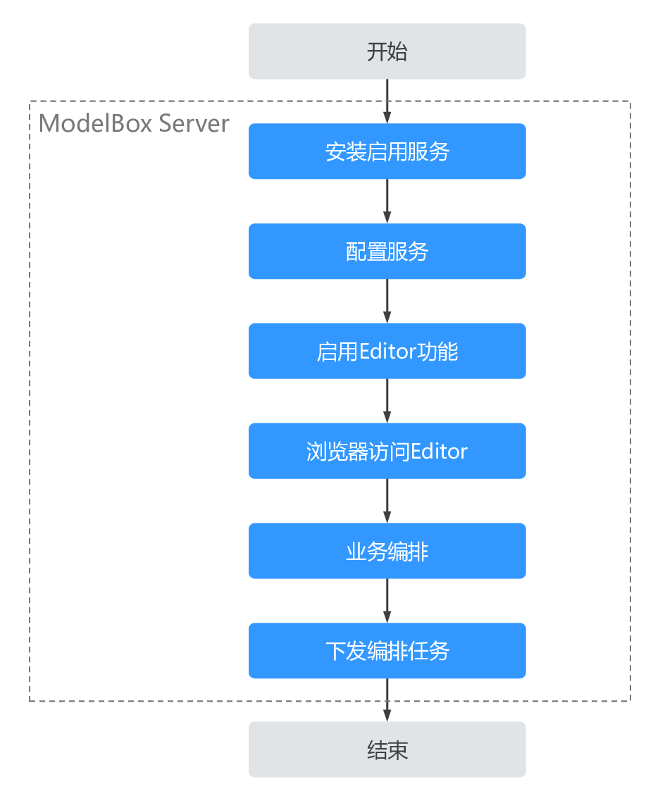
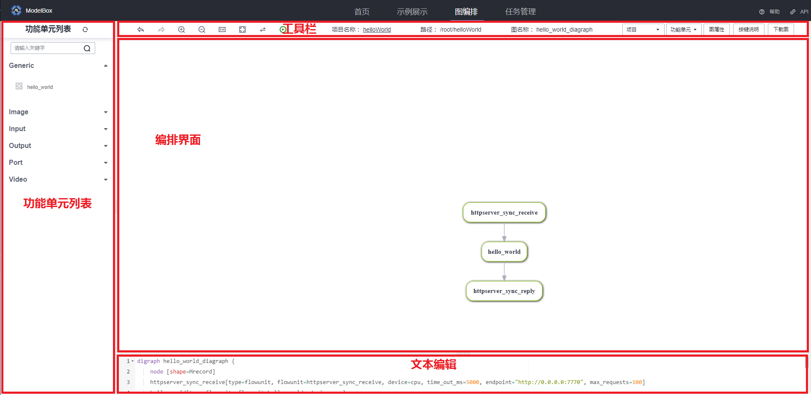
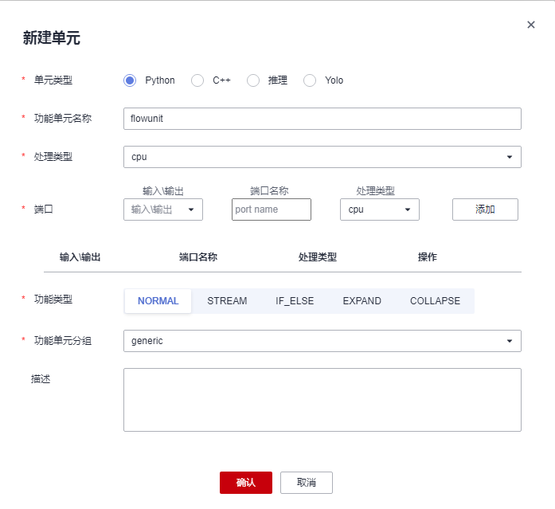

# 可视化编排插件

ModelBox提供了在线可视化编排的工具——Editor。在开发时，可使用此工具进行创建项目、创建功能单元、编排图、调试等来提升开发效率。

## 编排插件是什么

编排插件是用来在Editor可视化界面上，编排[流程图](../use-modelbox/standard-mode/flow/flow.md)并自动生成相对应的[图](../basic-conception/graph.md)代码的快速开发工具。

## 使用编排插件开发流程



1. 配置ModelBox Server。
2. 配置启用编排插件。
3. 浏览器访问Editor界面。
4. 业务进行编排操作。
5. 下发编排任务。

编排插件集成在ModelBox Server中，默认情况下，编排插件未启用。可以参考下方[编排插件配置](#编排插件配置)章节来启用编排插件并加载Editor界面。

## 编排插件配置

### 配置ModelBox Server

[ModelBox Server安装](../environment/container-usage.md)完成后，编排插件会通过插件的形式由ModelBox Server加载，并在网页浏览器上提供在线可视化编排插件。

对应插件路径为`"/usr/local/lib/modelbox-plugin-editor.so"`(#由于不同操作系统目录结构存在差异，此路径也可能为 `"/usr/local/lib64/modelbox-plugin-editor.so"`，下文涉及系统lib库路径的地方均存在系统路径差异)。

编排插件的配置文件路径为`$HOME/modelbox-service/conf/modelbox.conf`，其配置项目如下：

| 配置项目         | 配置说明                                                           |
| ---------------- | ------------------------------------------------------------------ |
| editor.enable    | 是否启用Editor工具                                                 |
| editor.ip        | Editor工具监听IP，默认为127.0.0.1。不指定的情况下，和server.ip一致 |
| editor.port      | Editor工具监听端口，默认为1104，不指定情况下，和server.port一致    |
| editor.root      | Editor前端UI路径，默认为/usr/local/share/modelbox/www              |
| editor.demo_root | Editor demo路径，默认为/usr/local/share/modelbox/demo              |

### 配置启用编排插件

通过如下命令，可开启基于Web的可视化编辑工具——Editor：

```shell
modelbox-tool develop -s 
```

命令执行后，将在用户$HOME/modelbox-service创建运行目录，并开启http编排服务，可使用对应主机的IP地址，和开启的端口号（默认端口号为1104）访问Editor界面。

**如果访问被拒绝，可以尝试检查并修改ACL配置**，并重启ModelBox服务生效，详见**访问控制列表**章节。

## Editor配置

  若需要定制化编排服务启动参数，可以修改配置文件，具体修改流程如下：

1. 打开`$HOME/modelbox-service/conf/modelbox.conf`，修改其中的配置项：

 ```shell
 [server]
 ip = "0.0.0.0"
 port = "1104"
 flow_path = "$HOME/modelbox-service/graph"
 
 [plugin]
 files = [
     "/usr/local/lib/modelbox-plugin.so",
     "/usr/local/lib/modelbox-plugin-editor.so"
 ]
 
 [control]
 enable = true
 listen = "$HOME/modelbox-service/run/modelbox.sock"
 
 [acl]
 allow = [
     "127.0.0.1/8",
     # ADD CLIENT HOST HERE
     "192.168.59.145"
 ]
 
 [editor]
 enable = true
 # ip = "127.0.0.1"
 # port = "1104"
 root = "/usr/local/share/modelbox/www"
 demo_root = "/usr/local/share/modelbox/demo"
 
 [log]
 # log level, DEBUG, INFO, NOTICE, WARN, ERROR, FATAL, OFF
 level = "INFO"
 
 # log archive number
 num = 32
 
 # log file path
 path = "$HOME/modelbox-service/log/modelbox.log"
 ```

1. 重启ModelBox Server服务使配置生效。

  ```shell
  $HOME/modelbox-service/modelbox restart
  ```

  或者

  ```shell
  $HOME/modelbox-service/modelbox-manager restart
  ```

## 访问控制列表

访问控制列表ACL（Access Control List）是由一条或多条规则组成的集合，里面配置了允许访问Editor的IP地址。
可以通过修改配置文件，来修改ACL列表，具体流程如下：

1. 打开`$HOME/modelbox/modelbox.conf`，修改其中的配置项：
    假设打开编排UI的机器的IP地址为10.11.12.13

    ```shell
    [acl]
    allow = [
        "10.11.12.13",
    ]
    ```

  如果没有配置任何访问白名单，则允许所有人皆可访问。

  ```shell
      # [acl]
      # allow = [
      #     "10.11.12.13",
      # ]
  ```

1. 重启ModelBox Server服务使配置生效。

## 浏览器访问Editor界面

服务启动成功后，可使用浏览器访问服务，输入对应的网址即可，如：`http://[host]:1104/editor/`，成功后，将显示如下界面：


在主页中，分别可以链接到**示例展示**，**任务编排**，**任务管理**。右上角可以可查看**帮助文档**以及**API**。

### 示例展示

  

  该页面分为5个功能区域，其对应的功能如下：

  1. 区域1，导航页面。
  1. 区域2，基本编排操作区域，包含对6号区域的放大，缩小，重置大小，居中显示，垂直/水平显示，运行图。
  1. 区域3，示例相关功能，可以选择示例以及打开指引。
  1. 区域4，图形化编排界面，使用鼠标可以控制组件链接和移动。`Ctrl+鼠标左键`可以拖动画布。
  1. 区域5，对应文本化编排界面，可使用标准的[DOT](https://www.graphviz.org/pdf/dotguide.pdf)语法进行文本编辑。

  

  成功加载所选示例，并点击图中节点时，将显示右侧配置面板。可根据自己的需求对各个节点进行配置。

  配置完成后，即可点击区域2中的“运行”按钮，将下发编排任务，并自动跳转至任务管理页面查看任务状态。

  快捷键说明：

  1. 放大缩小：`鼠标滚轮`，或键盘，`-`，`=`按键。
  1. 全选：`ctrl+a`
  1. 撤销：`ctrl+z`
  1. 重做：`ctrl+u`
  1. 取消选择：`escape`

  注意事项：

  1. 对应网址的端口号以Docker启动脚本中的 `EDITOR_MAP_PORT` 为准，默认端口号为1104。

### 任务管理页面


如果编排任务被下发，那么所有正在运行的任务都会显示在任务管理页面中。

该页面除了可以查看运行中的任务状态，还可以对任务进行Http调试。

调试功能有：`api调试`与`Base64编码`

api调试：

  选择模板， 修改Request中的Header和Body部分，发送请求之后得到的Reponse将显示在页面上。

Base64编码：

  选择需要转成base64格式的文件，即可在页面右侧得到base64代码。

### 任务编排页面



该页面是进行图编排、设置的主要界面。

进入界面后，即可点击`项目`来新建或者打开一个项目。
随后，可以通过`拖拽至编排界面`或者`双击`左侧功能单元列表上所需要的功能单元，将功能单元显示在编排界面上。
如果需要自定义新的功能单元，可以点击`功能单元`来创建。
当图编排完成之后，可以通过`图属性`设置相关属性。最后，点击`项目`下面的`保存`即可将项目信息保存至后端。
如果需要运行项目，就点击工具栏上的`运行`按钮即可。

#### 功能单元列表

功能单元列表中，陈列了后端内置以及自制的功能单元。用户可以采用拖拽的方式，将所需要使用的功能单元，拖拽至编排界面。随后进行相对应的图编排以及属性配置等操作。


点击已放入编排界面的功能单元，可以通过在右侧弹出的属性面板进行配置。

将鼠标悬浮至目标功能单元，在输出端口上方会显示一个白色的圆圈。点击白色的圆圈并连接至其它圆圈，即可完成功能单元的连接。

所有的更改，都将反馈至下方的文本编辑区域。

#### 工具栏


工具栏分为左中右三个区域。

1. 左侧区域
  
  该区域包括了图的显示工具（回退，重做，放大，缩小，重置缩放，自适应，切换布局）以及运行按钮。

1. 中部区域

  该区域显示了项目名称，路径，当前处于编排界面的图名称以及编辑状态。

1. 右侧区域

  该区域包括了项目的相关功能，功能单元的相关功能，图属性，按键说明以及下载图。

#### 项目


`项目`下拉菜单在工具栏的左侧的第一个位置，其有八个功能，分别为：

1. 新建项目

  依次输入项目名称以及项目路径，并选择相对应的项目模板，点击确认即可创建一个新的项目。项目路径如果不存在，将会自动创建。

  

1. 打开项目

  输入项目路径，或通过单击文件夹名称来选择项目，最后点击`确认`即可打开项目。

  

1. IDE打开工程

  点击`批处理`即可下载脚本。直接运行脚本，可自动配置并打开远程连接至目标容器。

  

1. 关闭项目

  将会清空保存在浏览器中的项目数据，并停止当前项目正在运行的编排服务。

1. 新建图

  输入新图名称之后，将新建图。如果需要保存当前图文件，需要`保存图`将图文件保存至后台。

1. 选择图
  
  可以选择当前项目中已保存至后台的图文件，点击确认之后，将从后台拉取至编排界面。

1. 保存图

  将当前编排界面的图文件保存至后台。

1. 同步图

  将后台的图文件覆盖当前编排界面的图文件。

#### 功能单元

1. 新建单元

  

  依次选择功能单元类型，名称，处理类型。

  端口可通过选择`输入\输出`，`端口名称`，`处理类型`，点击`添加`来增加功能单元的端口。

  再选择功能类型。功能类型相关的介绍可以参考[功能单元开发](../use-modelbox/standard-mode/flowunit/flowunit.md)。

1. 刷新单元

  如果在后端对功能单元直接进行了更改，可用该功能直接加载更新后的功能单元
