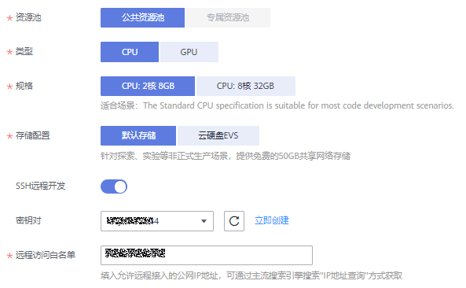

# ModelArts创建Notebook启动镜像

用户可在ModelArts开发环境中一键创建ModelBox实例并通过VsCode远程连接实例，方便地利用云上的GPU/D310资源进行推理应用开发和调试。当前在ModelArts控制台“上海一“区域以白名单形式开放。

## 准备工作

-   登录华为云ModelArts“上海一“区域。如果访问不了可以提工单申请白名单。
-   在华为云创建访问秘钥（AK和SK），用于对请求加密签名，确保请求的机密性、完整性和请求双方身份的正确性。

    访问秘钥在第一次创建时会自动下载，此后使用相同的秘钥时不会再有下载页面，请保存好。

## 创建Notebook实例

1.  登录ModelArts管理控制台，在左侧导航栏中选择“开发环境 \> Notebook“，进入“Notebook“新版管理页面。

    **图 1**  进入新版Notebook  
    

2.  单击“前往新版“，进入Notebook2.0界面，如所示。

    **图 2**  进入新版Notebook  
    

3.  单击“创建“，进入“创建Notebook“页面，请参见如下说明填写参数。
    1.  填写Notebook基本信息，包含名称、描述、是否自动停止，详细参数请参见[表1](#table1669535791517)。

        **图 3**  Notebook基本信息  
        

        **表 1**  基本信息的参数描述

        
        <table><thead align="left"><tr id="row156957575157"><th class="cellrowborder" valign="top" width="16.71%" id="mcps1.2.3.1.1">
参数名称

        </th>
        <th class="cellrowborder" valign="top" width="83.28999999999999%" id="mcps1.2.3.1.2">
说明

        </th>
        </tr>
        </thead>
        <tbody><tr id="row12695105718152"><td class="cellrowborder" valign="top" width="16.71%" headers="mcps1.2.3.1.1 ">
“名称”

        </td>
        <td class="cellrowborder" valign="top" width="83.28999999999999%" headers="mcps1.2.3.1.2 ">
Notebook的名称。只能包含数字、大小写字母、下划线和中划线，长度不能超过20位且不能为空。

        </td>
        </tr>
        <tr id="row2069535761517"><td class="cellrowborder" valign="top" width="16.71%" headers="mcps1.2.3.1.1 ">
“描述”

        </td>
        <td class="cellrowborder" valign="top" width="83.28999999999999%" headers="mcps1.2.3.1.2 ">
对Notebook的简要描述。

        </td>
        </tr>
        <tr id="row26969577153"><td class="cellrowborder" valign="top" width="16.71%" headers="mcps1.2.3.1.1 ">
“自动停止”

        </td>
        <td class="cellrowborder" valign="top" width="83.28999999999999%" headers="mcps1.2.3.1.2 ">
默认开启，且默认值为“1小时后”，表示该Notebook实例将在运行1小时之后自动停止，即1小时后停止计费。

        
开启自动停止功能后，可选择“1小时后”、“2小时后”、“4小时后”、“6小时后”或“自定义”几种模式。选择“自定义”模式时，可指定1~24小时范围内任意整数。

        </td>
        </tr>
        </tbody>
        </table>

    2.  填写Notebook详细参数，如工作环境、资源规格等，详细参数请参见[ModelArts创建Notebook启动镜像](ModelArts创建Notebook启动镜像.md)。

        **图 4**  Notebook实例的详细参数  
        

        

        **图 5**  Notebook实例的详细参数  
        

        **表 2**  Notebook实例的详细参数说明

        
        <table><thead align="left"><tr id="row1604184022219"><th class="cellrowborder" valign="top" width="16.8%" id="mcps1.2.3.1.1">
参数名称

        </th>
        <th class="cellrowborder" valign="top" width="83.2%" id="mcps1.2.3.1.2">
说明

        </th>
        </tr>
        </thead>
        <tbody><tr id="row26048409224"><td class="cellrowborder" valign="top" width="16.8%" headers="mcps1.2.3.1.1 ">
“镜像”

        </td>
        <td class="cellrowborder" valign="top" width="83.2%" headers="mcps1.2.3.1.2 ">
支持公共镜像和自定义镜像。

        <ul id="ul106491257429"><li>公共镜像：即预置在ModelArts内部的AI框架。</li><li>自定义镜像：可以将基于公共镜像创建的实例保存下来，作为自定义镜像使用。</li></ul>
        
一个镜像对应支持一种AI引擎，不可以在同一个Notebook实例中切换AI引擎。

        
由于开发应用使用推理框架ModelBox，因此创建Notebook实例时选择ModelBox镜像。

        </td>
        </tr>
        <tr id="row18604164013223"><td class="cellrowborder" valign="top" width="16.8%" headers="mcps1.2.3.1.1 ">
“资源池”

        </td>
        <td class="cellrowborder" valign="top" width="83.2%" headers="mcps1.2.3.1.2 ">
“公共资源池”无需单独购买，即开即用，按需付费，即按您的Notebook实例运行时长进行收费。

        
“公共资源池”本次版本暂不支持，将在下个版本开放。

        
“专属资源池”需要单独购买并创建。

        </td>
        </tr>
        <tr id="row136058406229"><td class="cellrowborder" valign="top" width="16.8%" headers="mcps1.2.3.1.1 ">
“类型”

        

        </td>
        <td class="cellrowborder" valign="top" width="83.2%" headers="mcps1.2.3.1.2 ">
芯片类型包括CPU、GPU和Ascend类型。

        
不同的镜像支持的芯片类型不同，根据实际需要选择。

        
GPU性能更佳，但是相对CPU而言，费用更高。

        </td>
        </tr>
        <tr id="row19605184010226"><td class="cellrowborder" valign="top" width="16.8%" headers="mcps1.2.3.1.1 ">
“规格”

        </td>
        <td class="cellrowborder" valign="top" width="83.2%" headers="mcps1.2.3.1.2 ">
根据选择的芯片类型不同，可选资源规格也不同。

        <ul id="ul66051440132210"><li>CPU规格
“2核8GB”：Intel CPU通用规格，用于快速数据探索和实验

        
“8核32GB”：Intel CPU算力增强型，适用于密集计算场景下运算

        </li><li>GPU规格
“GPU: 1*V100(32GB)|CPU: 8 核 64GB”：NVIDIA V100 GPU单卡规格，32GB显存，适合深度学习场景下的算法训练和调测

        </li><li>Ascend规格
“Ascend: 1*Ascend 910|CPU: 24 核 96GB”：昇腾910(32GB显存)单卡规格，配搭ARM处理器，适合深度学习场景下的模型训练和调测

        </li></ul>
        
镜像选择ModelBox镜像时，可选规格为“GPU: 1*V100(32GB)|CPU: 8 核 64GB”。

        </td>
        </tr>
        <tr id="row7480634155314"><td class="cellrowborder" valign="top" width="16.8%" headers="mcps1.2.3.1.1 ">
“资源池规格”

        </td>
        <td class="cellrowborder" valign="top" width="83.2%" headers="mcps1.2.3.1.2 ">
按实际情况选择已创建的专属资源池。

        </td>
        </tr>
        <tr id="row95332486599"><td class="cellrowborder" valign="top" width="16.8%" headers="mcps1.2.3.1.1 ">
“规格”

        </td>
        <td class="cellrowborder" valign="top" width="83.2%" headers="mcps1.2.3.1.2 ">
支持Ascend规格：“Ascend: 1*Ascend 910|CPU: 24 核 96GB” 昇腾910(32GB显存)单卡规格，配搭ARM处理器，适合深度学习场景下的模型训练和调测

        </td>
        </tr>
        <tr id="row5606114012216"><td class="cellrowborder" valign="top" width="16.8%" headers="mcps1.2.3.1.1 ">
“存储配置”

        </td>
        <td class="cellrowborder" valign="top" width="83.2%" headers="mcps1.2.3.1.2 ">
存储配置可选“默认存储”和“云硬盘EVS”。

        <ul id="ul106061540192218"><li>选择“默认存储”作为存储位置。
公共资源池模式下支持，专属资源池模式下不支持。

        
选择此模式，平台免费为每一个Notebook提供50GB的默认存储。

        </li><li>选择“云硬盘EVS”作为存储位置
根据实际使用量设置磁盘规格。磁盘规格默认5GB。磁盘规格的取值范围为5GB～4096GB。

        
从Notebook实例创建成功开始，直至实例删除成功，磁盘每GB按照规定费用收费。

        </li></ul>
        
“默认存储”和“云硬盘EVS”的存储路径挂载在/home/ma-user/work目录下。用户在Notebook实例中的所有文件读写操作都是针对该存储目录下的的内容操作，与OBS无关。

        
停止或重启Notebook实例时，内容会被保留，不丢失。

        
删除Notebook实例时，内容不保留。

        </td>
        </tr>
        <tr id="row6606144010222"><td class="cellrowborder" valign="top" width="16.8%" headers="mcps1.2.3.1.1 ">
“SSH远程开发”

        </td>
        <td class="cellrowborder" valign="top" width="83.2%" headers="mcps1.2.3.1.2 ">
开启此功能后，用户可以在本地开发环境中远程接入Notebook实例的开发环境。

        
开发应用时支持本地SSH远程连接，开启“SSH远程开发”功能。

        </td>
        </tr>
        <tr id="row15192194815534"><td class="cellrowborder" valign="top" width="16.8%" headers="mcps1.2.3.1.1 ">
“密钥对”

        </td>
        <td class="cellrowborder" valign="top" width="83.2%" headers="mcps1.2.3.1.2 ">
开启“SSH远程开发”功能后，需要设置此参数。

        
可以选择已有密钥对。

        
也可以单击密钥对右侧的“立即创建”，跳转到数据加密控制台，在“密钥对管理 &gt; 私有密钥对”页面，单击“创建密钥对”。

        
 注意： 

创建好的密钥对，请下载并妥善保存，使用本地IDE远程连接云上Notebook开发环境时，需要用到密钥对进行鉴权认证。

        

        </td>
        </tr>
        <tr id="row152971344135318"><td class="cellrowborder" valign="top" width="16.8%" headers="mcps1.2.3.1.1 ">
“远程访问白名单”

        </td>
        <td class="cellrowborder" valign="top" width="83.2%" headers="mcps1.2.3.1.2 ">
开启“SSH远程开发”功能后，需要设置此参数。

        
远程访问白名单设置为将要访问这个Notebook的IP地址，例如本地PC的IP地址或者访问机器的外网地址。

        
访问机器的外网地址可以在主流搜索引擎中搜索“IP地址查询”获取，如<a href="#fig157732211483">图6</a>所示。

        
白名单IP地址如果配置错误将无法连接Notebook开发环境。

        
创建完Notebook后，可以在Notebook详情页中修改白名单IP地址。

        </td>
        </tr>
        </tbody>
        </table>

        **图 6**  IP地址查询  
        

4.  参数填写完成后，单击“下一步“进行规格确认。
5.  参数确认无误后，单击“提交“，完成Notebook的创建操作。

    进入Notebook列表，正在创建中的Notebook状态为“创建中“，创建过程需要几分钟，请耐心等待。当Notebook状态变为“运行中“时，表示Notebook已创建并启动完成。

6.  在Notebook列表，单击实例名称，进入实例详情页，查看Notebook实例配置信息。

    包括Notebook实例名称、规格、状态、镜像类型、用户ID、存储路径、存储容量、Notebook地址和端口号、允许远程访问的白名单IP地址、认证密钥文件名。

    **图 7**  查看Notebook实例详情  
    

    在白名单右侧单击修改，可以修改允许远程访问的白名单IP地址。

