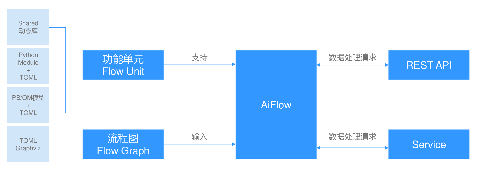

# ModelBox使用简介

ModelBox是一个专门为开发者，研究人，学生提供的一个易于使用，高效，高扩展性的AI推理开发框架，可以帮助开发者快速完成AI推理应用的开发和上线工作。

ModelBox的目标就是解决AI开发者在开发AI应用时的编程复杂度，降低AI应用的开发难度，将复杂的数据处理、并发互斥、多设备协同、组件复用、数据通信交由ModelBox处理。开发者主要聚焦业务逻辑本身，而不是AI 软件推理实现细节。 在提高AI应用开发效率的同时，保证软件应用推理的性能、可靠性、跨平台、易扩展等属性。

## 常用概念

使用ModelBox前，请提前了解ModelBox相关概念和介绍。

**图 1**  ModelBox核心概念  

-   流程图

    ModelBox中用流程图\(Graph\)来表达应用逻辑。采用有向图的方式，将应用的执行逻辑表达为顶点和边，其中顶点表示了应用的某个数据处理逻辑单元，边则表示了逻辑单元之间的数据传递关系。在ModelBox中，针对流程图的开发，既可以使用文本方式直接编辑，也可以使用可视化的编辑器进行编辑。对于流程图的表述，ModelBox默认采用Graphviz进行解释，即图的表述需要满足Graphviz的语法要求。

-   功能单元

    ModelBox将流程图中的顶点称为功能单元。功能单元是应用的基本组成部分，也是ModelBox的执行单元。在ModelBox中，内置了大量的基础功能单元，开发者可以将这些功能单元直接集成到应用流程图中，这也是基于流程图开发的一大好处。除内置功能单元外，ModelBox支持功能单元的自定义开发，支持的功能单元形式多样，如C/C++动态库、Python脚本、模型+Toml配置文件等。

-   接收数据处理请求

    应用流程图构建完毕后，需要数据处理请求才能触发应用运行。ModelBox提供两种数据处理请求接收的方式：在功能单元中，通过在加载时调用API产生数据处理的请求，因为产生的请求是固定的，所以一般用于调试场景；标准使用方式是使用ModelBox提供的[服务插件](http://modelarts-aiflow.inhuawei.com/develop/service-plugin/service-plugin.html)机制，在插件中接收外部请求，并调用任务相关的API来完成数据处理的请求。ModelBox提供了默认的服务插件可用于参考。数据处理请求的创建请详见[数据流](http://modelarts-aiflow.inhuawei.com/framework-conception/stream.html)。

-   ModelBox

    在应用构建完成后，结合ModelBox的框架才能形成完整可运行的应用。ModelBox作为应用入口，首先进行功能单元的扫描加载、应用流程图读取构建，然后接收数据处理请求，数据触发ModelBox中的执行引擎对功能单元进行调度，最终完成请求的数据处理任务。

## 使用流程

本文档以一个简单的应用为例，帮助您快速熟悉端到端使用ModelBox开发应用的流程。本文档开发的应用即打开一个mp4视频文件，推送到RTSP服务器，然后在PC端使用PotPlayer播放该mp4视频文件。

-   [步骤一：启动ModelBox开发镜像](../qs-modelbox/步骤一-启动ModelBox开发镜像.md)
-   [步骤二：远程连接ModelBox](../qs-modelbox/步骤二-远程连接ModelBox.md)
-   [步骤三：开发ModelBox应用](../qs-modelbox/步骤三-开发ModelBox应用.md)

