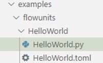
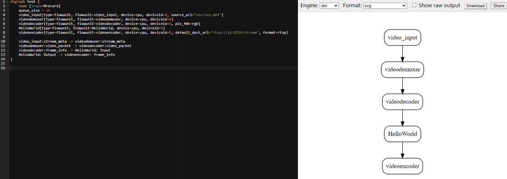

# 开发功能单元<a name="ZH-CN_TOPIC_0000001190564115"></a>

[开发流程图](../qs-modelbox/开发流程图.md)所开发的应用使用的是ModelBox自带的功能单元，本章节在此基础上使用Python语言开发一个简单的功能单元，嵌入到应用中，即在视频页面左上方写上“Hello World“。

1.  在Visual Studio Code执行如下命令，在指定路径下基于Python功能单元模板生成“HelloWorld“功能单元。

    ```
    modelbox-tool create -t python -n HelloWorld -d ./examples/flowunits
    ```

    其中，“./examples/flowunits“为存放功能单元的实际路径。

    生成的功能单元包括“.py“文件和“.toml“配置文件。

    **图 1**  功能单元<a name="fig751553213716"></a>  
    

2.  “.py“文件描述了功能单元的处理逻辑，在“.py“文件中增加OpenCV与numpy包的引用，修改其中的process函数，具体如下。

    ```
    import cv2
    import numpy as np
    …
        def process(self, data_context):
            # Process the data
            in_data = data_context.input("Input")
            out_data = data_context.output("Output")
            for buffer in in_data:
                width = buffer_img.get('width')
                height = buffer_img.get('height')
                channel = buffer_img.get('channel')
                img_data = np.array(buffer_img.as_object(), copy=False)
                img_data = img_data.reshape((height, width, channel))
                cv2.putText(img_data, 'Hello World', (50, 50), cv2.FONT_HERSHEY_SIMPLEX, 1, (255, 0, 0), 2)
                out_buffer = self.create_buffer(img_data)
                out_buffer.copy_meta(buffer_img)
                out_data.push_back(out_buffer)
            return modelbox.Status.StatusCode.STATUS_SUCCESS
    ```

    “.toml“配置文件配置该功能单元的名称、类别、输入输出端口等信息，当前不用修改。

3.  修改在[开发功能单元](../qs-modelbox/开发功能单元.md)创建的流程图“toml“格式文件，具体内容如下。

    ```shell
    [driver]
    dir = ["/usr/local/" ,
    "path-to-HelloWorld-flowunits"]
    skip-default = false
    [profile]
    profile=false
    trace=false
    dir="/tmp/"
    [log]
    level="DEBUG"
    [graph]
    format = "graphviz"
    graphconf = """digraph test {
        node [shape=Mrecord]
        queue_size = 16
        video_input[type=flowunit, flowunit=video_input, device=cpu, deviceid=0, source_url="xxx/xxx.mp4"]
        videodemuxer[type=flowunit, flowunit=videodemuxer, device=cpu, deviceid=0]
        videodecoder[type=flowunit, flowunit=videodecoder, device=cpu, deviceid=0, pix_fmt=rgb] 
        HelloWorld[type=flowunit, flowunit=HelloWorld, device=cpu, deviceid=0]
        videoencoder[type=flowunit, flowunit=videoencoder, device=cpu, deviceid=0, default_dest_url="rtsp://IP:PORT/stream", format=rtsp]
        video_input:stream_meta -> videodemuxer:stream_meta
        videodemuxer:video_packet -> videodecoder:video_packet 
        videodecoder:frame_info -> HelloWorld: Input
        HelloWorld: Output -> videoencoder: frame_info
    }"""
    [flow]
    desc = "test for video streams"
    ```

    其中，

    -   \[driver\]配置项的“dir“中添加了HelloWorld功能单元的路径_“path-to-HelloWorld-flowunits“，根据实际路径配置_。
    -   “source\_url“和“default\_dest\_url“需要根据实际情况自己配置，和[开发功能单元](../qs-modelbox/开发功能单元.md)创建的“toml“格式文件内容一致。

4.  ModelBox使用graphviz格式描述流程图，将流程图定义内容拷贝到[graphhiz工具](https://dreampuf.github.io/GraphvizOnline)中进行查看。

    **图 2**  应用流程图-1<a name="fig12356145818517"></a>  
    

5.  在Visual Studio Code执行如下命令，执行流程图。

    ```shell
    modelbox-tool -verbose -log-level INFO flow -run xxx/xxx.toml  
    ```

    其中，“xxx/xxx.toml“为“toml“格式文件的实际存放路径。

6.  打开浏览器，输入“toml“格式文件中配置的“default\_dest\_url“地址，选择对话框中“打开PotPlayer专用播放“。

    弹出的PotPlayer将会播放“toml“格式文件中配置的mp4视频文件。

    **图 3**  视频播放-1<a name="fig85035617539"></a>  
    


