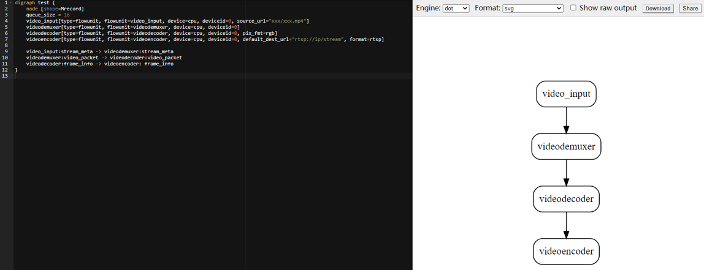

# 开发流程图<a name="ZH-CN_TOPIC_0000001144764062"></a>

本章节以开发一个简单的应用为例，介绍如何在Visual Studio Code开发ModelBox应用，该应用即打开一个mp4视频文件，推送到RTSP服务器，然后在PC端使用PotPlayer播放该mp4视频文件。

## 准备工作<a name="section13285135710513"></a>

在PC端安装PotPlayer播放器，用于播放RTSP视频流。

## 操作步骤<a name="section158165261865"></a>

1.  在[步骤一：启动ModelBox开发镜像](../qs-modelbox/步骤一-启动ModelBox开发镜像.md)已下载ModelBox的服务器中创建“toml“格式文件，用来描述流程图。

    ModelBox会根据流程图构建应用处理逻辑。

    ```shell
    [driver]
    dir = ["/usr/local/"]
    skip-default = false
    [profile]
    profile=false
    trace=false
    dir="/tmp/"
    [log]
    level="DEBUG"
    [graph]
    format = "graphviz"
    graphconf = """digraph test {
        node [shape=Mrecord]
        queue_size = 16
        video_input[type=flowunit, flowunit=video_input, device=cpu, deviceid=0, source_url="XXX/XXX/XXX.mp4"] 
        videodemuxer[type=flowunit, flowunit=videodemuxer, device=cpu, deviceid=0]
        videodecoder[type=flowunit, flowunit=videodecoder, device=cpu, deviceid=0, pix_fmt=rgb]
        videoencoder[type=flowunit, flowunit=videoencoder, device=cpu, deviceid=0, default_dest_url="rtsp://IP:PORT/stream", format=rtsp]
        video_input:stream_meta -> videodemuxer:stream_meta
        videodemuxer:video_packet -> videodecoder:video_packet
        videodecoder:frame_info -> videoencoder: frame_info
    }"""
    [flow]
    desc = "test for video streams"
    ```

    其中，“source\_url“和“default\_dest\_url“需要根据实际情况自己配置。

    -   _“XXX/XXX/XXX.mp4“_：实际mp4视频文件存放路径。
    -   _“IP“_：服务器IP。
    -   _“PORT“_：[步骤一：Docker开发镜像](../qs-modelbox/步骤一-启动ModelBox开发镜像.md#li16320324152911)中安装的RTSP服务器配置端口号。

    例如**source\_url="home/test.mp4"**、**default\_dest\_url="rtsp://10.10.10.100:8554/stream"**。

    > **说明：** 
    >如果启动ModelBox开发镜像使用的是[ModelArts创建Notebook启动镜像](../qs-modelbox/ModelArts创建Notebook启动镜像.md)，“default\_dest\_url“中的“IP:PORT“配置成localhost即可，例如**default\_dest\_url="rtsp://localhost/stream"**。

2.  ModelBox使用graphviz格式描述流程图，将流程图定义内容拷贝到[graphhiz工具](https://dreampuf.github.io/GraphvizOnline)中进行查看。

    **图 1**  应用流程图-0<a name="fig1326812414412"></a>  
    

3.  在Visual Studio Code执行如下命令，执行流程图。

    ```shell
    modelbox-tool -verbose -log-level INFO flow -run xxx/xxx.toml  
    ```

    其中，“xxx/xxx.toml“为“toml“格式文件的实际存放路径。

4.  打开浏览器，输入“toml“格式文件中配置的“default\_dest\_url“地址，选择对话框中“打开PotPlayer专用播放“。

    弹出的PotPlayer将会播放“toml“格式文件中配置的mp4视频文件。

    **图 2**  视频播放-0<a name="fig85035617539"></a>  
    


