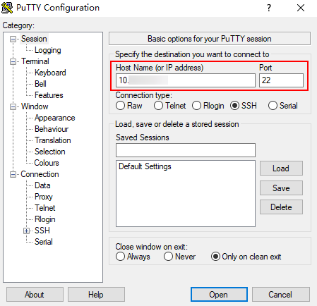
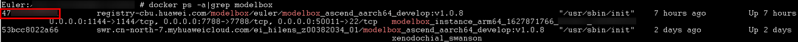
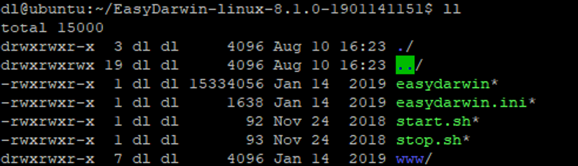
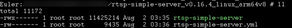

# 步骤一：启动ModelBox开发镜像<a name="ZH-CN_TOPIC_0000001190564113"></a>

## 准备工作<a name="section1409416191216"></a>

已下载SSH登录工具，如[PuTTY](https://www.putty.org/)。

## 操作步骤<a name="section1431131910139"></a>

1.  运行PuTTY，单击“Session“，在“Host Name\(or IP address\)“的输入框中输入服务器IP，在“Port“输入框中输入端口号，如[图1](#fig13585102521318)所示。

    **图 1**  使用PuTTY登录服务器<a name="fig13585102521318"></a>  
    

2.  单击“open“。

    登录端侧设备。

3.  输入服务器账户密码，登录服务器。
4.  根据服务器端硬件规格，在服务器选择合适的文件夹下载ModelBox开发镜像。
    -   X86+GPU服务器，执行如下命令下载镜像

        ```
        docker pull modelbox/modelbox_cuda101_develop
        ```

    -   ARM+D310服务器（如Atlas500），执行如下命令下载镜像

        ```
        docker pull modelbox/modelbox_ascend_aarch64_develop
        ```

5.  在服务器中选择合适的文件夹创建如下docker启动脚本，或在本地将如下脚本按需修改后，粘贴到ssh终端中执行。

    > **说明：** 
    >脚本中注明\[modify\]的地方都可以根据自己的需要修改。

    -   X86+GPU服务器可使用如下脚本。

        ```shell
        #! /bin/bash
         
        # ssh map port [modify]
        SSH_MAP_PORT=50011
         
        # editor map port [modify]
        EDITOR_MAP_PORT=1104
         
        # http server port [modify]
        HTTP_SERVER_PORT=7788
         
        # container name [modify]
        CONTAINER_NAME="modelbox_instance_`date +%s`_xxx"  # xxx可自定义。
         
        HTTP_DOCKER_PORT_COMMAND="-p $HTTP_SERVER_PORT:$HTTP_SERVER_PORT"
        sudo docker run -itd --gpus all \
        -e NVIDIA_DRIVER_CAPABILITIES=compute,utility,video \
        --tmpfs /tmp \
        --tmpfs /run \
        -v /sys/fs/cgroup:/sys/fs/cgroup:ro \
        --name $CONTAINER_NAME \
        -v /opt/modelbox:/opt/modelbox \
        -v /home:/home \
        -p $SSH_MAP_PORT:22 \
        -p $EDITOR_MAP_PORT: 1104 $HTTP_DOCKER_PORT_COMMAND \
        registry-cbu.huawei.com/modelbox/euler/modelbox_cuda101_develop:v1.0.8 /usr/sbin/init
        ```

    -   ARM+D310服务器可使用如下脚本。

        ```shell
        #!/bin/bash
         
        # ssh map port, [modify]
        SSH_MAP_PORT=50011
         
        # editor map port [modify]
        EDITOR_MAP_PORT=1144
         
        # http server port [modify]
        HTTP_SERVER_PORT=7788
         
        # container name [modify]
        CONTAINER_NAME="modelbox_instance_arm64_`date +%s`_xxx"  # xxx可自定义。
         
        HTTP_DOCKER_PORT_COMMAND="-p $HTTP_SERVER_PORT:$HTTP_SERVER_PORT"
        sudo docker run -itd --privileged --cap-add=SYS_PTRACE \
        --tmpfs /tmp --tmpfs /run -v /sys/fs/cgroup:/sys/fs/cgroup:ro \
        --device=/dev/davinci0 --device=/dev/davinci_manager --device=/dev/hisi_hdc --device=/dev/devmm_svm \
        --name $CONTAINER_NAME -v /opt/modelbox:/opt/modelbox -v /home:/home \
        -p $SSH_MAP_PORT:22 -p $EDITOR_MAP_PORT:1144 $HTTP_DOCKER_PORT_COMMAND \
        registry-cbu.huawei.com/modelbox/euler/modelbox_ascend_aarch64_develop:v1.0.8 /usr/sbin/init
        ```

6.  执行如下命令查看本服务器已启动的所有镜像，保存新启动的镜像ID。

    ```
    docker ps –a|grep modelbox
    ```

    镜像ID在第一列，如[图2](#fig9481145793211)所示。

    **图 2**  查看镜像ID<a name="fig9481145793211"></a>  
    

7.  执行如下命令进入ModelBox。

    ```shell
    docker exec -it $docker_id bash # 其中$docker_id 指新启动的镜像ID。
    ```

8.  执行如下命令修改root用户密码。密码要求至少三类字符组合，如数字、字母、特殊符号。

    ```
    passwd root
    ```

9.  退出容器，安装RTSP服务器，用于推送实时的RTSP视频流。

    -   X86+GPU服务器选择合适的文件夹[下载EasyDarwin](https://github.com/EasyDarwin/EasyDarwin/releases)，下载后解压文件，执行**start.sh**启动RTSP服务器。

        **图 3**  下载EasyDarwin<a name="fig3247754194119"></a>  
        

    -   ARM+D310服务器选择合适的文件夹[下载rtsp-simple-server](https://github.com/aler9/rtsp-simple-server/releases)，下载后解压得到可执行文件和配置文件。

        **图 4**  下载rtsp-simple-server<a name="fig1234175414512"></a>  
        

        打开**rtsp-simple-server.yml**可修改RTSP服务相关的配置参数，如端口号默认为8554，可以根据需要修改。

        **图 5**  rtsp-simple-server.yml<a name="fig2180153317546"></a>  
        

        修改后，执行如下命令后台启动RTSP服务器。

        ```
        nohup ./rtsp-simple-server &
        ```

    > **说明：** 
    >除了使用本地服务器启动ModelBox开发镜像，也可以选择使用ModelArts在线方式启动ModelBox开发镜像，详情可参考[ModelArts创建Notebook启动镜像](../qs-modelbox/ModelArts创建Notebook启动镜像.md)。


