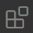
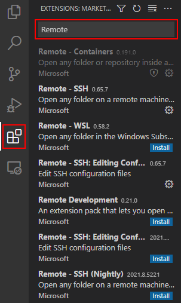
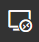
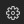
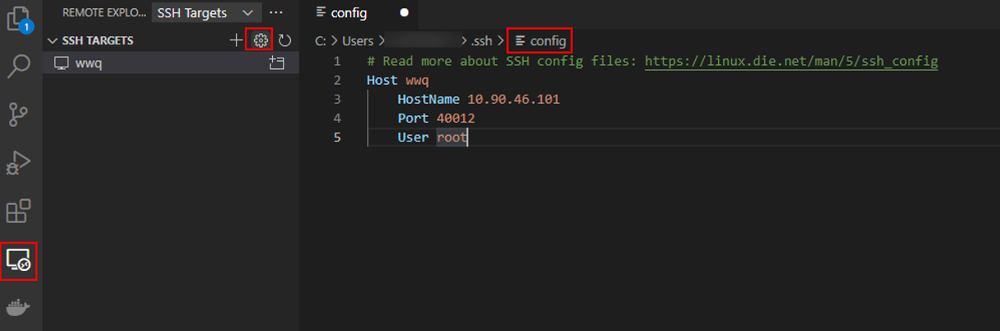
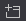
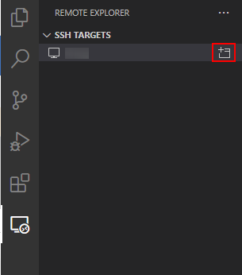

# 步骤二：远程连接ModelBox

## 准备工作

已下载并安装Visual Studio Code。

> **说明：** 
>请下载1.57.1及以下版本的Visual Studio Code。

## 操作步骤

1.  打开Visual Studio Code，单击左侧图标，搜索并安装Remote-SSH、Remote-Containers、Docker等插件。

    **图 1**  安装插件  
    

2.  单击左侧图标，鼠标移至“SSH TARGETS“右侧的，在右侧搜索框中选择“config“。

    使用Remote-SSH添加连接。

    **图 2**  配置ModelBox  
    

3.  配置ModelBox容器的远程连接，如[图2](#fig1225713518470)所示。
    -   Host：用户可自定义本次远程连接的名称。
    -   HostName：服务器IP。
    -   port：与[步骤一：启动ModelBox开发镜像](../qs-modelbox/步骤一-启动ModelBox开发镜像.md#li165103562711)创建docker时“SSH\_MAP\_PORT“的值一致。
    -   User：填写“root“。

4.  配置完，单击“SSH TARGETS“下方出现的图标。

    新弹出一个窗口。

    **图 3**  ModelBox远程连接  
    

5.  在新窗口，按提示输入ModelBox容器root帐号的密码，即[步骤一：Docker开发镜像](../qs-modelbox/步骤一-启动ModelBox开发镜像.md#li49429258269)中修改后的新密码。

    等待一会，即可连接上ModelBox容器。

    连接成功后，单击“Open folder“可直接打开ModelBox容器中的文件。

