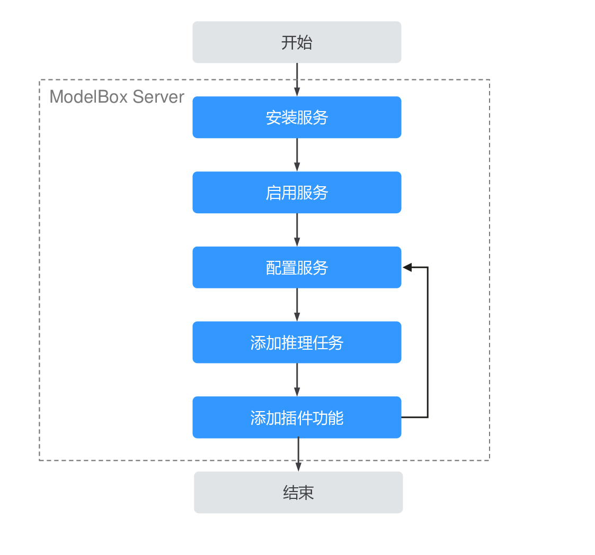

# Server服务

ModelBox Server是最基本也是最重要的服务，提供了服务化运行流程图和图形化进行UI编排的能力。

用户只需将flow流程图配置文件放到指定的目录下，即可实现flow作为服务的功能。

## Server服务使用流程

Server服务是预编译好的可执行文件，在使用时，按照正常的服务流程使用，其流程为：

1. 安装服务。
2. 启动服务。
3. 修改服务配置文件。
4. 添加流程图。
5. 管理扩展插件。

## 启动管理服务

ModelBox Server服务使用标准的systemd unit管理，启动管理服务，使用systemd命令管理。

通过如下命令对ModelBox服务进行操作：

* `sudo systemctl status modelbox.service`：查看ModelBox服务的状态。
* `sudo systemctl stop modelbox.service`：停止ModelBox服务。
* `sudo systemctl start modelbox.service`：启动ModelBox服务。
* `sudo systemctl restart modelbox.service`：重启ModelBox服务。

## ModelBox Server服务配置

ModelBox Serverf服务配置文件中包含主服务配置、插件、服务启动参数、编排服务配置和访问控制列表。
相关配置文件和配置功能说明如下：

| 配置类别         | 配置文件                          | 说明                                                                                                    |
| ---------------- | --------------------------------- | ------------------------------------------------------------------------------------------------------- |
| 主服务配置       | /usr/local/etc/modelbox/modelbox.conf | 包含基本的配置信息，如插件路径，日志级别。                                                              |
| 插件配置         | /usr/local/etc/modelbox/modelbox.conf | 和具体插件相关。                                                                                        |
| 编排服务配置     | /usr/local/etc/modelbox/modelbox.conf | 包括编排服务的配置信息，详情可见[运行服务](./editor.md)中的[运行编排服务](./editor.md#配置启用Editor)   |
| 访问控制列表     | /usr/local/etc/modelbox/modelbox.conf | 可访问ModelBox后端服务的白名单列表，详情可见[运行服务](./editor.md)中的[访问控制列表](./editor.md#访问控制列表) |
| 服务启动参数配置 | /usr/local/etc/modelbox/modelbox-opts | 支持配置ModelBox Server服务的启动参数。                                                                   |

### 主服务配置项

主服务配置主要配置插件列表，日志级别信息，具体配置项如下：

| 配置项         | 配置功能                                                                                                             |
| -------------- | -------------------------------------------------------------------------------------------------------------------- |
| `plugin.files` | ModelBox Server插件列表，顺序加载。                                                                                    |
| `log.level`    | ModelBox服务日志级别，默认为INFO，支持DEBUG, INFO, NOTICE, WARN, ERROR, FATAL, OFF，如果指定OFF，将关闭日志打印。      |
| `log.num`      | ModelBox服务日志归档文件个数最大值，默认为32，当归档日志超过该阈值时，最旧归档日志文件将删除。                         |
| `log.path`     | ModelBox服务日志文件路径，默认为`/var/log/modelbox/modelbox.log`。如果修改该配置项，需要保证日志目录存在且具有可读写权限。 |

* 插件服务配置

ModelBox启动后，会按照plugin.files配置的插件，顺序加载插件，各插件的配置，参考插件配置参数，默认`ModelBox plugin`插件的配置，可参考[运行流程图](run-flow.md)。

ModelBox服务中实现HTTP服务的可插拔模块，详见[ModelBox服务插件](../develop/service-plugin/service-plugin.md)。

### ModelBox服务启动参数配置

ModelBox Server服务启动参数配置项目如下：

| 配置项        | 配置功能                                                                                                               |
| ------------- | ---------------------------------------------------------------------------------------------------------------------- |
| `MODELBOX_OPTS` | ModelBox服务启动时会加载该变量的内容作为启动参数。如果用户需要重新指定其他的ModelBox服务运行配置时，可修改该变量的值实现。 |

## ModelBox Server预置功能列表

ModelBox Server可以通过自定义插件的形式扩展其基本功能，默认情况下，ModelBox Server集成了任务管理REST API服务，以及流程图的执行能力, ModelBox集成的插件列表。

| 插件          | 功能               | 说明                                                         | 使用指导            |
| ------------- | ------------------ | ------------------------------------------------------------ | ------------------- |
| modelbox-plugin | 默认流程图执行插件 | 默认的流程图执行插件，支持REST API管理流程图，和其执行结果。 | [指导](run-flow.md) |

## ModelBox Server文件目录

ModelBox Server安装完成后，对应的安装目录如下

| 文件路径                          | 说明                           |
| --------------------------------- | ------------------------------ |
| /usr/local/bin/modelbox             | ModelBox独立服务器主进程。       |
| /usr/local/etc/modelbox             | ModelBox配置目录。               |
| /usr/local/etc/modelbox/modelbox.conf | ModelBox主程序配置文件。         |
| /usr/local/etc/modelbox/modelbox-opts | ModelBox主程序启动参数配置文件。 |
| /usr/local/etc/modelbox/graph       | ModelBox执行程序图存储目录。     |
| /lib/systemd/modelbox.systemd       | ModelBox服务启动systemd unit。   |
| /usr/local/lib/libmodelbox-*.so     | libmodelbox，以及相关插件目录。  |

## ModelBox Server运行日志

ModelBox Server运行时的日志会记录到`/var/log/modelbox/modelbox.log`文件中。
