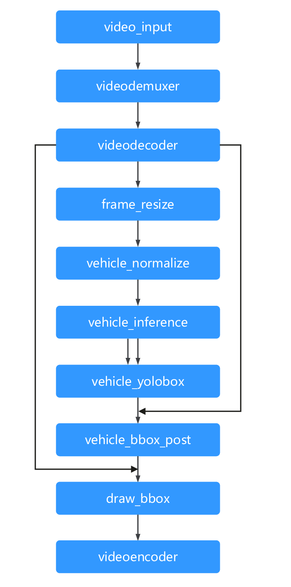

# 车辆检测

## 流程图

车牌检测流程如下图所示，video_input 功能单元接收视频流，往下分别经过 videodemuxer和videodecoder功能单元，videodecoder功能单元输出image，image经过前处理，包含resize、normalize之后，送给模型（vehicle_inference是一个yolov3模型），模型将推理得到的bbox结果传入后续的后处理功能单元进行处理（vehicle_bbox_post），可得到 最终的bbox框，将bbox框和videodecoder出来的image一同送入draw_bbox中，将绘制完bbox的image传入videoencoder，即得到带有检测框的视频。



上述提到的各个节点，在ModelBox中称为流程元（流程单元），模型图中的一个节点，编排功能单元构建运行图，运行图在ModelBox中的呈现形式为 toml文件。车辆检测运行toml文件内容如下：

```toml
[driver]
dir = ["drivers"]
[log]
level = "INFO"
[graph]
format = "graphviz"

graphconf = """digraph vehicle_detection {
            queue_size = 32
            batch_size = 16
            video_input[type=flowunit, flowunit=video_input, device=cpu, deviceid=0, source_url="test_video_vehicle.mp4"]                 
            videodemuxer[type=flowunit, flowunit=videodemuxer, device=cpu, deviceid=0]
            videodecoder[type=flowunit, flowunit=videodecoder, device=cuda, deviceid=0, pix_fmt=rgb]
            frame_resize[type=flowunit, flowunit=nppi_resize, device=cuda, deviceid=0, width=800, height=480]
            vehicle_normalize[type=flowunit, flowunit=normalize_v2, device=cuda, deviceid=0, output_layout="CHW", output_dtype="MODELBOX_FLOAT", mean="0,0,0", std="0.003921568627451,0.003921568627451,0.003921568627451"]
            vehicle_inference[type=flowunit, flowunit=vehicle_inference, device=cuda, deviceid=0]
            vehicle_yolobox[type=flowunit, flowunit=vehicle_yolobox, device=cpu, deviceid=0]
            vehicle_bbox_post[type=flowunit, flowunit=vehicle_bbox_post, device=cpu, deviceid=0]
            draw_bbox[type=flowunit, flowunit=draw_bbox, device=cpu, deviceid=0]
            videoencoder[type=flowunit, flowunit=videoencoder, device=cpu, deviceid=0, default_dest_url="rtsp://localhost/video", encoder="mpeg4"]
            
            video_input:stream_meta -> videodemuxer:stream_meta
            videodemuxer:video_packet -> videodecoder:video_packet
            videodecoder:frame_info -> frame_resize:In_1
            frame_resize: Out_1 -> vehicle_normalize: input
            vehicle_normalize: output -> vehicle_inference:data
            vehicle_inference: "layer15-conv" -> vehicle_yolobox: In_1
            vehicle_inference: "layer22-conv" -> vehicle_yolobox: In_2
            vehicle_yolobox: Out_1 -> vehicle_bbox_post: In_bbox
            videodecoder:frame_info -> vehicle_bbox_post: In_image
            vehicle_bbox_post: Out_bbox -> draw_bbox: In_1
            videodecoder:frame_info -> draw_bbox: In_2
            draw_bbox: Out_1 -> videoencoder: frame_info
}"""
```

toml构建图，定义节点和构建节点之间关系即可完成。输入配置在video_input中source_url中配置实际的视频所在路径，输出通过videoencoder输出rtsp流。

其中，[dirver]中dir的路径为，图中功能单元的so包或toml配置文件所在路径。

## 运行示例

用ModelBox的modelbox-tool命令，可以启动运行图。命令如下：

```shell
modelbox-tool -verbose flow -run vehicle_detection.toml
```

其中vehicle_detection.toml即为车牌检测的运行图，shell命令中为实际路径，运行环境中安装好EasyDarwin软件后，将 rtsp://localhost/video（localhost为你的ip）复制到网页中，即可打开浏览器，查看最后结果，示例结果如下：


