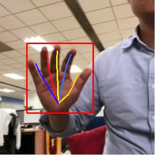

# 手势识别

手势识别解决方案是ModelBox提供可直接调用的API，开发者集成手势识别solution后，可以完成手势关键点的识别。检测效果如下图所示：



## 输入

输入类型为`ModelBox::Buffer`，其中包含Data与Meta两种数据，具体要求如下：

- Data：图片二进制数据

- Meta：无要求

## 输出

输出类型为`ModelBox::Buffer`，其中包含Data与Meta两种数据，具体如下：

- Data：检测后图片，若检测到手，则画出手的框与手指连线；若未检测到手，则为原图。

- Meta：
  - width：图片宽度。
  - height：图片高度。
  - channel：图片通道数。
  - pix_fmt：图片格式。
  - has_hand：值判断是否有检测到手，True为检测到有手，False为未检测到手。为True才会有bboxes与hand_pose参数。
  - bboxes：检测到手的box坐标。
  - hand_pose：检测到手指位置坐标，每只手5根手指，每根手指3个关键点坐标。

## 获取方法

可以通过下面两种方式获取：

- 安装包下载：进入[下载链接](http://download.modelbox-ai.com/solutions/hand_pose_detection/)，根据系统选择对应的版本进行下载到**libtorch**[ModelBox开发镜像](../environment/container-usage.md#支持容器列表)中，直接安装后可调用相关接口可以运行。

- 源码编译：进入[解决方案代码仓](https://github.com/modelbox-ai/modelbox-solutions)，克隆代码仓到**libtorch**[ModelBox开发镜像](../environment/container-usage.md#支持容器列表)中，编译`hand_pose_detection`解决方案并打包，具体命令如下：

  ```shell
  git clone https://github.com/modelbox-ai/modelbox-solutions.git
  cd modelbox-solutions
  mkdir build
  cd build
  cmake ..
  make package -j16 hand_pose_detection
  ```

  编译打包完成后，将在`release`目录下生成对应的安装包，安装在镜像中即可。

## 使用样例

### C++样例

- **头文件**

  需要引入如下头文件，并在编译时链接modelbox库：

  ```cpp
  #include <modelbox/flow.h>
  #include <opencv2/opencv.hpp>
  ```

- **Solution创建初始化和启动**
  
  ```c++
  std::shared_ptr<modelbox::Flow> CreateHandPoseDetectionSolution() {
    ModelBoxLogger.GetLogger()->SetLogLevel(modelbox::LogLevel::LOG_INFO);
    auto flow = std::make_shared<modelbox::Flow>();
    modelbox::Status mb_ret;
    mb_ret = flow->InitByName("hand_pose_detection");
    if (mb_ret != modelbox::STATUS_OK) {                           
      MBLOG_ERROR << "flow init failed, ret " << ret.Errormsg(); 
      return nullptr;                                                 
    }

    mb_ret = flow->StartRun();
    if (mb_ret != modelbox::STATUS_OK) {                           
      MBLOG_ERROR << "flow start run failed, ret " << ret.Errormsg(); 
      return nullptr;                                                 
    }

    return flow;
  }

  ```

- **外部数据交互**

  待处理数据的输入，和处理完成后结果获取。

  ```c++
  // 数据发送获取
  modelbox::Status Process(std::shared_ptr<modelbox::Flow> flow, const std::string &test_file) {
    // 创建输入输出句柄
    auto stream_io = flow->CreateStreamIO();
    modelbox::Status mb_ret;

    // 创建输入
    auto buffer = stream_io->CreateBuffer();
    mb_ret = BuildInputData(test_file, buffer);
    if (mb_ret != modelbox::STATUS_OK) {                           
      MBLOG_ERROR << "flow build input data failed, ret " << ret.Errormsg(); 
      return modelbox::STATUS_FAULT;                                                 
    }

    stream_io->Send("input", buffer);
    
    // 获取输出
    std::shared_ptr<modelbox::Buffer> output_buffer;
    stream_io->Recv("output", output_buffer);
    mb_ret = ProcessOutputData(output_buffer);
    if (mb_ret != modelbox::STATUS_OK) {                           
      MBLOG_ERROR << "flow process output failed, ret " << ret.Errormsg(); 
      return modelbox::STATUS_FAULT;                                                 
    }

    return modelbox::STATUS_OK;
  }
  ```

  - 创建输入

  ```cpp
  modelbox::Status BuildInputData(const std::string &img_path, std::shared_ptr<modelbox::Buffer> &input_buffer) {
    FILE *pImg = fopen(img_path.c_str(), "rb");
    if (pImg == nullptr) {
      MBLOG_ERROR << "file open failed, file path: " << img_path;
      return modelbox::STATUS_FAULT;
    }
  
    fseek(pImg, 0, SEEK_END);
    auto fSize = ftell(pImg);
    rewind(pImg);
  
    input_buffer->Build((size_t)fSize);
    auto buffer_data = (char *)input_buffer->MutableData();
    fread(buffer_data, fSize, 1, pImg);
  
    fclose(pImg);
    return modelbox::STATUS_OK;
  }
  ```

  - 处理输出

  ```cpp
  void ProcessOutputData(std::shared_ptr<modelbox::Buffer> &output_buffer) {
    bool has_hand;
    output_buffer->Get("has_hand", has_hand);
    MBLOG_INFO << "has hand: " << has_hand;
  
    int32_t width, height;
    output_buffer->Get("height", height);
    output_buffer->Get("width", width);
    cv::Mat image(height, width, CV_8UC3);
    memcpy_s(image.data, image.total() * image.elemSize(),
             output_buffer->ConstData(), output_buffer->GetBytes());
    cv::imwrite("path_to_result.jpg", image);
  }
  ```

- **资源释放**

  ```c++
  void FlowStop(std::shared_ptr<modelbox::Flow> flow) {
    // 结束执行
    flow->Stop();
  }
  ```

### Python样例

- **需要引入的包**

  ```python
  import modelbox
  import cv2
  import numpy as np
  ```

- **定义手势识别类**

  ```python
  class HandPoseDetection:
    ## 初始化，设置日志级别
    def __init__(self, log_level=modelbox.Log.Level.INFO):
        self.log = modelbox.Log()
        self.log.set_log_level(log_level)

    ## 初始化手势识别Solution
    def Init(self):
        self.flow = modelbox.Flow()
        ret = self.flow.init_by_name("hand_pose_detection")
        if ret == False:
            modelbox.error(ret)
            return ret
        
        ret = self.flow.start_run()
        if ret == False:
            modelbox.error(ret)
        return ret
    
    ## 设置输入图片路径，输出结果保存路径，返回是否检测到手
    def Process(self, input_file, output_path):
        stream_io = self.flow.create_stream_io()

        file = open(input_file, "rb")
        input_buffer = stream_io.create_buffer(file.read())
        file.close()
        stream_io.send("input", input_buffer)
        stream_io.close_input()

        result = stream_io.recv("output")

        has_hand = result.get("has_hand")
        msg = "has hand: " + str(has_hand)
        modelbox.info("has hand: ", msg)

        if has_hand:
            width = result.get("width")
            height = result.get("height")
            channel = result.get("channel")
            out_img = np.array(result.as_object(), dtype=np.uint8)
            out_img = out_img.reshape(height, width, channel)
            cv2.imwrite(output_path, out_img)
        
        return has_hand
  ```

- **主函数**

  ```python
  if __name__ == '__main__':
      hand_pose = HandPoseDetection()
      hand_pose.Init()
      hand_pose.Process(input_image_path, output_image_path)
  ```
