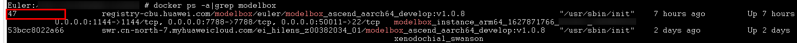
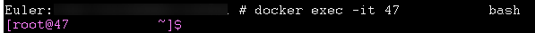
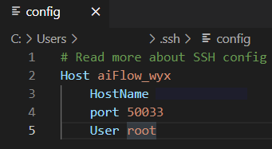
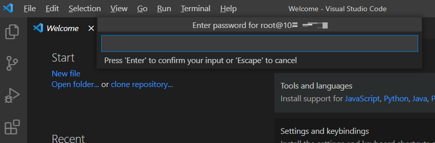

# ModelBox 上手指南

## 准备工作

### 服务器端启动镜像

1. 根据服务器端硬件规格下载ModelBox开发镜像，如X86+GPU的服务器可以用如下命令下载：

    `docker pull registry-cbu.huawei.com/modelbox/euler/modelbox_cuda101_develop:v1.0.8`

    Arm+D310的服务器（如Atlas500）可以用如下命令下载：

    `docker pull registry-cbu.huawei.com/modelbox/euler/modelbox_ascend_aarch64_develop:v1.0.8`

    其中cuda版本、镜像版本可以根据需要进行选择。下载成功后可以用docker images命令查看本机已有的镜像：

    

2. 启动ModelBox镜像，*X86+GPU*版本可使用如下脚本：

    ```bash
    #! /bin/bash

    # ssh map port [modify]
    SSH_MAP_PORT=50011

    # editor map port [modify]
    EDITOR_MAP_PORT=1104

    # http server port [modify]
    HTTP_SERVER_PORT=7788

    # container name [modify]
    CONTAINER_NAME="modelbox_instance_`date +%s`_xxx"

    HTTP_DOCKER_PORT_COMMAND="-p $HTTP_SERVER_PORT:$HTTP_SERVER_PORT"
    sudo docker run -itd --gpus all \
    -e NVIDIA_DRIVER_CAPABILITIES=compute,utility,video \
    --tmpfs /tmp \
    --tmpfs /run \
    -v /sys/fs/cgroup:/sys/fs/cgroup:ro \
    --name $CONTAINER_NAME \
    -v /opt/modelbox:/opt/modelbox \
    -v /home:/home \
    -p $SSH_MAP_PORT:22 \
    -p $EDITOR_MAP_PORT:1104 $HTTP_DOCKER_PORT_COMMAND \
    registry-cbu.huawei.com/modelbox/euler/modelbox_cuda101_develop:v1.0.8
    ```

    *Arm+D310*版本可使用如下脚本：

    ```bash
    #!/bin/bash

    # ssh map port, [modify]
    SSH_MAP_PORT=50011

    # editor map port [modify]
    EDITOR_MAP_PORT=1144

    # http server port [modify]
    HTTP_SERVER_PORT=7788

    # container name [modify]
    CONTAINER_NAME="modelbox_instance_arm64_`date +%s`_xxx"

    HTTP_DOCKER_PORT_COMMAND="-p $HTTP_SERVER_PORT:$HTTP_SERVER_PORT"
    sudo docker run -itd --privileged --cap-add=SYS_PTRACE \
    --tmpfs /tmp --tmpfs /run -v /sys/fs/cgroup:/sys/fs/cgroup:ro \
    --device=/dev/davinci0 --device=/dev/davinci_manager --device=/dev/hisi_hdc --device=/dev/devmm_svm \
    --name $CONTAINER_NAME -v /opt/modelbox:/opt/modelbox -v /home:/home \
    -p $SSH_MAP_PORT:22 -p $EDITOR_MAP_PORT:1144 $HTTP_DOCKER_PORT_COMMAND \
    registry-cbu.huawei.com/modelbox/euler/modelbox_ascend_aarch64_develop:v1.0.8
    ```

    脚本中注明[modify]的地方都可以根据自己的需要修改

3. 启动后可以用`docker ps –a|grep modelbox`看到本机已启动的所有镜像，其中镜像ID在第一列：

    

    使用`docker exec -it $docker_id bash`命令进入ModelBox容器：

    

    进入容器后使用passwd root修改root用户密码（注意密码要求至少三类字符的组合——数字、字母、特殊符号）：

    

4. 安装RTSP服务器，用于推送实时的RTSP视频流（注意是在容器外安装执行）。X86+GPU的服务器可以选择EasyDarwin，Arm版可以选择rtsp-simple-server。以rtsp-simple-server为例，下载链接为`https://github.com/aler9/rtsp-simple-server/releases`，下载后解压得到可执行文件和配置文件：

    

    打开rtsp-simple-server.yml可修改RTSP服务相关的配置参数，如端口号默认为8554，可以根据需要修改：

    

    修改后执行命令nohup ./rtsp-simple-server &，即在后台启动了RTSP服务器。

### PC端使用vscode远程连接ModelBox容器

1. 安装Visual Studio Code（下称vscode，注意不要用1.58.x版本，最高只能用1.57.1，安装后关闭自动升级）

1. vscode中安装 Remote-SSH、Remote-Containers、Docker等插件

1. vscode上使用remote ssh添加连接：

    

1. 在config中按照如下方式配置ModelBox容器的远程连接：

    

1. 设置完成后，旁边目录就会出现远程目标，点击后面的图标，重新打开一个窗口：

    

1. 打开之后，输入上面修改的容器root账号密码，稍等片刻，就可以连接上了：

    

1. 点击Open folder, 可以直接打开docker中的文件：

    

1. 想要在代码中实现跳转，需要在远端安装跳转工具，点击插件，然后插件上会出现 `install in SSH: ...`。点击后会就在远端安装该插件，一般安装C/C++, python等，安装好之后会在插件的SSH栏中出现：

    

1. 安装PotPlayer播放器，用于播放rtsp视频流

## 第一个ModelBox应用

准备工作完成后，就可以在vscode中开发ModelBox应用了，第一个应用非常简单：打开一个mp4视频文件，推送到RTSP服务器，然后在PC端使用PotPlayer播放出来。

### 流程图开发

1. ModelBox根据流程图构建应用的处理逻辑，我们使用TOML格式的文件来描述第一个应用：

    ```toml
    [driver]
    dir = ["/usr/local/"]
    skip-default = false
    [profile]
    profile=false
    trace=false
    dir="/tmp/"
    [log]
    level="DEBUG"
    [graph]
    format = "graphviz"
    graphconf = """digraph test {
        node [shape=Mrecord]
        queue_size = 16
        video_input[type=flowunit, flowunit=video_input, device=cpu, deviceid=0, source_url="xxx/xxx.mp4"]
        videodemuxer[type=flowunit, flowunit=videodemuxer, device=cpu, deviceid=0]
        videodecoder[type=flowunit, flowunit=videodecoder, device=cpu, deviceid=0, pix_fmt=rgb]
        videoencoder[type=flowunit, flowunit=videoencoder, device=cpu, deviceid=0, default_dest_url="rtsp://ip:8554/stream", format=rtsp]
        video_input:stream_meta -> videodemuxer:stream_meta
        videodemuxer:video_packet -> videodecoder:video_packet
        videodecoder:frame_info -> videoencoder: frame_info
    }"""
    [flow]
    desc = "test for video streams"
    ```

    使用时，需要将video_input单元中的source_url属性内容修改为实际的mp4文件路径，将videoencoder单元default_dest_url属性内容中的ip修改为真实的服务器ip，端口号8554要与rtsp-simple-server或者EasyDarwin中配置的端口号保持一致。

1. 如上所示，ModelBox使用graphviz格式描述流程图，我们可以把中间那一段digraph流程图定义内容拷贝到graphviz工具（如：`https://dreampuf.github.io/GraphvizOnline`）中进行查看：

    

## 流程图执行

1. 流程图开发好之后，在vscode terminal中使用modelbox-tool -verbose -log-level INFO flow -run xxx/xxx.toml执行该流程图：

    

1. 打开浏览器，输入TOML文件中配置的default_dest_url地址，点击弹出对话框中的“打开PotPlayer专用播放”按钮：

    

1. 弹出的PotPlayer将会播放TOML文件中配置的mp4视频文件

## 开发自己的流单元

第一个应用中使用的都是ModelBox自带的流单元，接下来我们用Python开发一个最简单的流单元，嵌入到上面的应用中：在画面左上方写上“Hello World”，再输出。

### 新建流单元

1. 在`vscode terminal`中执行`modelbox-tool create -t python -n HelloWorld -d path-to-flowunits`：

    

    命令执行后将在指定路径下基于Python流单元模板生成HelloWorld流单元，包括一个py文件和一个toml配置文件：

    

1. 在`HelloWorld.toml`中配置该流单元的名称、类别、输入输出端口等信息，当前不用修改；HelloWorld.py中描述了该流单元的处理逻辑，这里我们增加OpenCV与numpy包的引用，修改其中的process函数如下：

    ```python
    import cv2
    import numpy as np
    …
    def process(self, data_context):
        # Process the data
        in_data = data_context.input("Input")
        out_data = data_context.output("Output")

        for buffer in in_data:
            width = buffer_img.get('width')
            height = buffer_img.get('height')
            channel = buffer_img.get('channel')

            img_data = np.array(buffer_img.as_object(), copy=False)
            img_data = img_data.reshape((height, width, channel))

            cv2.putText(img_data, 'Hello World', (50, 50), cv2.FONT_HERSHEY_SIMPLEX, 1, (255, 0, 0), 2)

            out_buffer = self.create_buffer(img_data)
            out_buffer.copy_meta(buffer_img)
            out_data.push_back(out_buffer)

        return modelbox.Status.StatusCode.STATUS_SUCCESS
    ```

### 流程图执行方式

1. 修改流程图TOML文件如下：

    ```toml
    [driver]
    dir = ["/usr/local/" ,
    "path-to-HelloWorld-flowunits"]
    skip-default = false
    [profile]
    profile=false
    trace=false
    dir="/tmp/"
    [log]
    level="DEBUG"
    [graph]
    format = "graphviz"
    graphconf = """digraph test {
        node [shape=Mrecord]
        queue_size = 16
        video_input[type=flowunit, flowunit=video_input, device=cpu, deviceid=0, source_url="xxx/xxx.mp4"]
        videodemuxer[type=flowunit, flowunit=videodemuxer, device=cpu, deviceid=0]
        videodecoder[type=flowunit, flowunit=videodecoder, device=cpu, deviceid=0, pix_fmt=rgb] 
        HelloWorld[type=flowunit, flowunit=HelloWorld, device=cpu, deviceid=0]
        videoencoder[type=flowunit, flowunit=videoencoder, device=cpu, deviceid=0, default_dest_url="rtsp://ip:8554/stream", format=rtsp]
        
        video_input:stream_meta -> videodemuxer:stream_meta
        videodemuxer:video_packet -> videodecoder:video_packet 
        videodecoder:frame_info -> HelloWorld: Input
        HelloWorld: Output -> videoencoder: frame_info
    }"""
    [flow]
    desc = "test for video streams"
    ```

    其中[driver]配置项的dir中添加了HelloWorld流单元的路径，graphviz图定义中插入HelloWorld流单元，新的流程图如下所示：

    

1. 在vscode terminal中执行该流程图，通过浏览器打开PotPlayer播放，可看到输出的视频。
