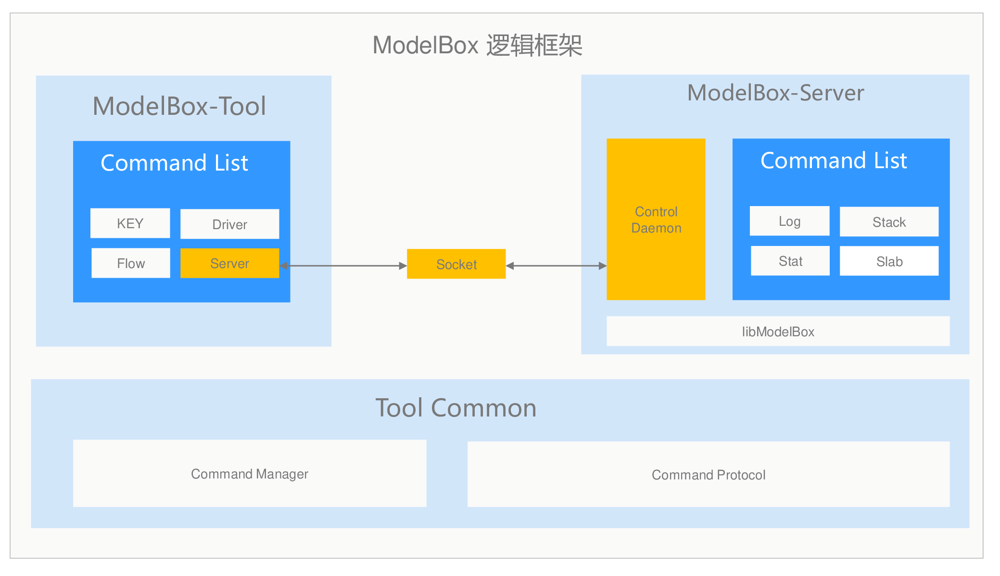

# ModelBox Tool

ModelBox Tool是ModelBox套件集成的一个开发、维护工具，提供了开发、维护的常用命令, 可用于开发调试。

在功能上，ModelBox Tool包含了如下功能

| 功能    | 功能说明                             |
| ------- | ------------------------------------ |
| help    | 显示帮助信息                         |
| driver  | 查看Driver列表及其功能               |
| flow    | 快速运行一个流程，快速验证           |
| key     | 密码加解密，模型加解密               |
| server  | 查看Log，Stack，Slab和Statistics信息 |
| develop | 创建开发编排环境                         |

ModelBox为标准的命令行工具，可以使用`modelbox-tool -h`查看详细的帮助说明。

## help功能

用于显示Modelbox各命令组帮助信息

* 查询各命令组帮助信息
  
    ```shell
    modelbox-tool help driver
    modelbox-tool help flow
    modelbox-tool help key
    modelbox-tool help server
    modelbox-tool help develop
    modelbox-tool help template
    ```

## driver功能

用于查询ModelBox Driver相关的信息。

此命令组为`modelbox-tool driver`，格式如下：

```shell
modelbox-tool driver [-type flowunit] [-path dir1,dir2] [-details [-name name]] [-conf path/to/graph.conf]
```

-path为添加扫描路径，不携带时默认扫描系统目录，携带时，扫描系统目录和新增目录。

-name 为过滤参数，不携带时默认列出所有扫描到的结果，可以输入功能单元名称进行过滤，也可以输入cpu/cuda/ascend进行设备类型过滤。

### 查询列表

在开发过程中，可能需要查询图中需要的插件的列表，这时ModelBox Tool可以用于查询当前图的情况。

常用命令如下：

* 查询当前系统中已经安装可用的driver：

    ```shell
    modelbox-tool driver -info
    ```

* 查询当前系统中已经安装可用的flowunit列表：

    ```shell
    modelbox-tool driver -info -type flowunit
    ```

* 查询系统路径和指定图文件的flowunit列表

    ```shell
    modelbox-tool driver -info -type flowunit -conf [path/to/graph.conf]
    ```

* 查询系统路径和指定路径使用的flowunit

    ```shell
    modelbox-tool driver -info -type flowunit -path [path/to/flowunits]
    ```

* 查询单个flowunit的详细信息

     ```shell
     modelbox-tool driver -info -type flowunit -details -name [FlowunitName] -path [path/to/flowunit]
    ```

### 查询详细信息

如需要查询具体功能单元的功能说明，输入，输出名称和选项设置，可以用ModelBox Tool查询详细参数。

常用命令如下：

* 查询当前系统中driver的详细信息：

    ```shell
    modelbox-tool driver -info -details -name [name] 
    ```

* 查询当前系统中所有功能单元的详细信息：

    ```shell
    modelbox-tool driver -info -type flowunit -details -name cuda
    ```

* 查询指定名称的功能单元详细信息

     ```shell
     modelbox-tool driver -info -type flowunit -details -name [name] -path [path/to/flowunit]
    ```

## Flow功能

流程图相关的功能，用于测试，验证图是否配置正确。

此命令组为`modelbox-tool flow`

### 运行调测流程图

在开发过程中，可能需要临时调试图以及对应的功能单元，这时，可以使用`modelbox-tool flow`命令组的命令。

* 执行图

    ```shell
    modelbox-tool flow -run [path/to/graph.toml]
    ```

工具执行后的运行日志，存储在`/var/log/modelbox/modelbox-tool.log`中。如果需要修改日志级别，或将日志输出到屏幕上，可参考后续章节的内容。

## template功能

创建代码模板，用于开发准备。可以使用`modelbox-tool template`命令组,格式如下：

```shell
modelbox-tool template [options]
```

* 创建工程模板

    ```shell
    modelbox-tool template -project -name [name]
    ```

* 创建c++功能单元模板

    ```shell
    modelbox-tool template -flowunit -lang c++ -name [name] -input name=[port_name],device=[cpu/cuda/ascend/...] -output name=[port_name],device=[cpu/cuda/ascend/...]
    ```

* 创建python功能单元模板

    ```shell
    modelbox-tool template -flowunit -lang python -name [name] -input name=[port_name],device=[cpu/cuda/ascend/...] -output name=[port_name],device=[cpu/cuda/ascend/...]
    ```

* 创建推理功能单元模板
  
    ```shell
    modelbox-tool template -flowunit -lang infer -name [name] --virtual-type [tensorflow/tensorrt/torch/acl/mindspore] -model [model_path] -copy-model -input name=[port_name],device=[cpu/cuda/ascend/...] -output name=[port_name],device=[cpu/cuda/ascend/...]
    ```

* 创建YOLO功能单元模板
  
    ```shell
    modelbox-tool template -flowunit -lang yolo -name [name] -virtual-type yolov3_postprocess -input name=[port_name],device=[cpu/cuda/ascend/...] -output name=[port_name],device=[cpu/cuda/ascend/...]
    ```

* 创建服务插件模板

    ```shell
    modelbox-tool template -service-plugin -name [name]
    ```

通常情况下，先创建工程模板，再在工程对应目录创建功能单元或者服务插件。

## Key功能

key功能包括了模型加解密，密码加密等功能。

此命令组为`modelbox-tool key`

### 密码加密

某些情况，需要对存储在本地文件，或图中的密码等敏感信息，加密。

* 键盘输入密码：

    ```shell
    modelbox-tool key -pass
    ```

* 标准输入输入密码：

    ```shell
    modelbox-tool key -pass < pass_file
    ```

    ```shell
    modelbox-tool key -pass <<EOF
    pass
    EOF
    ```

* 环境变量输入密码加密

    ```shell
    MODELBOX_PASSWORD="pass" modelbox-tool key -pass
    ```

注意

1. 默认情况下，加密的密码和设备绑定，若需要和设备无关，则需要增加`-n`参数。
1. 密码安全性上，键盘输入最可靠，其次是标准输入，环境变量形式不推荐。
1. 编程接口，可以使用popen执行命令，然后write密码到管道中。

### 模型加密

如需要对模型文件进行加密，则可以使用`modelbox-tool key -model`命令组对模型文件进行加密。

* 对指定模型文件进行加密

```shell
modelbox-tool key -model [path/to/model]
```

执行后，输入密码，工具加密后，会输出加密文件，以及加密密钥。

注意：

1. 默认情况下，加密的密码和设备绑定，若需要和设备无关，则需要增加`-n`参数。
1. 模型安全性上，并不能确保模型文件100%不被获取到明文，为保证模型的安全性，应该从系统角度考虑安全性。具体可参考推理功能单元的说明。

## Server功能

查看Log，Stack，Slab和Statistics信息。

此命令组为`modelbox-tool server`



server功能需要进行配置

### Log

动态设置日志级别
此命令组为`modelbox-tool server log`, 命令格式如下：

```shell
modelbox-tool server log --setlevel [level]
modelbox-tool server log --getlevel
```

### Stack

查看modelbox线程栈信息
此命令组为`modelbox-tool server stack`

### Slab

查看内存碎片
此命令组为`modelbox-tool server slab`, 命令格式如下：

```shell
modelbox-tool server slab 
modelbox-tool server slab --device --type [cuda/cpu] --id [id]
```

### Statistics

查看统计信息
此命令组为`modelbox-tool server stat`, 命令格式如下：

```shell
modelbox-tool server stat --all 
modelbox-tool server stat --node [name]
```

## Develop

创建开发运行环境，用于启动ModelBox编排UI，链接UI进行工程创建。此命令组为`modelbox-tool develop`, 命令格式如下：

```shell
modelbox-tool develop -s 
modelbox-tool develop -q
```

具体参数说明如下：

| 参数       | 功能说明                                                    |
| ---------- | ----------------------------------------------------------- |
| -s   | 在$HOME/modelbox目录下创建开发环境，并启动支持编排的服务。                                        |
| -q   | 查询对应开发环境的状态和信息。 |
| --home  | 指定开发环境服务的路径，默认情况为$HOME/modelbox   |

## ModelBox Tool主配置

ModelBox Tool可以支持修改日志级别，输出形式，和日志文件路径，在执行命令时，可以通过如下参数修改

```shell
modelbox tool main options:
  -verbose      output log to screen. 
  -log-level    log level: DEBUG, INFO, NOTICE, WARN, ERROR, FATAL.
  -log-path     log file: default : /var/log/modelbox/modelbox-tool.log
```

注意，使用时，上述参数需要紧接`modelbox-tool`命令后，不能放到子命令组阶段，如

```shell
modelbox-tool -verbose [-log-level DEBUG] [-log-path filepath] flow -run [/path/to/graph.toml]
```

具体参数说明如下：

| 参数       | 功能说明                                                    |
| ---------- | ----------------------------------------------------------- |
| -verbose   | 是否将日志输出到屏幕                                        |
| -log-level | 输出日志级别，可以为debug, info, notice, warn, error, fatal |
| -log-path  | 输出日志文件，默认为`/var/log/modelbox/modelbox-tool.log`   |
