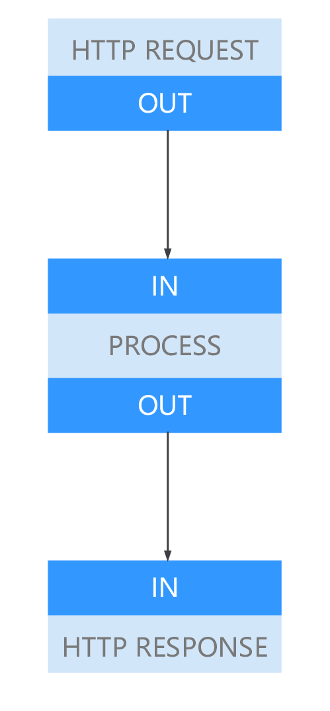

# 流程图开发

流程图(Graph)是应用的逻辑表述，ModelBox将根据流程图构建应用的处理逻辑。

因此在应用开发中，流程图的开发是首要进行的。流程图开发完毕后，才能明确需要开发的功能单元。

流程图开发时，可采用如下形式进行开发

| 方式             | 说明                                                            | 推荐度 | 连接                                        |
| ---------------- | --------------------------------------------------------------- | ------ | ------------------------------------------- |
| ModelBox编排服务 | 使用ModelBox编排服务进行流程图的开发。                          | ⭐️⭐️⭐️    | [指导](../../../plugins/editor.md)              |
| 手工编写         | 手工编写toml格式的流程图文件，并添加到ModelBox Server插件中运行 | ⭐️      | [指导](../../../basic-conception/graph.md) |

## 流程图的开发的四个步骤


- 图的创建： 也叫图的定义，是开发者根据实际的业务需求，按照流程图的开发规范创建的流程图。流程图中标识了功能单元的名称、配置以及数据流向。

- 图的加载： 用户通过调用ModelBox的函数将图文件或者存储图的内存块加载到ModelBox中， ModelBox会根据配置解析出代码可识别的模型，如果图的配置有问题也会在此时发现并通过返回值获取。此时ModelBox会根据配置中的flowunit以及device去查询当前已加载的驱动库是否有匹配的driver，只有当所有的driver都能正确查询到时，才能正确加载图。

- 图的构建： 当用户调用对应的ModelBox函数接口时， ModelBox会将解析完毕的图模型转换为各个Node对象，并且创建好数据流通道。 此时所有的node都已经准备好，等有数据到来时既可以直接处理数据。

- 图的运行： 当用户调用函数接口时， ModelBox会从用户配置的数据源读取数据并按照图构建的路径处理数据，并输出到用户指定的路径中。此时node从前面的节点中获取数据并调用flowunit的处理函数处理数据，并将处理后的数据输出到下一个node中，此时所有的node节点都已经运行起来了，直到数据结束或者用户手动终结流程。

## 流程图设计

流程图基本概念可参考基础概念中的[图](../../../basic-conception/graph.md)章节。在了解了基本概念后，根据业务需求可进行流程图的设计。流程图的设计一般遵循以下几个原则：

- 模型推理一般作为一个图上的一个节点；

- ModelBox内置了大量高性能[预处理功能单元](../../../flowunits/flowunits.md#功能单元列表)，可直接作为流程图节点;

- ModelBox也内置了部分后处理功能单元，如[yolo后处理](../../../flowunits/flowunits-virtual.md#yolo_postprocess)，可直接作为流程图节点；

- 如有业务逻辑在中有分支判断、拆分合并可作为单独的节点；

更多例子可参考[第一个应用](../../../first-app/first-app.md)中每个案例的的`流程图开发`章节。

## 流程图定义

ModelBox默认情况，采用Graphviz DOT语法表达图，关于DOT语法，可以查看[Graphviz DOT](https://www.graphviz.org/pdf/dotguide.pdf)的指导。

假设有一个简单的业务例子如下图：

- ModelBox启动http server监听80端口
- 当有请求时，调用PROCESS功能处理数据
- 数据处理完成后，再将结果回应到客户端



Graphviz的表达：

```toml
digraph G {
    // 定义点属性
    HTTP_REQUEST[flowunit=http, listen="127.0.0.1:8080"]
    PROCESS[flowunit=json"]
    HTTP_RESPONSE[flowunit=http]

    // 定义点关系
    HTTP_REQUEST:OUT->PROCESS:IN
    PROCESS:OUT->HTTP_RESPONSE:IN
}
```

完成上述图构成后，即可将上述图，组成ModelBox可识别的配置文件。  
ModelBox可识别的配置文件采用[TOML配置格式](https://toml.io/cn/v1.0.0-rc.1)。  
生成TOML文件后，即可将配置文件加载到ModelBox中执行。

```toml
[graph]
format = "graphviz"
graphconf = '''
    digraph G {
        // 定义点属性
        HTTP_REQUEST[flowunit=http, listen="127.0.0.1:8080"]
        PROCESS[flowunit=json]
        HTTP_RESPONSE[flowunit=http]

        // 定义点关系
        HTTP_REQUEST:OUT->PROCESS:IN
        PROCESS:OUT->HTTP_RESPONSE:IN
    }
'''
```

## 关键字说明

下面图的配置，包含三部分。

```toml
// 1. 图
digraph G {
    // 2. 定义点属性
    HTTP_REQUEST[flowunit=http, listen="127.0.0.1:8080"]
    PROCESS[flowunit=json]
    HTTP_RESPONSE[flowunit=http]

    // 3. 定义点关系
    HTTP_REQUEST:OUT->PROCESS:IN
    PROCESS:OUT->HTTP_RESPONSE:IN
}
```

1. 第一部分是图

    - 格式

    ```markdown
    digraph [name]
    ```

    - 说明

    digraph开头，[name]可以是字符串。

1. 第二部分是点Node的定义

    - 格式

    ```markdown
    name[key=value]
    ```

    - 说明

    - `name`为点的名称，`key`为node的配置属性，每个节点不同，`value`为`key`的配置值。

        - `type`参数指定点node的类型，可以是`input`, `output`, `flowunit`
        - 当未指定`type`参数时，node缺省为`flowunit`。
        - `flowunit`表示此点为功能单元功能模块，配合`flowunit=xx`指定，功能单元的执行实体。

        ```markdown
        node[type=flowunit, flowunit=httpserver]
        ```

        上述配置表示，点的名称为`node`，类型为`flowunit`，其执行实体为`httpserver`。
        支持的Flowunit可以使用[modelbox-tool](../../../tools/modelbox-tool/modelbox-tool.md)工具查询。

    - `input`：表示此点的类型为输入端口，为整个图的配置，表示图的数据输入端口。

        ```markdown
        graphinput[type=input]
        ```

        上述配置表示，图输入点的名称为`graphinput`，在使用SDK形式调用ModelBox时可以使用此名称发送数据给图。

    - `output`: 表示此点的类型为输出端口，为整个图的配置，表示图的数据输出端口。

        ```markdown
        graphoutput[type=output]
        ```

        上述配置表示，图输出点的名称为`graphoutput`，在使用SDK形式调用ModelBox时可以使用此名称接收图处理后的数据。

1. 第三部分是点的关系定义

    - 格式

    ```markdown
    name:outport -> name:inport
    ```

    - 说明

    `name`为点的名称，`outport`为输出端口名称，`inport`为输入端口名称。

## 流程图配置

一个流程图使用一份TOML格式的配置表示，配置文件内容如下：

```toml
[driver]
dir=["dir1","dir2"]
skip-default=false
[graph]
format = "graphviz"
graphconf = '''digraph demo {
  input[type=input]
  output[type=output]
  process[type=output, flowunit=process]

  input->process->output
}'''
graph.graphconffilepath = "/path/to/graphviz/flow.conf"
```

配置文件项目说明：

1. \[driver\]：用于说明驱动加载路径。
   - `dir`: 指定功能单元等驱动加载路径，可以指定多个路径，通过[] 和 ，分隔。
   - `skip-default`：true表示只扫描dir路径，false表示扫描系统目录和dir路径。
1. \[graph\]：用于指定图的内容。
   - `format`指定流程图的格式，目前仅支持graphviz。
   - `graphconf`为内联graphviz流程图。
   - `graph.graphconffilepath`为外部流程图文件。