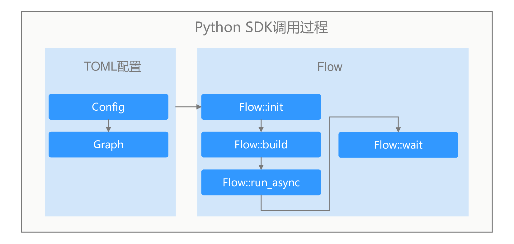

# Python开发方式

开发前请先准备好Modelbox开发环境，详见[环境准备](../../environment/compile.md)章节。

## Python SDK API接口说明

ModelBox提供了流程图的创建、运行、关闭等基础接口。下面是Python中使用的API列表：

| API接口                                               | 参数说明                                                     | 函数说明                                                     |
| ----------------------------------------------------- | ------------------------------------------------------------ | ------------------------------------------------------------ |
| Flow::init   | configfile: 指定config文件的路径<br />format： 指定图文件的格式，可选项为 FORMAT_AUTO,FORMAT_TOML，FORMAT_JSON | 初始化ModelBox服务，主要包含功能如下：<br />1. 读取driver参数，获取driver的扫描路径<br />2. 扫描指定路径下的driver文件，并创建driver实例<br />3. 加载流程图并转换为ModelBox可识别的模型<br />4. 初始化设备信息，性能跟踪和数据统计单元 |
| Flow::init   | name: 指定的图的名称<br />graph: 存储图的字符串<br />format：指定图的格式 | 与上面init的区别是，上面通过读取文件的方式，而此函数通过读取字符串的方式，其他功能相同 |
| Flow::init    | config: Configuration指针，存储图信息  | 功能同上                                                     |
| Flow::build() | / | 用于构建图，将图模型转为可以运行的Node节点并且建立好数据通道 |
| Flow::run()    | / | 图的运行： 同步方式，图运行完成后返回  |
| Flow::run_async  | / | 图的运行： 异步运行， 调用后直接返回， wait()函数判断运行是否结束 |
| Flow::wait | millisecond: 超时时间， 以毫秒为单位<br />ret_val: 图运行的结果 | 等待图运行状态为结束，当图的运行时间超过millisecond表示的时间时，则强制停止图的运行，并返回TIMEOUT |
| Flow::stop | / | 强制停止运行中的图 |
| Flow::create_external_data_map   | / | 当图中的第一个节点为input节点时， 使用此函数可以创建一个输入的ExternalDataMap， 用户可以通过向ExternalDataMap数据中赋值并传递数据给Input节点。具体使用方法可参考[外部数据交互](./python.md#外部数据交互)章节 |

Python开发调用流程图时，需要先安装C++的运行包，然后再编写C++函数，调用Flow执行API执行流程图。Flow流程图接口调用过程如下图所示：



1. 安装python SDK包
1. 开发流程图，配置基础部分和图部分。
1. 调用Flow::init接口，输入流程图文件。
1. 调用Flow::build初始化流程图。
1. 调用Flow::run_async，异步执行流程图。
1. 数据输入，数据处理，结果获取。
1. 调用Flow::Stop释放图资源。

## 流程图配置

SDK模式的流程图的开发和标准模式基本一样，具体开发介绍见[流程图开发](../standard-mode/flow/flow.md)章节。SDK模型区别可以通过设置input和output端口作为外部数据的输入和输出。具体配置如下：

```toml
[driver]
dir=""
skip-default = false
[graph]
graphconf = '''digraph demo {
  input1[type=input] # 定义input类型端口，端口名为input1，用于外部输入数据
  resize[type=flowunit, flowunit=resize, device=cuda]
  model_detect[type=flowunit, flowunit=model_detect, device=cuda]
  yolobox_post[type=flowunit, flowunit=yolobox_post, device=cpu]
  output1[type=output] # 定义output类型端口，端口名为output1，用于外部获取输出结果
   
  input1 -> resize:in_image
  resize:out_image -> model_detect:in
  model_detect:output -> yolobox_post:in
  yolobox_post:out -> output1
}'''
format = "graphviz"
```

如上图，input1和output1端口作为图的输入和输出，如果需要设置多个外部输入输出端口，可按照图配置规则配置多个。

## 流程图运行

* 导入ModelBox包

编写时，需要导入ModelBox的开发包。

```python
import modelbox
```

* 图创建初始化和启动

```python
def CreateFlow(flow_file):

    flow = modelbox.Flow()
    # 初始化Flow接口
    ret = flow.init(flow_file)
    if ret == False:
        modelbox.error(flow_file + " flow init failed")

    # 创建流程图
    ret = flow.build()
    if ret == False:
        modelbox.error(flow_file + " flow build failed")

    # 异步执行流程图
    ret = flow.run_async()
    if ret == False:
        modelbox.error(flow_file + " flow run async failed")
    
    return flow
```

* 外部数据交互

业务数据往往需要输入给流程图进行处理，同时处理完成后需要获取结果。一次数据的发送和结果过程如下：

```python

def send_external_data(extern_data, img_rgb):
    # 申请Buffer
    buffer_list = extern_data.create_buffer_list()
    im_array = np.asarray(img_rgb[:,:])
    buffer_list.push_back(im_array)
    # 将数据发送到"input"。
    extern_data.send("input1", buffer_list)
    # 结束输入。
    extern_data.shutdown()
# 从图中接收数据

def recv_flow_data(extern_data):
    out_buffer = extern_data.create_buffer_list()
    # 使用创建的external对象从output接收数据
    while True:
        ret = extern_data.recv(out_buffer)
        if ret != modelbox.Status.StatusCode.STATUS_SUCCESS:
            if ret == modelbox.Status.StatusCode.STATUS_EOF:
                break
            extern_data.close()
            print("recv data failed", ret)
            break
        result_buffer_list = out_buffer.get_buffer_list("output1")
        # 循环处理数据
        for i in range(result_buffer_list.size()):
            aa = result_buffer_list[i]
            np_image = np.array(aa, copy= False)
            image = Image.fromarray(np_image)
            # ....

def Process(flow, img_rgb);
    # 创建外部输入句柄
    extern_data = flow.create_external_data_map()
    
    # 发送数据到流程图
    send_external_data(extern_data, img_rgb)

    # 获取输出结果并处理
    recv_flow_data(extern_data)
```

* 图的资源释放

```c++
def FlowFtop(flow) {
  // 结束执行
  flow.stop();
}
```

## Python日志

默认情况，ModelBox的SDK输出日志到console，业务需要注册相关的日志处理函数，注册方法可参考[日志](../standard-mode/debug/log.md#日志sdk)章节。
