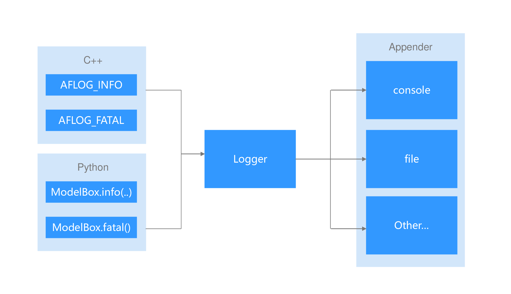

# 日志

ModelBox提供了运行日志，对应的组件在运行时会输出相关的日志信息。

## 日志的基本流程



C++，Python功能单元、ModelBox库、插件调用ModelBox的日志函数后，由ModelBox的Logger将数据发送到Appender，Appender可注册不同的类型。

ModelBox的日志级别分为DEBUG, INFO, NOTICE, WARN, ERROR, FATAL。

## ModelBox Server日志

ModelBox Server和ModelBox Tool中内置了File日志组件，在运行时，会将对应的日志记录到相关的文件中。对应的日志路径，配置方法如下：

| 进程            | 日志路径                       | 级别设置                                                          |
| --------------- | ------------------------------ | ----------------------------------------------------------------- |
| modelbox server | /var/log/modelbox/modelbox.log | /usr/local/etc/modelbox/modelbox.conf配置文件中，log字段的level。 |
| modelbox tool   | /var/log/modelbox-tool.log     | modelbox-tool命令参数。                                           |

## 默认console日志

ModelBox Library在未设置输出appender的情况下，所有打印输出到console，且默认情况下日志输出关闭，若要设置日志级别，可以通过环境变量设置。可设置的变量值为`DEBUG`, `INFO`, `NOTICE`, `WARN`, `ERROR`, `FATAL`。

```shell
export MODELBOX_CONSOLE_LOGLEVEL=INFO
```

## 日志SDK

ModelBox日志提供了日志输出接口，日志appender捕获接口；功能单元，ModelBox库，插件使用日志接口输出日志，业务模块使用appender捕获日志到对应的日志组件。

日志输出信息包括

* level: 日志级别
* file: 日志文件
* lineno: 行号
* func: 函数名称
* msg: 日志内容

appender可以按需求输出日志。

不同语言的SDK日志调用接口，日志捕获接口如下：

### C++

#### c++日志调用

C++调用日志时，需要包含头文件，然后使用类似std::cout的语法输出日志。

```c++
#include <modelbox/base/log>

void LogExample() {
    MBLOG_DEBUG << "this is debug";
    MBLOG_INFO << "this is info";
    MBLOG_NOTICE << "this is notice";
    MBLOG_WARN << "this is warning";
    MBLOG_ERROR << "this is error";
    MBLOG_FATAL << "this is fatal";
}
```

#### c++日志捕获

c++提供了日志接口logger，只需要实现logger中的方法，即可将日志重定向。

```c++
class Logger {
 public:
  // vprint接口
  virtual void Vprint(LogLevel level, const char *file, int lineno,
                      const char *func, const char *format, va_list ap);
  // print接口
  virtual void Print(LogLevel level, const char *file, int lineno,
                     const char *func, const char *msg);
  // 设置日志级别
  virtual void SetLogLevel(LogLevel level);
  // 获取日志级别
  virtual LogLevel GetLogLevel() = 0;
};

// 注册日志函数
ModelBoxLogger.SetLogger(logger);
```

* 流程：
  1. 编写自定义日志对象，从Logger派生，实现相关的接口
  1. 初始化时，调用`ModelBoxLogger.SetLogger(logger)`注册日志处理函数。
  1. 调用`ModelBoxLogger.GetLogger->SetLogLevel(level)`设置日志级别。

### Python

#### Python日志调用

python输出日志时，需要包含modelbox包，使用上类似，print函数。

```python
import modelbox

modelbox.debug("this is debug")
modelbox.info("this is info")
modelbox.notice("this is notice")
modelbox.warn("this is warning")
modelbox.error("this is error")
modelbox.fatal("this is fatal")
```

### Python日志捕获

```python
# 导入相关的包
import modelbox
import datetime

__log = modelbox.Log()

# 日志捕获函数
def LogCallback(level, file, lineno, func, msg):
    # 输出日志信息
    print("[{time}][{level}][{file}:{lineno}] {msg}".format(
        time=datetime.datetime.now(), level=level,
        file=file, lineno=lineno, msg=msg
    ))

# 日志注册函数
def RegLog():
    # 注册日志函数
    __log.reg(LogCallback)
    # 设置日志级别为INFO
    __log.set_log_level(modelbox.Log.Level.INFO)

# 注册自定义日志
RegLog()
```

#### 流程

  1. 编写自定义函数，函数原型为`logfunc(level, file, lineno, func, msg)`。
  1. 初始化日志对象`modelbox.Log()`。
  1. 将`logfunc`调用`modelbox.Log::reg`注册为日志处理函数
  1. 调用`modelbox.Log::set_log_level(modelbox.Log.Level)`设置日志级别。
