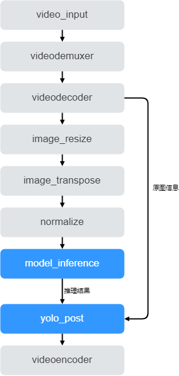

# 流程图开发

## 流程图开发步骤

流程图开发是指开发者根据实际的业务需求，对业务处理流程进行设计拆分，最后按照流程图的开发规范创建流程图，形成ModelBox能识别的配置文件的过程。流程图基本概念可参考基础概念中的[流程图](../../../basic-conception/graph.md)章节。流程图的开发是首要进行的，流程图开发完毕后，才能明确业务处理流程，同时明确开发者还需要开发哪些功能单元。



如上图，以开发一个视频车辆检测的AI应用为例，流程图开发步骤如下：

1. 根据业务流程可以将业务流程拆分为如下几个功能单元：视频输入、视频解封装、视频解码、图片缩放、图片颜色转换、归一化、车辆推理、原图画框、视频编码。确定哪些可以直接预置功能单元，哪些需要自定义开发。即确定流程图的点。

1. 确定自定义功能单元的输入输出、类型，如原图画框步骤需要两个输入：车辆检测坐标、原始图片，输出为画框后的图片。即确定流程图的边。

1. 确定自定义功能单元的类型和属性，是否是条件分支、展开、合并等。具体概念可参考基础概念中[功能单元](../../../basic-conception/flowunit.md)章节。

1. 创建自定义功能单元，根据ModelBox流程图规范进行构图。可以通过ModelBox的[可视化UI编排](../../../plugins/editor.md)界面构图，也可以手工编写配置文件。

## 流程图设计原则

根据业务需求对业务流程进行拆分设计时，节点粒度越细并发度和复用度越高，但会带来节点间交互复杂度变高。流程图的设计一般可遵循以下几个原则：

- 模型推理一般作为单独的功能单元；

- ModelBox内置了大量高性能[预处理功能单元](../../../flowunits/flowunits.md#功能单元列表)，可直接作为流程图节点;

- ModelBox也内置了部分后处理功能单元，如[YOLO后处理](../../../flowunits/flowunits-virtual.md#yolo_postprocess)，可直接作为流程图节点；

- 如有业务逻辑在中有分支判断、拆分合并则需要作为单独的功能单元；

- 条件/展开功能单元之前的功能单元不能直接连接到条件/展开的内部；

- 其他业务逻辑，如果不是处理瓶颈，不需要拆分。

典型场景业务可以参考ModelBox提供的应用样例，具体可参考[第一个应用](../../../first-app/first-app.md)中每个案例的的流程图开发章节。

## 流程图构建规范

ModelBox采用[TOML配置格式](https://toml.io/cn/v1.0.0-rc.1)作为流程图配置文件。一个流程图使用一份TOML格式的配置表示，配置文件内容如下：

```toml
[driver]                       
dir=["dir1","dir2"]           
[graph]                 
format = "graphviz"      
graphconf = '''digraph demo {
    # 定义节点属性
    httpserver_sync_receive[type=flowunit, flowunit=httpserver_sync_receive, device=cpu, time_out_ms=5000, endpoint="http://0.0.0.0:7770"]
    hello_world[type=flowunit, flowunit=hello_world, device=cpu]
    httpserver_sync_reply[type=flowunit, flowunit=httpserver_sync_reply, device=cpu]

    # 定义边，即节点关系
    httpserver_sync_receive:out_request_info -> hello_world:in_data
    hello_world:out_data -> httpserver_sync_reply:in_reply_info
}                            
'''                      
```

- 配置文件说明：

  \[driver\]：用于配置功能单元的扫描路径。
  - `dir`: 指定功能单元等驱动加载路径，可以指定多个路径，通过[] 和 ，分隔。

  \[graph\]：用于定义流程图的描述。
  - `format`指定流程图的格式，目前仅支持graphviz。
  - `graphconf`为流程图的描述内容。

ModelBox流程图的描述采用Graphviz DOT语法表达，关于DOT语法，可以查看[Graphviz DOT](https://www.graphviz.org/pdf/dotguide.pdf)的指导。具体格式可包含三部分：

1. 第一部分是图

    - 格式

    ```markdown
    digraph [graph_name]
    ```

    - 说明

    digraph开头，[graph_name]可以是字符串。

1. 第二部分是点Node的定义

    - 格式

    ```markdown
    node_name[type=flowunit, flowunit=flowunit_name, key=value]
    ```

    - 说明

    `node_name`为点的名称，`key`为node的配置属性，每个节点不同，`value`为`key`的配置值。

    `type`参数指定点node的类型，可以是`input`, `output`, `flowunit`，当未指定`type`参数时，node缺省为`flowunit`。不同取值含义如下：

    - **`flowunit`**: 表示此点为功能单元功能模块，配合`flowunit=xx`指定功能单元的执行实体。

        ```markdown
        node[type=flowunit, flowunit=httpserver]
        ```

        上述配置表示，点的名称为`node`，类型为`flowunit`，其执行实体为`httpserver`。

    - **`input`**：表示此点的类型为输入端口，为整个图的配置，表示图的数据输入端口，主要用于外部数据输入到流程图。

        ```markdown
        graphinput[type=input]
        ```

        上述配置表示，图输入点的名称为`graphinput`，在使用SDK形式调用ModelBox时可以使用此名称发送数据给图。

    - **`output`**: 表示此点的类型为输出端口，为整个图的配置，表示图的数据输出端口，主要用于数据输出到流程图外。

        ```markdown
        graphoutput[type=output]
        ```

        上述配置表示，图输出点的名称为`graphoutput`，在使用SDK形式调用ModelBox时可以使用此名称接收图处理后的数据。

1. 第三部分是点的关系定义

    - 格式

    ```markdown
    flowunit_name1:outport -> flowunit_name2:inport
    ```

    - 说明

    `flowunit_name1`为点的名称，`outport`为输出端口名称，`inport`为输入端口名称。
