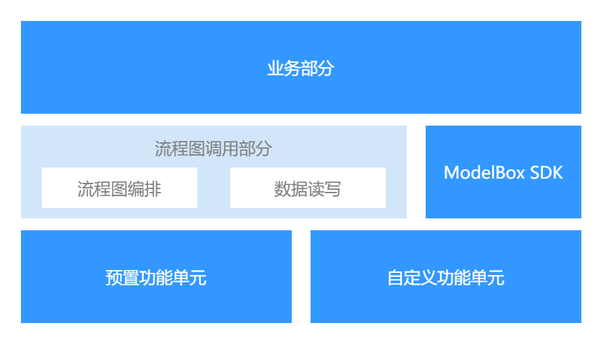

# 使用ModelBox开发AI应用

使用ModelBox进行AI应用开发，主要流程为：**准备开发环境**，**创建项目**，**开发应用**，**调试优化**，**打包部署**。

ModelBox采用图编排的方式开发业务，在开发前，需要对基本概念有些了解。

## ModelBox基本概念

1. 流程图：  
ModelBox中用流程图(Graph)来表达应用逻辑。采用有向图的方式，将应用的执行逻辑表达为顶点和边，其中顶点表示了应用的某个数据处理逻辑单元，边则表示了逻辑单元之间的数据传递关系。在ModelBox中，针对流程图的开发，可以使用文本方式直接编辑，也可以使用可视化的编辑器进行编辑。对于流程图的表述，ModelBox默认采用[Graphviz](https://www.graphviz.org/pdf/dotguide.pdf)格式，图的表述需要满足Graphviz的语法要求。

1. 功能单元：  
ModelBox将流程图中的顶点称为功能单元(FlowUnit)。功能单元是应用的基本组成部分，也是ModelBox的执行单元。在ModelBox中，内置了大量的基础功能单元，开发者可以将这些功能单元直接集成到应用流程图中，这也是基于流程图开发的一大好处。除内置功能单元外，ModelBox支持功能单元的自定义开发，支持的功能单元形式多样，如C/C++动态库、Python脚本、模型+模型配置文件等。

## AI应用模式
在ModelBox下，AI应用模式主要分为两种：

1. ModelBox应用模式：

    

    此模式下，开发者的应用构成分为服务逻辑和应用逻辑两个部分，AI应用的主入口为ModelBox，ModelBox首先加载服务逻辑，然后由服务逻辑加载指定的应用逻辑并运行。
    * 服务逻辑：此部分主要用于启动由图编排时所描述的应用逻辑，并提供管理能力。ModelBox内置了两个服务插件：ModelBoxPlugin用来启动指定的应用逻辑；EditorPlugin则提供了WEBUI，可以用于执行样例、可视化编排应用逻辑等，详见[Editor](../use-modelbox/flow/editor.md)。
    * 应用逻辑：此部分由开发者编写，首先通过配置文件描述应用的整体逻辑，然后对逻辑中使用到的自定义功能单元进行开发。

1. 自定义应用模式：

    

    此模式下，开发者的应用构成分为业务逻辑和推理逻辑两个部分，AI应用的主入口为业务逻辑，由开发者提供，开发者通过提供的API使用ModelBox相关能力。
    * 业务逻辑：开发者编写的业务相关逻辑。
    * 推理逻辑：模型相关的执行逻辑，也可以由开发者决定，在此部分写入更多的业务逻辑，使得AI应用只包含此部分。此部分中，开发者可以通过API静态的编排逻辑、或者通过solution使用预置的逻辑，然后调用已编排好的逻辑；也可以动态执行功能单元，立即获得返回。
